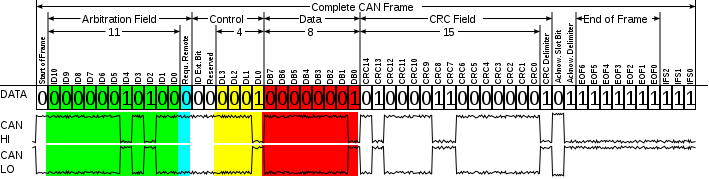

# CAN 的特点
为什么汽车行业都用 CAN 总线？它有什么特点？它为什么能存在于工业界这么多年至今仍被广泛应用着？它到底有什么过人之处？因项目需要，重拾 CAN 总线，关于 CAN 的资料浩如烟海，这里只聊干货。
<!--more-->
## 差分传输
由于 CAN 总线使用差分信号传输，只需要三个线，CAN_H,CAN_L,GND，其中 GND 作为屏蔽层使用。这种设计方式使得它的传输距离远、可靠性高，最远可达10公里。
## 多主结构
由于 CAN 设备不需要使用地址标识每个挂接在总线上的设备，而只需要ID来标识，因此 CAN 总线上的设备没有主从之分，任意节点都可以发起通信；
## 错误检测
出错的 CAN 节点可自动切断与总线的连接，不影响其他节点通信，自动传输破坏的报文；
# CAN 通信
CAN 总线上的设备不分主从，任意设备都可以主动发送消息到总线，所有挂接在总线上的设备都可以收到该消息；当某一时刻出现两个或以上的节点同时操作总线时，CAN 设备在发送消息的同时也检测总线状态，如果自己发送的数据与检测回来的数据不同，则主动放弃总线使用权。举例说明该情况，假如某一时刻有两个 CAN 节点同时操作总线，消息的前面都会附加11位的 ID 新版提升为29位，这个 ID 决定了消息的优先级，ID 数字越小优先级则越高：
   ```
 节点  ID 
  A    11110001000
  B    11101110111
 总线   11100000000
   ```
CAN 总线使用仲裁来判定哪个节点最终拥有总线使用权，它利用线与特性，当一个节点发送1，另外一节点发送0时，则线与后总线为0，那么发送0的节点则拥有了总线使用权，它可以继续发送数据，而发送1的节点则退出总线使用权。如上面，两个节点A B 同时发送信息，在发送到 ID 的第4位时，B节点发送的是0，A节点发送的是1，线与之后总线为0，因此B节点获取了总线使用权，A节点退出。CAN 总线上的0称为显性，1称为隐性，因为0总是拥有总线使用权。总线上的设备都可以接收任意节点发来的消息，根据ID号判断消息是否是自己需要的，如果发现ID号与自己需要的信息不符，则主动放弃接收。
# 数据帧结构

这张图片摘自 wikipedia,CAN 数据的帧结构包括仲裁、控制域、数据域、CRC校验以及结束部分。

