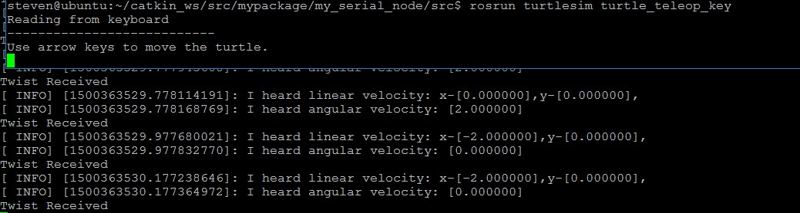
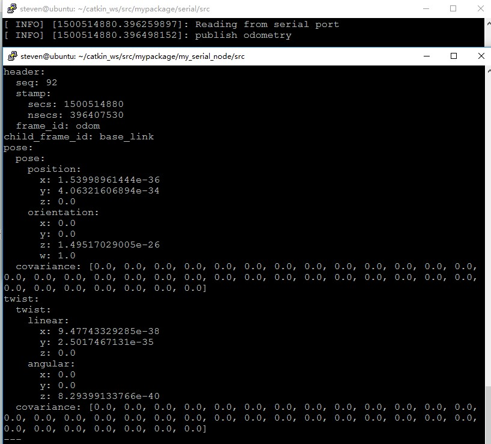

移动底座与ROS上层的通信一般采用串口或者CAN接口，本次设计选用串口与ROS上层通信。Navigation Stack 中发布给 base_controller 的话题为 cmd_vel ，因此需要设计一个节点用于接收 cmd_vel 话题，获取该话题中的消息将其转换成移动底座可识别的速度及角速度指令，通过串口发送给移动底座，从而控制移动底座按既定要求运动。该节点还需要接收底座的通过串口上传过来的里程编码消息并转换成里程计消息发布到 ROS 上层，为 ROS 导航提供必须的里程计消息。
<!--more-->
# 订阅cmd_vel话题
设计一个节点，我们暂时命名为 my_serial_node ,在该节点中借助 [ros-serial](https://github.com/wjwwood/serial) 实现串口的收发功能，并订阅话题 cmd_vel, 为了方便测试我们这里暂时订阅 /turtle1/cmd_vel 话题，详细看代码：
   ```
  #include <ros/ros.h>
  #include <serial/serial.h>
  #include <std_msgs/String.h>
  #include <std_msgs/Empty.h>
  #include <geometry_msgs/Twist.h>
 
  serial::Serial ser;
 
  //订阅turtle1/cmd_vel话题的回调函数，用于显示速度以及角速度
  void cmd_vel_callback(const geometry_msgs::Twist& cmd_vel){
      ROS_INFO("I heard linear velocity: x-[%f],y-[%f],",cmd_vel.linear.x,cmd_vel.linear.y);
      ROS_INFO("I heard angular velocity: [%f]",cmd_vel.angular.z);
      std::cout << "Twist Received" << std::endl;
  }
  int main (int argc, char** argv){
      ros::init(argc, argv, "my_serial_node");
      ros::NodeHandle nh;
 
      
      //订阅/turtle1/cmd_vel话题用于测试 $ rosrun turtlesim turtle_teleop_key
      ros::Subscriber write_sub = nh.subscribe("/turtle1/cmd_vel",1000,cmd_vel_callback);
      ros::Publisher read_pub = nh.advertise<std_msgs::String>("sensor", 1000);
 
      try
      {
          ser.setPort("/dev/ttyUSB0");
          ser.setBaudrate(115200);
          serial::Timeout to = serial::Timeout::simpleTimeout(1000);
          ser.setTimeout(to);
          ser.open();
      }
      catch (serial::IOException& e)
      {
          ROS_ERROR_STREAM("Unable to open port ");
          return -1;
      }
 
      if(ser.isOpen()){
          ROS_INFO_STREAM("Serial Port initialized");
      }else{
         return -1;
      }

   ```
可以通过以下方式简单的测试一下订阅的话题是否可行：
   ```
 $ roscore &
 $ rosrun turtlesim turtle_teleop_key
   ```
在另外一个 terminal 中运行上面的节点:
   ```
$ rosrun my_serial_node my_serial_node
   ```
当用手按下上下左右方向键时会看到实时的打印速度信息：

# 串口发送
节点订阅了 cmd_vel 话题，将速度、角速度数据提取出来之后，需要将这些信息以固定的协议格式通过串口送至移动底座，移动底座接收该命令并执行该命令。这里的协议格式可自行定义，也可以直接发送速度、角速度数据到移动底座；本次开发定义格式如下：

head|head|A-speed|B-speed|C-speed|CRC
---|---|---
0xff|0xfe|float|float|float|u8
因此串口发送的总字节数是15字节，在获取到cmd_vel话题后提取有效数据并打包送至底层，串口发送借助 [ros-serial](https://github.com/wjwwood/serial) 的 write 函数功能即可。
　　```
serial.write(buffer,buffersize)
　　```
# 串口接收与发布 odometry 话题
设计本节点还需要通过串口从移动底座获取里程计信息，并发布该里程计信息，为 Navigation stack 提供必要的 odometry 信息。串口接收的数据格式定义如下：

head|head|x-position|y-position|x-speed|y-speed|angular-speed|pose-angular|CRC
---|---|---
0xff|0xae|float|float|float|float|float|float|u8

因此串口接收数据总字节数为27字节，串口接收完成后通过校验分析数据无误后，提取对应数据填充到 odometry 消息中，并发布出去。串口接收 [ros-serial](https://github.com/wjwwood/serial) 提供了很多接口函数，因为底层发送的都是16进制格式，因此数据接收我选择了 Serial::read (uint8_t *buffer, size_t size) 函数，这个可以从 [ros-serial](https://github.com/wjwwood/serial) 的源码中查到。里程计消息的发布可以参考站内文章:  
运动学解析函数
　　```

/**********************************************************
 * 运动学解析函数 将获取的 x y 方向的线速度以及角速度转变成
 * 移动底座三个轮子的速度，并通过串口发送出去
 * VA = Vx + L*W
 * VB = -Vx*cosθ + Vy*sinθ + L*W
 * VC = -Vx*cosθ - Vy*sinθ + L*W
 * θ 为轮子与移动底座坐标系X轴的夹角，此处为60°
 * VA VB VC 分别为三个轮子的速度
 * Vx Vy 为移动底座在x y 方向的速度
 * W 为移动底座绕Z轴的角速度 
 * L 为三个轮子到移动底座中心的距离 此处为0.15m
 * ********************************************************/
void kinematics_analysis(const geometry_msgs::Twist& cmd_vel){
	float_union VA,VB,VC;
	VA.fvalue = cmd_vel.linear.x + 0.15*cmd_vel.angular.z;
	VB.fvalue = -cmd_vel.linear.x * 0.5 + cmd_vel.linear.y * 0.867 + 0.15*cmd_vel.angular.z;
	VC.fvalue = -cmd_vel.linear.x * 0.5 - cmd_vel.linear.y * 0.867 + 0.15*cmd_vel.angular.z;
	memset(s_buffer,0,sizeof(s_buffer));
	//数据打包
	s_buffer[0] = 0xff;
	s_buffer[1] = 0xfe;
	//VA
	s_buffer[2] = VA.cvalue[0];
	s_buffer[3] = VA.cvalue[1];
	s_buffer[4] = VA.cvalue[2];
	s_buffer[5] = VA.cvalue[3];
	//VB
	s_buffer[6] = VB.cvalue[0];
	s_buffer[7] = VB.cvalue[1];
	s_buffer[8] = VB.cvalue[2];
	s_buffer[9] = VB.cvalue[3];
	//VC
	s_buffer[10] = VC.cvalue[0];
	s_buffer[11] = VC.cvalue[1];
	s_buffer[12] = VC.cvalue[2];
	s_buffer[13] = VC.cvalue[3];
	//CRC
	s_buffer[14] = s_buffer[2]^s_buffer[3]^s_buffer[4]^s_buffer[5]^s_buffer[6]^s_buffer[7]^
					s_buffer[8]^s_buffer[9]^s_buffer[10]^s_buffer[11]^s_buffer[12]^s_buffer[13];
	ser.write(s_buffer,sBUFFERSIZE);

}


　　```

# 测试
在与底盘实际通信前我们先用两台电脑进行串口的通信测试，并查看发布的 odometry 消息。一台电脑跑ROS并通过串口与另一台电脑连接，串口监控软件送出一组模拟数据：

　　```
0xff 0xae 0x01 0x02 0x03 0x04 0x05 
0x06 0x07 0x08 0x09 0x00 0x01 0x02 
0x03 0x04 0x05 0x06 0x07 0x08 0x09 
0x00 0x12 0x13 0x14 0x15 0x00
　　```
运行节点：
　　```
 $ roscore &
 $ rosrun my_serial_node my_serial_node
　　```
通过串口监控软件不停的发送上述数据帧，并通过以下命令查看话题：
　　```
$ rostopic echo /odom
　　```
可以看到串口接收到底层送来的数据并实时的进行发布：



