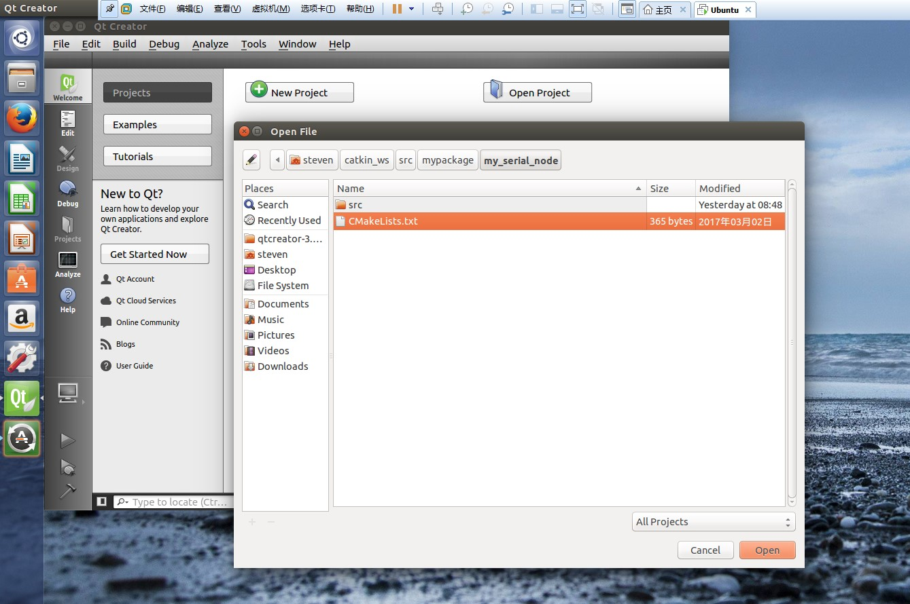
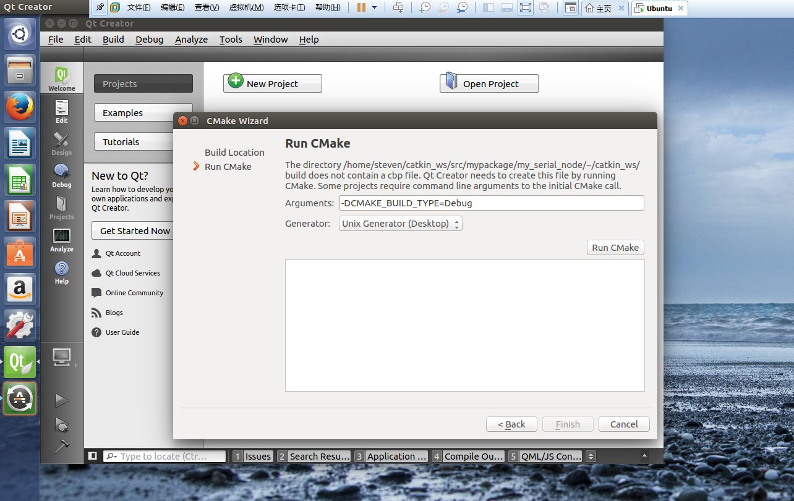
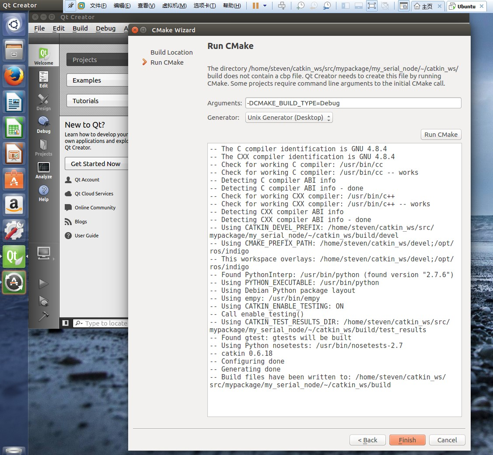

其实 vim 配置好后可以很方便的调试 ROS ，就是 Vim 配置比较麻烦，可以参考我的站内文章  [如何让VIM变的爱不释手](http://stevenshi.me/2017/05/18/vim/) 。 相信很多人都用过 Qt ，它原生支持 CMake ，因此 Qt 可以很好的支持 ROS，本篇学习如何使用 Qt 进行 ROS 的开发。
<!--more-->
# 配置
首先找到这个文件 QtProject-qtcreator.desktop 该文件可能位于~/.local/share/applications/，也可能位于/usr/share/applications，可以使用如下命令查找：
   ```
 $ cd /
 $ sudo find -name QtProject-qtcreator.desktop
   ```
打开该文件，在Exec那一行添加 bash -i –c ：
   ```
 Exec=bash -i -c /usr/local/qtcreator-3.4.2/bin/qtcreator
   ```
添加 “bash -i –c” 是为了在通过快捷方式启动Qt Creator的同时加载ROS环境变量，ROS环境变量加载脚本配置在 ~/.bashrc 文件内，类似于加载工作空间里的 *devel/setup.bash* 。
# 打开工程
在桌面上打开 qt-creator，打开某一个ROS工程，找到 CMakelist.txt 因为 qt 本身支持 cmake 项目:



设置编译路径为 catkin_ws 的 build 路径:


设置CMake编译模式：-DCMAKE_BUILD_TYPE=Debug :



最后点击 Run CMake 按钮,然后点击 Finish 按钮就可以编译该工程了：



值得注意的是，在运行前需要新开一个 terminal 运行 roscore,然后再运行编译后的工程节点。
# 新建工程
对于 ROS 新工程的建立需要 [Qt Creator](https://www.qt.io/ide/) 4.1 以上版本，需要安装 [ros_qtc_plugin](http://rosindustrial.org/news/2016/6/9/ros-qt-ide-plugin) 插件，该插件位于 [github](https://github.com/ros-industrial/ros_qtc_plugin)。 因为我安装的版本较低，所以我依然采用 ROS 命令行建立新的 pkg。 至此，可以开始使用 Qt 开发 ROS 了。

