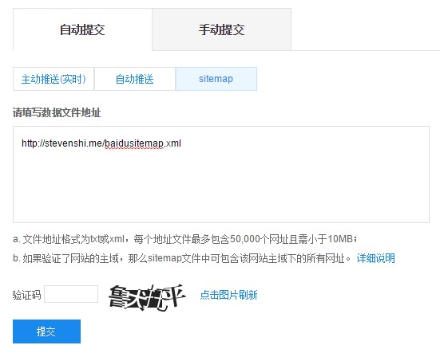
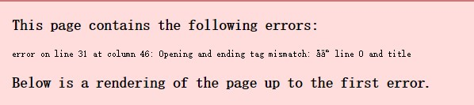
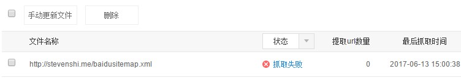
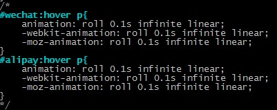

# 添加页面
页面指的是分类页*categories*、标签页*tags*、关于页*about*等。使用以下命令生成以上页面参考[nexT](http://theme-next.iissnan.com/theme-settings.html):
　　```
 $hexo new page categories
 $hexo new page tags
 $hexo new page about　
　　```
在 *hexo* 配置文件 *_config.yml* 文件中设置 *post_asset_folder* 为true,当新建页面后会自动生成一个同名文件夹，用于存储所需的资源图片等。生成以上页面后在主题配置文件中 *themes/nexT/_config.yml* 打开相关配置项:
　　```
 menu:
   home: /
   categories: /categories
   about: /about
   archives: /archives
   tags: /tags
   #sitemap: /sitemap.xml
   #commonweal: /404.html
　　```
<!--more-->
设置自己的标签页面位于*hexo/source/tags*:
  ```
title: 标签
date: 2017-05-05 12:30:52
type: "tags"
comments: false
tags:
 - Qt
 - Linux
 - Hexo
 - ROS
　```
可以在上面添加自己的标签。
分类页的示例如下:
　```
 title: 分类
 date: 2017-05-05 12:30:42
 type: "categories"
 comments: false
　```
# 发表文章
新文章的发表使用以下命令：
　　```
 $hexo new post "文章名" 或者 hexo n "文章名"
　　```
一个文章的开头应包含:
　```
 title: #文章题目
 date: #日期
 tags: #标签
 categories: #分类
　```
文章存储在*hexo/source/_posts*目录下，后缀为*.md*。可以在适当位置插入以下符号用于部分显示:
　　```
<!--more-->
　　```
插入该符号之前的文字可以直接显示出来，之后的需要鼠标点击*阅读全文*来显示全部。
　　```
 $hexo g //生成静态文件
 $hexo d //部署
　　```
# 添加RSS
安装RSS插件：
　　```
 $npm install hexo-generator-feed --save
　　```
修改*hexo/_config.yml*根目录下的站点配置文件，添加以下内容:
　　```
 #RSS 订阅支持
 plugin:
 - hexo-generator-feed
 #feed Atom
 feed:
   type: atom
   path: atom.xml
   limit: 20
　　```
修改主题目录下的配置文件*themes/nexT/_config.yml*
　　```
 rss: /atom.xml
　　```
# 添加sitemap
sitemap 插件可以方便的管理网站，并生成符合搜索引擎需要的网站格式，供那些网络爬虫抓取，以便于我们的网站可以被搜索到。
安装*sitemap*插件:
　```
 $npm install hexo-generator-sitemap --save
　　```
修改*hexo/_config.yml*根目录下的站点配置文件:
　　```
 sitemap:
　　　path: sitemap.xml
　　```
添加baidusitemap：
  ```
 $npm install hexo-generator-baidu-sitemap --save
  ```
修改*hexo/_config.yml*根目录下的站点配置文件:
　　```
 baidusitemap:
　　　path: baidusitemap.xml
　　```
在站点配置文件中添加：
　　```
plugin:
- hexo-generator-sitemap
- hexo-generator-baidu-sitemap
 　```
修改文件 node_modules/hexo-generator-baidu-sitemap/baidusitemap.ejs ,添加自己的网站地址：
 　```
 <loc><%- encodeURI("http://stevenshi.me/" + post.path) %></loc>
 　```
当执行 hexo g 命令后会在站点目录下的 public/ 下生成 baidusitemap.xml 和 sitemap.xml 文件。将 baidusitemap.xml 提交给百度，[百度提交入口](http://www.sousuoyinqingtijiao.com/baidu/tijiao/) 将 sitemap.xml 提交给 google,[Google提交入口](https://www.google.com/webmasters/verification/home?hl=en)
## 百度提交
先去百度站长平台注册，并添加自己的网站然后开始验证。关于验证方式，百度提供了三种,这里为了简单选择 html 标签验证。将百度提供的标签信息添加到 主题目录下的 layout/_partials/head.swig 文件内即可：
 　```

  <meta name="baidu-site-verification" content=   />

 　```
content 内容为百度提供的验证内容，同时在主题目录中的 _config.ym l中将 google-site-verification 和 baidu_site_verification 的值设置为 true 即可。
 　```
baidu_site_verification: true
google-site-verification: true
 　```
重新部署网站后开始验证，不出意外很快会验证成功。成功之后转到百度站长找到左边的链接提交，选择自己的站点，选择自动提交，添加自己的sitemap:

填入自己的 sitemap 地址：http://stevenshi.me/baidusitemap.xml，剩下的时间就是等待了。
## 谷歌提交

## 错误

当在浏览器输入 http://localhost:4000/baidusitemap.xml 时出现错误：



貌似是标题格式问题， baidusitemap.xml 和普通的 sitemap.xml 格式不同，它多一个标题,经过仔细检查原来标题中的<>符号问题，标题中有该符号即报上面的错误，去掉该符号后问题解决。

提交网站 sitemap 百度提示抓取失败：



原来百度抓取 github 时是被拒绝的，github 屏蔽了百度爬虫，汗..

# 添加侧栏社交链接
修改主题目录下的配置文件*themes/nexT/_config.yml*
　　```
 # Social Links
 # Key is the link label showing to end users.
 # Value is the target link (E.g. GitHub: https://github.com/iissnan)
 social:
   Github: https://github.com/username
   知乎: http://www.zhihu.com/people/username
   Email: mailto: user@xx.com
　　```
设置链接的图标，对应的字段是*social_icons*在主题配置文件中:
　```
 # Social Icons
 social_icons:
 enable: true
 # Icon Mappings
 GitHub: github
 Email: envelope
　　```
nexT使用的图标来自[FontAwesome](http://fontawesome.io/)，只要上面有的都可以配置到nexT使用。
# 添加本地搜索
安装*hexo-generator-serarch*
　　```
 $npm install hexo-generator-search --save
　　```
修改*hexo/_config.yml*根目录下的站点配置文件添加:
　　```
 search:
  path: search.xml
  field: post
　　```
# 设置头像
在hexo/source/目录下建立images文件夹，将头像放置在该文件夹下，修改主题目录下的配置文件*themes/nexT/_config.yml*
　　```
 avatar: /images/avatar.jpg
　　```
# 生成网站二维码
二维码生成工具很多，这个[Custom QR Code Generator](https://www.unitag.io/qrcode)比较不错。生成后将二维码添加到关于页面。
# 设置代码高亮主题
NexT 使用[TomorrowTheme](https://github.com/chriskempson/tomorrow-theme)作为代码高亮，共有5款主题供选择。 打开主题配置文件*themes/nexT/_config.yml*修改:
　　```
 # Code Highlight theme
 # Available value:
 #    normal | night | night eighties | night blue | night bright
 # https://github.com/chriskempson/tomorrow-theme
 highlight_theme: night bright

　　```
# 开启打赏功能
只需要主题配置文件中填入微信和支付宝收款二维码图片地址，即可开启该功能。修改主题配置文件*themes/nexT/_config.yml*
　　```
 reward_comment: 您的支持是我原创的动力
  wechatpay: /path/to/wechat-reward-image
  alipay: /path/to/alipay-reward-image

　　```
鼠标放置在二维码上面时，下面的字来回晃眼，修改如下文件:
*themes/next/source/css/_common/components/post/post-reward.styl*
注释掉以下代码：
# 友情链接
修改主题配置文件*themes/next/_config.yml*
　　```
 # Blog rolls
 links_title: 友情链接
 #links_layout: block
 #links_layout: inline
 links:
  hexo: https://hexo.io/zh-cn/docs
  nexT: http://theme-next.iissnan.com/
　　```
# 开启动画背景
[nexT](http://theme-next.iissnan.com/theme-settings.html) 自带两种背景动画效果，canvas_nest以及three_waves,在主题配置文件:
 *themes/next/_config.yml*中设置为true即可开启,
　　```
 # Canvas-nest
 canvas_nest: true
　　```
# 开启JiaThis分享
[Jiathis](http://www.jiathis.com/)为文章提供社会化分享功能。修改主题配置文件*themes/next/_config.yml*:
　　```
 # Share
 jiathis: true
　　```
# 百度分享
两种分享只能同时开启一种，百度分享需要在站点配置文件*hexo/_config.yml*中添加：
　　```
 # baidu share
 baidushare: true #百度分享功能
　　```
另外需要在主题配置文件*themes/next/_config.yml*中开启百度分享功能：
　　```
 # Baidu Share
 # Available value:
 #    button | slide
 # Warning: Baidu Share does not support https.
 baidushare: 
  type: button

　　```
# 添加DISQUS评论
修改主题配置文件开启[DISQUS](https://disqus.com/)功能：
　　```
 # Disqus
 disqus:
  enable: true
  shortname:
  count: true
　　```
去[DISQUS](https://disqus.com/)官网注册，并获取自己的shortname,填写至主题配置文件中的对应字段中。取消一篇文章的评论只需要在文章的头部修改：
　　```
 comments: false
　　```
# 设置网站图标
图标制作网站[faviconer](http://www.faviconer.com/)，制作完成自己的网站图标后放到*hexo/source*根目录下，并修改主题配置文件：
　　```
# Put your favicon.ico into `hexo-site/source/` directory.
favicon: /favicon.ico
　　```
# 页面中插入图片
图片的插入可以使用[MarkdownPad](http://markdownpad.com/ "markdown Editor for Windows")的语法：
　　```
 
　　```
图片可以放在本地，也可以放在云端。建议放在云端，因为github的空间有限，云端可以使用[七牛云存储](https://www.qiniu.com/)。
本地图片的插入有两种方法，早期的[hexo](https://hexo.io/zh-cn/docs/ "hexo说明")需要将图片放在网站根目录下的*source/*文件夹中比如*source/images/*文件夹，将图片放到该处，即可在页面中引用：
　　```
 
　　```
[hexo](https://hexo.io/zh-cn/docs/ "hexo说明")2.0之后，引入新方法，参考[CodeFalling/hexo-asset-image](https://github.com/CodeFalling/hexo-asset-image)
安装插件：
　　```
 $npm install hexo-asset-image --save
　　```
 修改配置文件中的 *post_asset_folder:* 为 *true* ，这样新建文章时，会在 *_post* 目录下生成同名的文件夹，页面需要的各种图片都可以放到此处。比如：
　　```
 my-Publish
 ├── my.jpg
 ├── logo.jpg
 └── test.jpg
 my-Publish.md
　　```
新建名为 *my-Publish* 的新文章，文章需要的图片都放到该文件夹中。引用:
　　```
 
　　```
即可插入图片，*xx*可以随意。

 