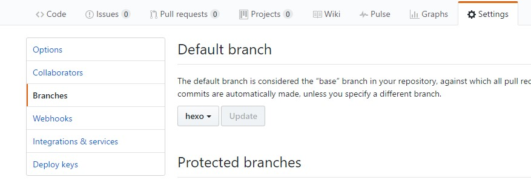

# 前言
　　在公司电脑中做好了hexo博客撰写，也将文章推送到了github并且发布了;回到家中在自己的电脑上想给自己的博客添加一篇文章，按照hexo建站流程，又建了一遍，但写完文章后发现，之前在公司写得博客被覆盖了，想哭的感觉有木有。

　　当使用不同的电脑撰写博客时，会涉及到博客资源的备份和更新，如果简单的拷贝会比较麻烦，当然也可以tar整个hexo工作目录;单纯的push到github会有部分文件不全,由于主题文件目录也是git管理方式，当push后，主题默认是不会被推送到github上的。所以，必须稍作修改，才能正确的备份。
# 解决方案
　　在自己的github仓库中默认有master分支，比如username目录下的：
username.github.io仓库。使用master分支保存自己的hexo博客静态文件，新建hexo分支用于保存hexo资源文件。每次撰写完博客后，顺便将自己的hexo工作目录push到远程仓库的hexo分支;当在另外一台电脑上写博客时，先获取远程仓库的分支，之后就可以编辑了
<!--more-->
## 推送到远程
　　进入到自己的博客工作目录比如*github\hexo*,先查看远程主机
　　```
  $git remote -v
　　```
　　如果有输出，查看下是否是自己远程仓库的名字，如果不是username.github.io则删除：
　　```
  $git remote rm origin
　　```
　　添加远程主机：
　　```
  $git remote add origin https://github.com/yourusername/yourusername.github.io.git
  $git init 
　　```
　　删除掉*theme\nexT*目录下的*.git*文件夹，因为我们要将主题配置一同推送。如果删除后还是不能推送nexT主题，就将nexT改个名字，但要注意在hexo的_config.yml中对应的主题名字与这个文件夹名字要保持一致。
　　```
  $git add --all //add之后可以用*git status*查看刚刚改过的文件状态
  $git commit -m "backup hexo"
  *$git config --global user.name "yourusername" //这两步之前已经做好了，不需要再配置*
  *$git config --global user.email "yourusername@xxx.com"*
  $git push origin hexo //将本地文件push到远程仓库的hexo分支，没有则建立该分支
　　```
　　在远程仓库查看，username.github.io的仓库下已经有了两个分支，一个叫master,一个叫hexo。但发现有些不想推送的文件也被推送到了远程，比如hexo根目录下的public文件夹，这个文件夹是生成的博客静态文件，它是在博客部署后被推送到：
username.github.io的master分支的，我们这里并不需要保存该文件夹。编辑hexo根目录下的.gitignore文件，添加不需要推送的文件或文件夹：
　　```
  .DS_Store
  Thumbs.db
  *.log
  node_modules/
  public/
  .deploy*/
　　```
由于之前推送过，可能.gitignore没有起作用，.gitignore只能忽略那些原来没有被追踪的文件，如果某些文件已经被纳入了版本管理中，则修改.gitignore是无效的。这个时候就需要删除缓存改变未被追踪状态，重新提交：
　　```
  $git rm -r --cached .
  $git add --all
  $git commit -m "update .gitignore"
　　```
　　之后再次推送即可。
## 获取远程分支
　　前面已经将写好的博客资源文件推送到远程仓库username.github.io的分支hexo,无论在哪里都可以获取远程分支至本地进行博客撰写，并且保持文章的更新状态。
假如我在家中的电脑的目录*F:\github\home*下想撰写一篇新博客文章，首先要做的是进入到该目录下，进行hexo环境的安装，参考我的前一篇博客。
　　```
  $npm install hexo-cli --save //在新电脑上配置hexo
  $npm install hexo --save
  $npm install hexo-server --save
  $npm install hexo-generator-search --save
  $npm install hexo-deployer-git --save
　　```
当环境建立好后，运行*hexo init*命令：
　　```
 $hexo init
　　```
然后删除*hexo init*命令产生的其它文件夹，只保留生成的node_modules文件夹，建立博客需要的hexo各种命令以及依赖项都在这里。之后添加远程仓库分支至本地：
　　```
 $git remote add origin https://github.com/yourusername/yourusername.github.io.git
　　```
　查看远程仓库所有分支：
　　```
  $git branch -r
　　```
　　一般输出为：
　　```
  *origin/HEAD -> origin/master*
  *origin/hexo*
  *origin/master*
　　```
此时可以看到远程仓库有两个分支，但默认的分支为master,我们需要的是hexo分支，所以需要将默认分支修改为hexo:


如果不修改则需要获取分支hexo到本地：
　　```
  $git fetch origin hexo:hexo
　　```
或者：
　　```
 $git pull origin hexo
　　```
切换到hexo分支：
　　```
  $git checkout hexo //此处为hexo分支
　　```
此时就可以在该目录下进行博客的撰写工作了，撰写完可以将最新更新提交，并push到远程仓库的hexo分支，至此完成多个电脑同步的问题。
当再次回到公司电脑时，进入到博客目录使用*git pull*即可同步更新。
　　```
  $git pull //获取更新
  $hexo n post "new blog"
  $hexo clean //清除生成的静态文件
  $hexo g //生成静态文件
  $hexo d //部署到远程
  $git add --all //添加所有文件
  $git commit -m "add new blog"
  $git push origin hexo //推送到远程分支hexo
　　```
 如果不小心搞乱了，或者误删了，使用命令恢复到前一个版本:
　　```
  $git log //查看记录
  $git reset --hard HEAD^ //恢复到前一个记录
　　```
 当每次git commit提交更改时，总是提示以下错误：
　　```
 On branch hexo
 Changes not staged for commit:
       
 Untracked files:
　　```
 通过输入git status查看提示：
　　```
 $ git status
On branch hexo
Changes not staged for commit:
  (use "git add <file>..." to update what will be committed)
  (use "git checkout -- <file>..." to discard changes in working directory)

        
Untracked files:
  (use "git add <file>..." to include in what will be committed)

        
no changes added to commit (use "git add" and/or "git commit -a")
 
　　```
 Changes not staged for commit说明git已经跟踪到这些文件的修改，但还没有放到暂存区，需要使用git add命令提交更新到暂存区。之后再通过git status查看状态：
　　```
$git status
On branch hexo
Changes to be committed:
  (use "git reset HEAD <file>..." to unstage)

       
　　```
 状态已经变成了Changes to be committed。提示未被跟踪的文件Untracked files说明是新建立的文件，在git之前的提交中没有这些文件，git不会自动将它们纳入跟踪范围，必须手动添加这些文件。使用git add命令跟踪新文件：
　　```
$git add "file" //添加未被跟踪的文件
　　```
如果还有错误，直接清除缓存:
　　```
$git rm -r --cached .
$git add --all //跟踪所有文件
$git commit -m "your commit" //提交更新
$git push origin "yourbranch" //推送到远程分支yourbranch
　　```
