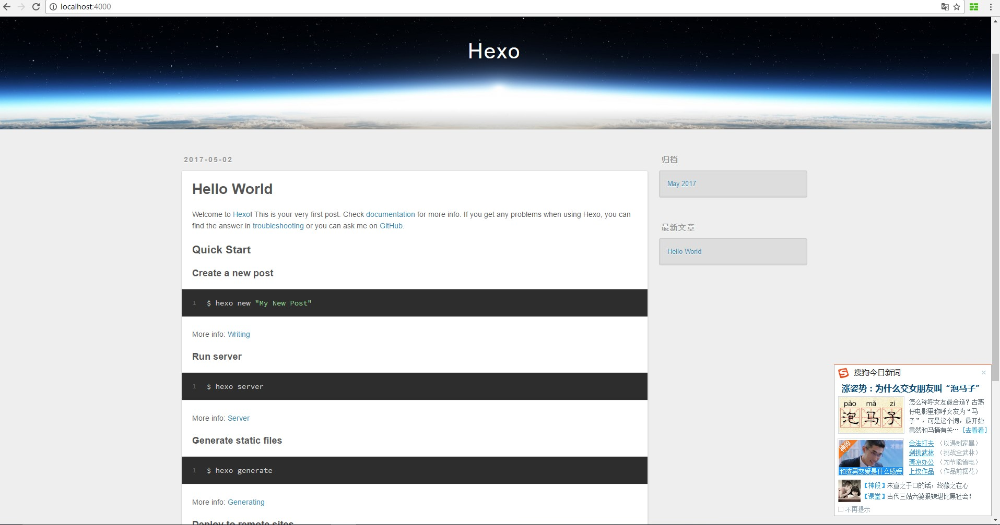

*环境： windows10 64bits*
*所需软件： *
　　1. [Node.js](https://nodejs.org/en/ "Java Script运行环境")　基于Chrome V8引擎的JavaScript运行环境；
　　2. [Git-for-windows](https://github.com/git-for-windows/git/releases "git for windows")　windows平台下git 运行环境；
　　3. [MarkdownPad](http://markdownpad.com/ "markdown Editor for Windows")　博客撰写工具

　　*开始之前先去 [github](www.github.com) 注册一个账户，并新建一个与自己用户名同名的仓库，最后生成的仓库地址：https://github.com/username/username.github.io  注：username替换为自己的用户名*
# hexo安装与配置
　　首先在本地建立自己的博客文件夹，比如 *F:\github\hexo*，进入该文件夹内，右键点击*Git Bash Here*,打开*git for windows*环境，开始安装 [hexo](https://hexo.io/zh-cn/docs/ "hexo说明")：
　　```
　　$npm install hexo-cli -g //注: -g表示全局安装
　　$npm install hexo-server -g //注： hexo3.0之后server模块是独立的,需要单独安装
　　```
　　完成之后可以通过命令查看hexo是否安装成功：
　　```
　　$hexo -v
　　```
　　<!--more-->
## hexo常用命令
　　hexo常用命令可以参考hexo的帮助说明，下面列举几个常用命令：
　　```
　　$hexo g //等同于hexo generate,用于生成静态文件
　　$hexo s //等同于hexo server,用于启动本地服务器，预览网页
　　$hexo d //等同于hexo deploy,用于部署文件到github
　　```

## 建站
　　在自己的博客文件夹下*F:\github\hexo*,执行命令：
　　```
　　$hexo init //初始化，自动下载搭建网站所需的所有文件
　　$npm install //安装依赖包
　　$hexo g //产生静态文件
　　$hexo s //启动本地服务器，开启预览功能
　　```
　　这个时候在浏览器输入localhost:4000即可查看到生成的静态网页：
## 部署到github
　　在hexo根目录下找到配置文件_config.yml，使用[MarkdownPad](http://markdownpad.com/ "markdown Editor for Windows") 打开，编辑最后的deploy字段，将自己的github仓库地址输入进去：
　　```
　　deploy:
　　　type: git //注意冒号':'后面的空格一定要有
　　　repository: https://github.com/username/username.github.io.git
　　　branch: master
　　```
　　重新生成一下静态文件：
　　```
　　$hexo clean //清除缓存文件db.json和已生成的静态文件public
　　$hexo g //产生静态文件
　　$hexo d //部署到github
　　```
　　在运行*hexo d*之前需要安装git部署工具
　　```
　　$npm install hexo-deployer-git -g
　　```

  第一次执行*hexo d*会弹出对话框提示输入github的用户名和密码。此时在浏览器输入：
  *https://github.com/username/username.github.io*即可看到自己的博客已经搭建成功。
　　注: username替换为自己的用户名.
# nexT主题
　　hexo安装完成后，默认的主题是landscape，保存在hexo/themes/文件夹下。[nexT](http://theme-next.iissnan.com/) 主题需要自行下载。在博客文件目录下F:\github\hexo右键单击Git Bash Here，输入命令:
　　```
　　$git clone https://github.com/iissnan/hexo-theme-next.git themes/nexT
　　```
　　下载后的nexT主题会保存在themes目录下。修改hexo根目录下的配置文件_config.yml使主题生效:
　　```
　　# Extensions
　　## Plugins: https://hexo.io/plugins/
　　## Themes: https://hexo.io/themes/
　　theme: nexT
　　```
　　接下来选择nexT的Scheme，打开nexT的配置文件，
在目录F:\github\hexo\themes\nexT中，修改:
　　```
　　# Schemes
　　#scheme: Muse //默认Scheme，黑白主调，大量留白
　　#scheme: Mist //紧凑版本，整洁有序
　　scheme: Pisces //双栏显示，清新
　　```
## 设置语言
　　打开hexo的配置文件F:\github\hexo\_config.yml，修改:
　　```
　　language: zh-Hans //中文汉字
　　```
# 访问量统计
### 文章阅读量统计
　　使用 [leancloud](https://leancloud.cn) 实现文章阅读次数统计。注册完成后，点击访问控制台，选择创建新应用:

创建名为Counter的class。之后找到该应用的AppID、AppKey，将这两个值写入到nexT的主题配置文件中_config.yml:
　　```
　　# Show number of visitors to each article.
　　# You can visit https://leancloud.cn get AppID and AppKey.
　　leancloud_visitors:
  　　enable: true
  　　app_id: #<app_id> //复制刚才创建的应用的AppID
  　　app_key: #<app_key> //复制刚才创建的应用的AppKey
　　```
为了安全，将自己的域名加入安全中心->web安全域名中，防止恶意修改。完成后部署网站，看效果是不是已经有了文章阅读量显示了。
### 站点访问统计
　　使用 [不蒜子](http://ibruce.info/2015/04/04/busuanzi/) 脚本实现。
在themes\nexT\layout\_partials目录下找到文件footer.swig，在文件的头部添加:
　　```
　　<script async src="//dn-lbstatics.qbox.me/busuanzi/2.3/busuanzi.pure.mini.js">
　　</script>
　　```
#备份
　　

　　
　　

　　