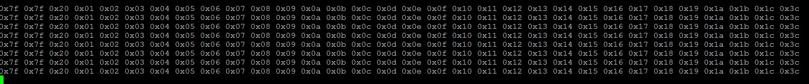

# 前言
*linux* 下编写串口应用程序，无论是中断模式，还是 *select/poll* 模式，每次接收到的数据不一定是自己希望得到的数据。比如数据帧长度为40，有可能先接收到18个字节，接着接收到了12个字节，最后接收到了10个字节。不管怎么折腾，一帧数据总是不能一次接收完全。查阅相关资料，貌似是串口芯片缓存所致。串口芯片缓存满或着超时时间到都会触发读或写中断，这个说法是否真的如此，暂且不管，能不能用一种机制保证一次读到的是一帧数据呢？只有自己编写协议，先把数据分多次接收过来满足一个有效的帧长度之后，再进行处理。
<!--more-->
# 实现
关于 *linux* 串口编程有很多参考例子：[serial-how-to](http://www.faqs.org/docs/Linux-HOWTO/Serial-Programming-HOWTO.html) [serial-Programming-Guide-For-POSIX-OS](http://digilander.libero.it/robang/rubrica/serial.htm)。其他读者可自行 [google](www.google.com)。为避免重复造轮子，本次采用 [libcssl](https://github.com/mwheels/libcssl),也可以从 [sourceforge](https://sourceforge.net/projects/cssl/) 下载它是基于事件驱动的异步串口驱动库，用该库测试时，即出现上面的现象，一帧数据总是分多次接收。为了避免该现象，修改代码如下：
　　```
 static void callback(int id,
               uint8_t *buf,
               int length)
  {
      int i;
      //printf("length:%d\n",length);
      //printf("length:%d\n",length);
      //如果数据帧不是一次接收到的
      //则进行下面的处理，数据包的长度为FRAMELENGTH
      for(i=0;i<length;i++) {
          data[i+pos] = buf[i];
          //printf("0x%02x ",buf[i]);
      }
      //记录位置
      pos += length;
      //收到既定的一帧
      if(pos >= FRAMELENGTH){
          pos = 0;
          data_already = 1;
      }
      //进行处理
      if(data_already == 1){//
 
          for(i=0;i<FRAMELENGTH;i++)
              printf("0x%02x ",data[i]);
          memset(data,0,FRAMELENGTH);
          data_already = 0 ;//数据包准备好信号置零
          printf("\n");
      }
 
 
      //printf("\n");
      //fflush(stdout);
  }
　　```
在中断回调函数中，每次记录收到字节的个数 *pos* ，直到满足既定帧长度。测试结果可正常接收既定的一帧数据包，测试时可自行指定帧长度。
本次测试一帧数据长度为32字节：

完整代码已 *push* 到 [github](https://github.com/StevenShiChina/libcssl-cpp)，欢迎下载测试交流。
