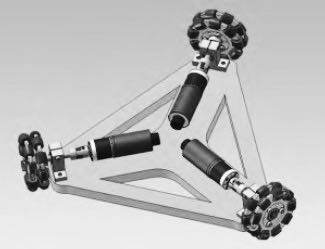
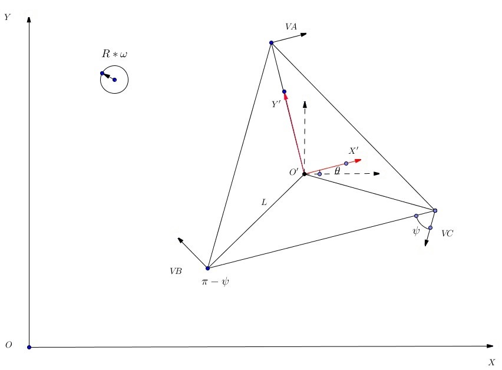

三轮全向移动底盘因其良好的运动性并且结构简单，近年来备受欢迎。三个轮子互相间隔120°，每个全向轮由若干个小滚轮组成，各个滚轮的母线组成一个完整的圆。机器人既可以沿轮面的切线方向移动，也可以沿轮子的轴线方向移动，这两种运动的组合即可以实现平面内任意方向的运动。

<!--more-->
# 运动学分析

为便于运动学分析，我们以理想情况为基础，三个轮子相对于车体的中轴线对称，且物理尺寸重量等完全一致；上层负载均衡，机器人的重心与三个轮子转动轴线的交点重合；三个轮体与地面摩擦力足够大，不会发生打滑现象；机器人中心到三个全向轮的距离相等。
定义绝对坐标系 *XOY*，机器人自身坐标系 *X'O'Y'*。机器人的姿态角为 *θ*，即机器人自身坐标相对于绝对坐标的旋转角度。机器人自身旋转的角速度设为 *W*。 *L* 为三个轮子相对于机器人中心的距离，$V_A$,$V_B$,$V_C$ 分别表示三个轮子沿驱动方向的速度；角度 *ψ* 为 轮子与机器人坐标系 *X* 轴的夹角，这个夹角我们可以算出为 60°。我们假定机器人在任意时刻的速度为 $V = [V_x,V_y,W]$,其中 $V_x$ 和 $V_y$ 分别为机器人在自身坐标系下的  *X* 轴 *Y* 轴方向的速度，*W* 为机器人运动的角速度，假定顺时针方向为正方向。那么可得出机器人运动学方程：
$ V_A= V_x + L W $
$ V_B= -V_x cosψ + V_y sinψ + L W $      
$ V_C= -V_x cosψ - V_y sinψ + L W $
写成矩阵形式为：
$\left[
\begin{matrix}
V_A \\\\
V_B \\\\
V_C \\\\
\end{matrix}
\right] =
\left[
\begin{matrix}
1 & 0 & L \\\\
-cosψ & sinψ & L \\\\
-cosψ & -sinψ & L
\end{matrix}
\right]
\left[
\begin{matrix}
V_x \\\\
V_y \\\\
W \\\\
\end{matrix}
\right] $       
车轮的线速度还可以表示为：
$ V_A = Rω_A $
$ V_B = Rω_B $      
$ V_C = Rω_C $
式中 R 为全向轮的半径，ω 为全向轮旋转角速度,因此得出：
$\left[
\begin{matrix}
ω_A \\\\
ω_B \\\\
ω_C \\\\
\end{matrix}
\right] = R^{-1}
\left[
\begin{matrix}
1 & 0 & L \\\\
-cosψ & sinψ & L \\\\
-cosψ & -sinψ & L
\end{matrix}
\right]
\left[
\begin{matrix}
V_x \\\\
V_y \\\\
W \\\\
\end{matrix}
\right]$
以上是机器人在自身坐标系下的运动学方程，实际应用中还需要转换为全局坐标系，上图中机器人自身坐标与全局坐标的夹角为 *θ*，假设机器人在全局坐标系中的速度为
$V_g = [V_gx,V_gy,W_g]$
那么可以推出：
$V_gx = V_xcosθ - V_ysinθ $
$V_gy = V_xsinθ + V_ycosθ $
因此可以推出机器人相对于自身坐标下的速度 $V = [V_x,V_y,W]$ 与机器人相对于全局坐标下的速度 $V_g = [V_gx,V_gy,W_g]$ 之间的变换关系：

$R(θ)=
\left[
\begin{matrix}
cosθ & -sinθ & 0 \\\\
sinθ &  cosθ & 0 \\\\
0 & 0 & 1 \\\\
\end{matrix}
\right]$

因此两个坐标系下的变换可写成：

$\left[
\begin{matrix}
V_gx \\\\
V_gy \\\\
W_g \\\\
\end{matrix}
\right] = 
\left[
\begin{matrix}
cosθ & -sinθ & 0 \\\\
sinθ &  cosθ & 0 \\\\
0 & 0 & 1 \\\\
\end{matrix}
\right]
\left[
\begin{matrix}
V_x \\\\
V_y \\\\
W \\\\
\end{matrix}
\right]$

 