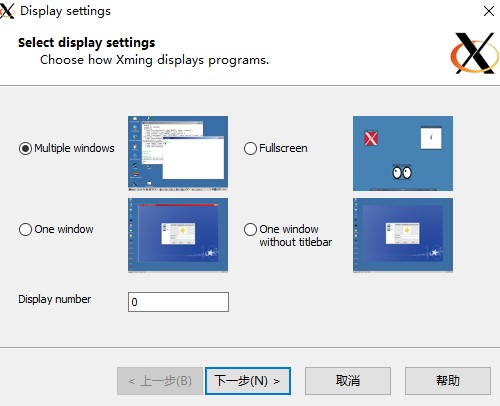
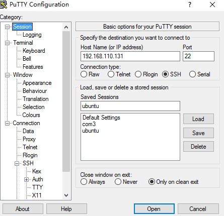
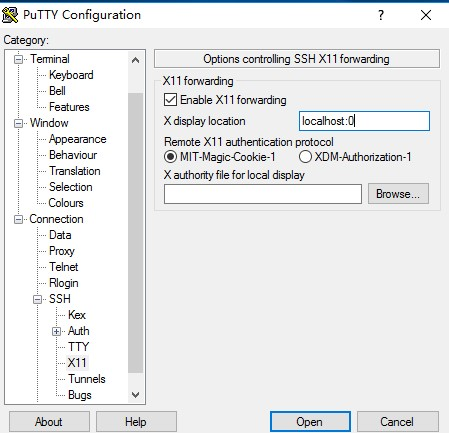
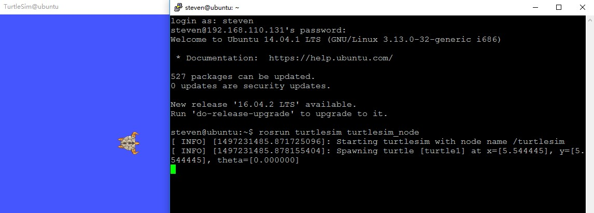

远程登录 linux 一般通过 SSH 协议，或 telnet 协议，这两种协议一般都只是命令行界面，而不能远程运行带有图形界面的应用程序。但是 putty 这款软件支持 X11 Forwarding,如果再配合一个 [X server](https://zh.wikipedia.org/wiki/X_Window%E7%B3%BB%E7%B5%B1) 问题就解决了。一般常用的 [X server](https://zh.wikipedia.org/wiki/X_Window%E7%B3%BB%E7%B5%B1) 有 [Xming](https://sourceforge.net/projects/xming/) 和 [VcXsrv](https://sourceforge.net/projects/vcxsrv/)。基本的原理就是 ubuntu 开启 X11 转发服务，putty 负责数据的转发，而 X Server 进行图形界面的显示。
<!--more-->
# SSH 配置
配置 ubuntu 允许 X11 转发，打开 /etc/ssh/sshd_config 使能 X11 forwarding:
   ```
 X11Forwarding yes
   ```
配置完成后记得重启 SSH 服务：
   ```
 $ sudo /etc/init.d/ssh restart
   ```
# X Server 配置
X Server 可以使用 [Xming](https://sourceforge.net/projects/xming/) 也可以使用 [VcXsrv](https://sourceforge.net/projects/vcxsrv/)，在 win10 64bits 环境下测试 [VcXsrv](https://sourceforge.net/projects/vcxsrv/) 的效果较好。
## [Xming](https://sourceforge.net/projects/xming/) 
Xming 的安装保持默认即可，安装完成后运行 Xlaunch 进行简单的配置：



主要是 Display number 的配置，记住这个号码，之后在 putty 中会用到。保存配置后即可启动 Xming。
## [VcXsrv](https://sourceforge.net/projects/vcxsrv/)
VcXsrv 安装完成后运行 XLaunch 进行配置，和前面 xming 的配置类似，主要是 Display number 我这里配置为 0。
# Putty 配置
Putty 首先选择 SSH 协议，端口 22：

还需配置X11：


注意 X display location 中的 localhost:0 ，这个端口号即是前面设置的 Display number，保持前后一致即可。
登录到 ubuntu 后，在命令行界面打开一个图形界面程序：

比较不爽的是当用键盘控制时，turtle 的反应比较慢，不如直接在 ubuntu 系统内运行快。