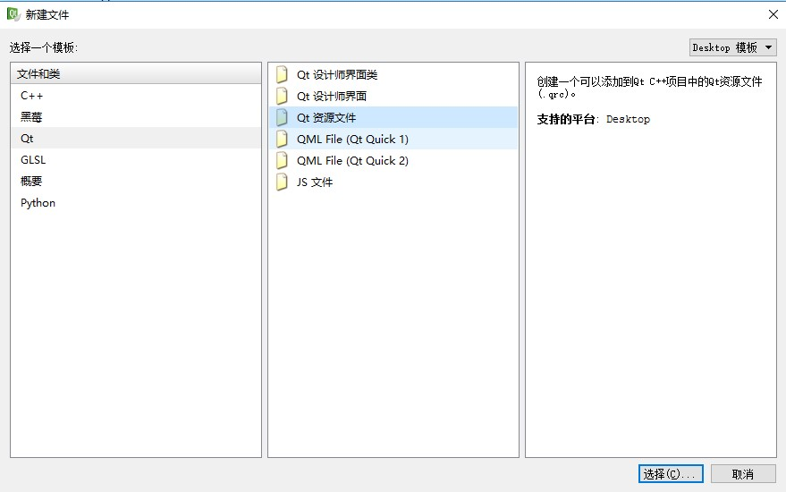
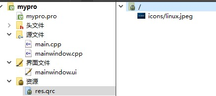

# 前言
　　假如窗体背景为一张图片，想要在图片的某一个位置放置一个*Qlabel*，用于显示一个实时变量，但又不知道这个位置的精确坐标，这个时候该如何实现呢？
# 思路
　　一种方法是借用图片工具，找到指定位置的相对坐标，然后将控件放置在该坐标处;另一种方法可以将图片用网格划分，然后添加一个网格布局，查看指定的位置位于哪一行哪一列，然后将控件放置到布局中。这种方式不能做到精确的定位，但大体上可以使用。考虑到简单实用，选择第二种方法。
# 开始
## 添加资源文件
　　首先创建一个*QWidget*，并设置背景图片。在工程目录下创建一个名为*icons*的文件夹，将图片放置到这个位置。回到*Qt*工程目录，右键自己的工程选择添加新文件->*qt*资源文件: 

假如建立后的资源文件为*res.qrc*,打开后，选择添加前缀，并添加刚才放置的图片文件，添加后的*res.qrc*如下:
## 设置背景图片
　　在设置背景图片后要保证窗口变化时，背景图片能够随着窗口的变化而变化。因此需要重写窗口的*resizeEvent*事件。
　　```
void MainWindow::resizeEvent(QResizeEvent *event)
{
　QWidget::resizeEvent(event);
　QImage image;
　image.load(":/icons/linux.jpeg");
　QPalette palette;
　palette.setBrush(this->backgroundRole(),QBrush(image.scaled(event->size(),Qt::IgnoreAspectRatio,Qt::SmoothTransformation)));
　this->setPalette(palette);
　}
　　```
<!--more-->
显示效果如下：
## 将窗体网格化
假如我想在X字符下面显示一个*Qlabel*，现将窗体分成8行9列因为我的显示器是16:9尺寸，并显示所画的网格线，重写窗体的*paintEvent*事件：
　　```
 void MainWindow::paintEvent(QPaintEvent *event)
 {
　//画网格线
  QPainter painter(this);
  drawMyGrid(&painter,8,9);
  painter.setPen(Qt::black);
　}
 void MainWindow::drawMyGrid(QPainter *painter,int row,int col)
 {
  int Margin=1;
  QRect rect;
  int i,j,x,y;
  rect=QRect(Margin,Margin,width()-2*Margin,height()-2*Margin);
  for(i=0;i<=col;i++)//列
  {
   x=rect.left()+(i*(rect.width()-1)/col);
   painter->drawLine(x,rect.top(),x,rect.bottom());
  }
  for( j=0;j<=row;j++)//行
  {
   y=rect.bottom()-(j*(rect.height()-1)/row);
   painter->drawLine(rect.left(),y,rect.right(),y);
  }
}
　　```
显示效果：
## 在指定位置放置控件
字符X下方的位置为第六行第七列。首先给窗体安装一个*QGridLayout*布局，将*Qlabel*放置到该布局中。
　　```
　label1  = new QLabel(tr("Text"));
　label1->setStyleSheet("color:white;font:bold;font-size:30");
　QGridLayout *mylayout     = new QGridLayout;
　mylayout->addWidget(label1,5,6,1,1);//第六行第七列，占用1行1列
　QWidget * widget = new QWidget(this);
　widget->setLayout(mylayout);//安装布局
　setCentralWidget(widget);
　　```
也可以通过以下代码设置行列的宽高比例:
　　```
 mylayout->setColumnStretch(0,1);//设置第一列的宽度比例
 mylayout->setRowStretch(0,1);//设置第一行的高度比例
　　```
如果不设置默认为1:1
最后效果:
