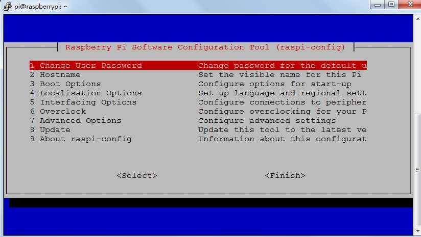
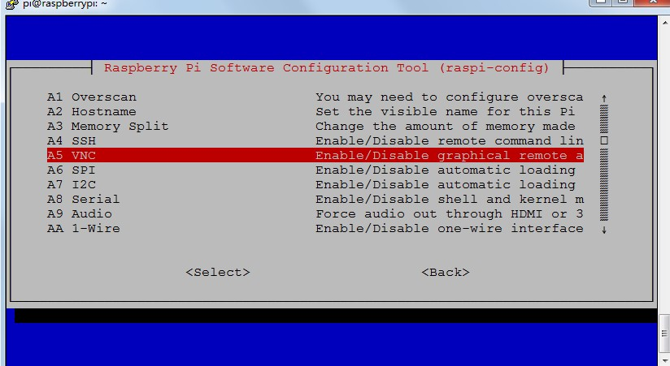
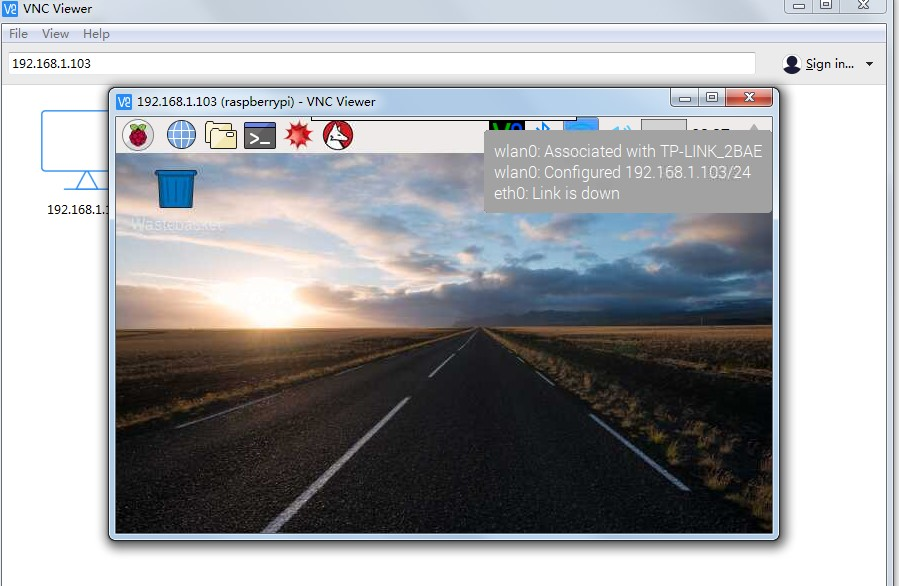
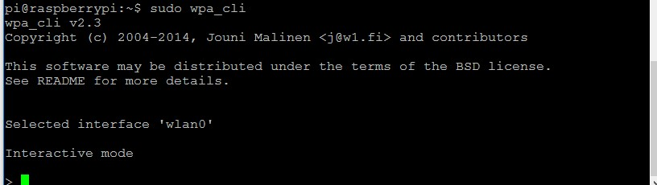

前段时间入手一块树莓派[raspberryPi](https://www.raspberrypi.org/)型号为3B。关于它的介绍这里就不多说了，可自行[google](https://www.google.com)。使用前需要准备一张SD卡用于安装系统镜像。容量尽可能大，最好不低于16G。树莓派支持多种平台，因后续要安装[ROS](http://www.ros.org/)，考虑到官方支持的稳定性，选用 *Raspbian* 平台镜像。因为*Raspbian* 是官方推荐的支持的操作系统，而[Ros-indigo](http://wiki.ros.org/cn/indigo)也刚好有基于该平台的安装包。
# 镜像安装
参考官网[Install-Images](https://www.raspberrypi.org/documentation/installation/installing-images/)。我安装的版本为*2017-03-02-raspbian-jessie.img*
<!--more-->
# 开启SSH和串口
该版本默认不开启SSH以及串口功能，需要手动开启。树莓派板子需要连接显示器、键盘、鼠标。在终端中输入:
　　```
  $sudo raspi-config
　　```
进行配置。树莓派默认的用户名为*pi*密码为*raspberry*。

进入第5项开启SSH以及GPIO14 GPIO15对应的串口控制台功能。
# 开启VNC远程桌面
同样在配置菜单的第5项开启:
在windows上安装[VNC Viewer](https://www.realvnc.com/)并且输入树莓派的IP地址就可以远程访问树莓派。
如果不知道IP地址，可以使用工具[freeIpScanner](http://www.eusing.com/ipscan/free_ip_scanner.htm)获取IP地址。或者使用linux下的nmap命令,nmap命令说明：
　　```
  $namp 192.168.1.1/24 //扫描整个子网
  $namp 192.168.1.x (x:0-255) //扫描单个主机
  $namp 192.168.1.x 192.168.1.y //扫描多个目标
  $namp 192.168.1.100-255 扫描某个范围内的目标#ip地址在192.168.1.100和192.168.1.255之间 
  $nmap 192.168.1.1/24 -exclude 192.168.1.1 扫描一个网段除了某个主机
  $nmap -p80,21,23 192.168.1.1 扫描某个主机下的端口（80端口 21端口 23 端口）

　　```
# 手动配置wifi
命令行下启动 *wpa_cli* 参考 [WPA_supplicant](http://w1.fi/wpa_supplicant/)：
　　```
 $sudo wpa_cli
　　```

　 ```
  status //列出目前的联网状态
  list_networks //记住网络ID
  set_network "ID" key_mgmt WPA-PSK  //设置无线网络加密方式
  set_network "ID" psk "yourpassword"   //设置密码
  enable_network "ID"   //使能该网络
  save_config //保存配置
  　```
完成之后会在文件/etc/wpa_supplicant/wpa_supplicant.conf看到配置信息已经写入到文件,此时可以查看网络是否连接:
  　```
 $ifconfig
  　```
