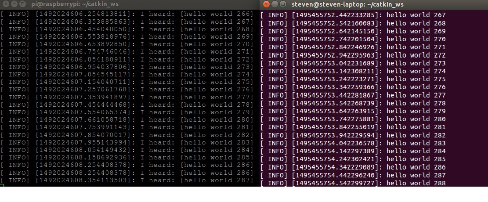
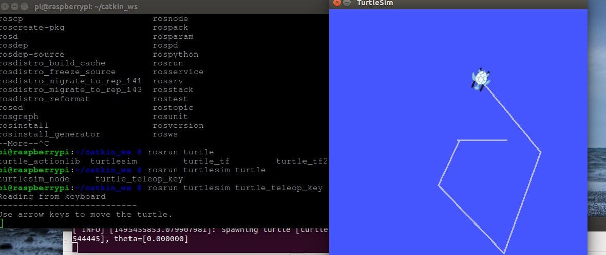

# 前言
ROS移动平台使用的是树莓派3B，资源有限，只能运行一些低级任务，又不具备显示器，想实时的看到ROS的运行情况只能依靠远程登录的方式。可以让PC负责运行界面，树莓派负责底层的传感器数据采集，比如激光雷达的数据采集，通过网络传给PC，PC上运行界面程序，将树莓派传过来的数据进行处理，并生成地图。要实现类似功能，需要进行多个运行ROS的设备间的通讯。
<!--more-->
# 配置
首先保证 *raspberryPi* 与 *PC*在一个局域网内，并获取各自的 *IP* 地址。假设 *PC* 的 *IP*：192.168.2.102；*raspberryPi* 的 *IP*：192.168.2.105；之后查看各自的主机名,使用命令：
　　```
 $hostname
　　```
假设 *PC* 的主机名为： *steven-laptop*,而 *raspberryPi* 的主机名为 *raspberry*。我们需要将各自的主机名通知对方。在 *raspberryPi* 中打开 */etc/hosts*文件加入 *PC* 的主机名以及IP地址：
　　```
 192.168.2.102 *steven-laptop*
　　```
同样在 *PC* 中告知 *raspberryPi* 的主机名和 *IP* 地址,修改*/etc/hosts*：
　　```
 192.168.2.105 raspberry
　　```
此时，可以使用:
　　```
 $ping 对方主机名
　　```
进行连接测试。完成之后在 *PC* 中指定ROS通讯的主机名以及ROS服务器的地,让 *PC* 作为ROS服务器：
　　```
export ROS_HOSTNAME=steven-laptop
export ROS_MASTER_URI=http://steven-laptop:11311
　　```
在 *raspberryPi* 中指定 *PC* 作为 *ROS Master*:
　　```
export ROS_MASTER_URI=http://steven-laptop:11311
　　```
# 跨机运行talker/listenner
做完以上配置，即可进行多机通信的测试。先在 *PC* 上开一个 *terminal* 运行 *roscore*:
 *PC*
　　```
 $roscore & //'&'指后台运行
　　```
然后运行 *beginner_tutorials*(参考 [ROS tutorial](http://wiki.ros.org/cn/ROS/Tutorials)) 中的节点 *talker*;在  *raspberryPi* 中运行 *beginner_tutorials* 中的 *listenner* 节点。保证两个节点中发布的主题和订阅的主题名字一样。
此时可以在 *raspberryPi* 中收到 *PC* 传过来的信息：

# 跨机运行turtlesim
在PC上运行：
　　```
$roscore & 
$rosrun turtlesim turtlesim_node
　　```
在 *raspberryPi* 上使用键盘进行控制：
　　```
$rosrun turtlesim turtle_teleop_key
　　```
效果图：
