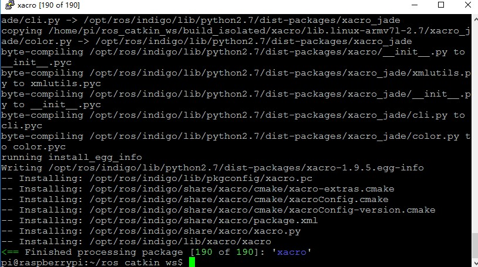
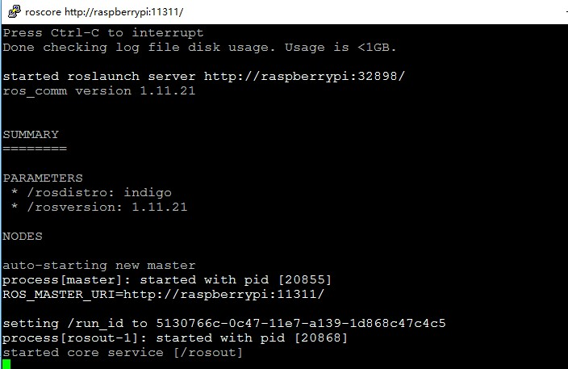

# 前言
目前对于基于 [ROS](http://www.ros.org/) 的可移动平台，有两种方案较为流行用户较多，可参考的资料也多。一种是使用英伟达的 [TK1](http://www.nvidia.cn/object/jetson-tk1-embedded-dev-kit-cn.html)，另外一种是使用 [raspberryPi](https://www.raspberrypi.org/)。相对于 [TK1](http://www.nvidia.cn/object/jetson-tk1-embedded-dev-kit-cn.html)，树莓派在价格上更亲民，虽然性能上差一些，在计算 [SLAM](https://zh.wikipedia.org/wiki/%E5%8D%B3%E6%97%B6%E5%AE%9A%E4%BD%8D%E4%B8%8E%E5%9C%B0%E5%9B%BE%E6%9E%84%E5%BB%BA) 时会有卡顿现象，但对于入门级用户来说，也是个不错的选择。
<!--more-->
# 树莓派3B上安装ROS-Indigo
 *环境*： *Raspbian OS Jessie*
 *硬件*： *raspberryPi 3B*以及一张*16G SD 卡*
 *参考*： [InstallROSIndigoOnRaspberryPi](http://wiki.ros.org/ROSberryPi/Installing%20ROS%20Indigo%20on%20Raspberry%20Pi)
## 添加ROS代码仓
添加ROS源以及key
　　```
 $sudo sh -c 'echo "deb http://packages.ros.org/ros/ubuntu jessie main" > /etc/apt/sources.list.d/ros-latest.list'
 $wget https://raw.githubusercontent.com/ros/rosdistro/master/ros.key -O - | sudo apt-key add -
　　```
## 更新
　　```
 $sudo apt-get update
 $sudo apt-get upgrade
　　```
## 安装引导程序依赖项
　　```
 $sudo apt-get install python-pip python-setuptools python-yaml python-distribute python-docutils python-dateutil python-six
 $sudo pip install rosdep rosinstall_generator wstool rosinstall
　　```
## 安装vim
　　```
 $sudo apt-get install vim
　　```
## 增大swap空间
修改/etc/dphys-swapfile文件，增大交换空间，以免编译ROS源码时出现内存不足现象。将CONF_SWAPSIZE 修改为 2048
　　```
CONF_SWAPSIZE=2048
　　```
## 初始化rosdep
　　```
 $sudo rosdep init
 $rosdep update
　　```
## 创建workspace
创建一个workspace用于存储和编译ROS源码
　　```
 $mkdir ~/ros_catkin_ws
 $cd ~/ros_catkin_ws/

　　```
## 下载源码
选择desktop完全版本
　　```
 $rosinstall_generator desktop --rosdistro indigo --deps --wet-only --exclude roslisp --tar > indigo-desktop-wet.rosinstall
 $wstool init -j4 src indigo-desktop-wet.rosinstall
　　```
源代码将会保存在目录 *~/ros_catkin_ws/src* 下，*-j4*意思是开启4个线程同时下载。如果下载异常中断，可以尝试使用下面命令恢复：
　　```
 $wstool update -j4 -t src
　　```
下载时间很漫长。
## 解决ROS依赖
在正式编译ROS之前，我们还需要手动安装以下几个依赖包：
 *libconsole-bridge-dev*
 *liblz4-dev*
 *liburdfdom-headers-dev* 
 *liburdfdom-dev* 
 *collada-dom-dev*
为这些依赖包建立单独的用于编译安装的文件夹，同时安装checkinstall和cmake：
　　```
 $mkdir ~/ros_catkin_ws/external_src
 $sudo apt-get install checkinstall cmake
　　```
如果无法安装，更新一下再安装：
　　```
 $sudo apt-get update && sudo apt-get upgrade
　　```
然后添加：
　　```
 $sudo sh -c 'echo "deb-src http://mirrordirector.raspbian.org/raspbian/ testing main contrib non-free rpi" >> /etc/apt/sources.list'
　　```
更新：
　　```
 $sudo apt-get update
　　```
## 安装libconsole-bridge-dev
　　```
 $cd ~/ros_catkin_ws/external_src
 $sudo apt-get build-dep console-bridge
 $apt-get source -b console-bridge
 $sudo dpkg -i libconsole-bridge0.2*.deb libconsole-bridge-dev_*.deb
　　```
## 安装liblz4-dev
　　```
 $cd ~/ros_catkin_ws/external_src
 $apt-get source -b lz4 //获取，该步骤耗时很长
 $sudo dpkg -i liblz4-*.deb //安装
　　```
## 安装liburdfdom-headers-dev
　　```　　
 $cd ~/ros_catkin_ws/external_src
 $git clone https://github.com/ros/urdfdom_headers.git
 $git reset --hard 9aed725
 $cd urdfdom_headers
 $cmake .
 $sudo checkinstall make installl
　　```
最后一步提示：
　　```
The package documentation directory ./doc-pak does not exist.
Should I create a default set of package docs?  [y]: y
This package will be built according to these values:

0 -  Maintainer: [ root@raspberrypi ]
1 -  Summary: [ Package created with checkinstall 1.6.2 ]
2 -  Name:    [ urdfdom-headers ]
3 -  Version: [ 20170318 ]
4 -  Release: [ 1 ]
5 -  License: [ GPL ]
6 -  Group:   [ checkinstall ]
7 -  Architecture: [ armhf ]
8 -  Source location: [ urdfdom_headers ]
9 -  Alternate source location: [  ]
10 - Requires: [  ]
11 - Provides: [ urdfdom-headers ]
12 - Conflicts: [  ]
13 - Replaces: [  ]
　　```
这里的'9aed725'就是将"liburdfdom-headers-dev"的安装版本变成我们需要的1.0.0版本。check-install开始会让你输入包的描述，可以直接按回车跳过。当checkinstall询问是否改变安装选项时，选择［2］，将名字从"urdfdom-headers" 改为 "liburdfdom-headers-dev"，其余有[y]或[n]的问题都输入'n'按回车， 否则会编译出错
完成后检查安装的包是否正确:
　　```
 $dpkg -l | grep urdf
　　```
如果正确会输出：
　　```
ii  liburdfdom-headers-dev       20170318-1     armhf        Package created with checkinstall 1.6.2
　　```
## 安装liburdfdom-dev
　　```
 $cd ~/ros_catkin_ws/external_src
 $sudo apt-get install libboost-test-dev libtinyxml-dev
 $git clone https://github.com/ros/urdfdom.git
 $cd urdfdom
 $cmake .
 $sudo checkinstall make install
　　```
check-install开始会让提示输入包的描述，可以直接按回车跳过。当checkinstall询问是否改变安装选项时，选择［2］，将名字从 "urdfdom"改为"liburdfdom-dev" ，其余有[y]或[n]的问题都输入'n'按回车， 否则会编译出错。
编译出错提示找不到文件：utils.h
添加一个文件(utils.h)到/usr/local/include/urdf_model目录下：
　　```
 $cd /usr/local/include/urdf_model
 $sudo wget https://raw.githubusercontent.com/ros/urdfdom_headers/master/urdf_model/include/urdf_model/utils.h
　　```
重新编译
## 安装collada-dom-dev
　　```
 $cd ~/ros_catkin_ws/external_src
 $sudo apt-get install libboost-filesystem-dev libxml2-dev
 $wget http://downloads.sourceforge.net/project/collada-dom/Collada%20DOM/Collada%20DOM%202.4/collada-dom-2.4.0.tgz
 $tar -xzf collada-dom-2.4.0.tgz
 $cd collada-dom-2.4.0
 $cmake .
 $sudo checkinstall make install
　　```
check-install开始会让你输入包的描述，可以直接按回车跳过。当checkinstall询问是否改变安装选项时，选择［2］，将名字从 "collada-dom"改为 "collada-dom-dev" ，其余有[y]或[n]的问题都输入'n'按回车， 否则会编译出错。
## rosdep依赖
　　```
 $cd ~/ros_catkin_ws
 $sudo rosdep init
 $rosdep update
 $rosdep install --from-paths src --ignore-src --rosdistro indigo -y -r --os=debian:Jessie

　　```
*rosdep install*命令会寻找所有src目录的package并递归安装依赖，要安装的依赖包有点多，耐心等待。rosdep会检查src文件夹，安装其他的依赖包。
## 编译catkin工作空间
在开始编译之前，先打两个补丁
打开文件: 
　　```
 $vim ~/ros_catkin_ws/src/robot_model/collada_urdf/src/collada_urdf.cpp
　　```
在最后一个#include后添加
　　```
 #ifdef __arm__  
 #include <strings.h>
 bool Assimp::IOSystem::ComparePaths(const char *p1, const char *p2) const  
 {  
 return !::strcasecmp(p1,p2);  
 } 
 #endif
　　```
修改~/ros_catkin_ws/src/rviz/src/rviz/mesh_loader.cpp文件，在最后一个#include（如果#include的下一行是#endif则放到#endif后）行后加入以下代码
　　```
 #ifdef __arm__                 // fix for ARM build
 #include <strings.h>
 bool Assimp::IOSystem::ComparePaths(const char *p1, const char *p2) const
 {
    return !::strcasecmp(p1, p2);
 }
 #endif
　　```
编译：
　　```
 $cd ~/ros_catkin_ws
 $sudo ./src/catkin/bin/catkin_make_isolated --install -DCMAKE_BUILD_TYPE=Release --install-space /opt/ros/indigo -j4

　　```
上面命令将编译文件安装到/opt/ros/indigo –j4是使用4个线程编译.
## 出现的错误
###error: ‘shared_ptr’ in namespace ‘std’ does not name a template type
执行上面的编译命令提示错误：
　　```
in file included from /home/pi/ros_catkin_ws/src/robot_model/urdf/include/urdf/model.h:43:0, 
                 from /home/pi/ros_catkin_ws/src/robot_model/urdf/src/model.cpp:37: 
/home/pi/ros_catkin_ws/devel_isolated/urdf/include/urdf/urdfdom_compatibility.h:78:14: error: ‘shared_ptr’ in namespace ‘std’ does not name a template type 
 typedef std::shared_ptr<ModelInterface> ModelInterfaceSharedPtr; 
              ^ 
/home/pi/ros_catkin_ws/devel_isolated/urdf/include/urdf/urdfdom_compatibility.h:79:14: error: ‘shared_ptr’ in namespace ‘std’ does not name a template type 
 typedef std::shared_ptr<const ModelInterface> ModelInterfaceConstSharedPtr; 
              ^ 
/home/pi/ros_catkin_ws/devel_isolated/urdf/include/urdf/urdfdom_compatibility.h:80:14: error: ‘weak_ptr’ in namespace ‘std’ does not name a template type 
 typedef std::weak_ptr<ModelInterface> ModelInterfaceWeakPtr; 
              ^ 
CMakeFiles/urdf.dir/build.make:62: recipe for target 'CMakeFiles/urdf.dir/src/model.cpp.o' failed

　　```
修改文件：
/home/pi/ros_catkin_ws/devel_isolated/urdf/include/urdf/urdfdom_compatibility.h
从78行开始到80行都屏蔽掉
　　```
 /*
 typedef std::shared_ptr<ModelInterface> ModelInterfaceSharedPtr;
 typedef std::shared_ptr<const ModelInterface> ModelInterfaceConstSharedPtr;
 typedef std::weak_ptr<ModelInterface> ModelInterfaceWeakPtr;
*/
　　```
再次编译成功。这个过程非常漫长。
## 测试
完成之后设置环境变量：
　　```
 $source /opt/ros/indigo/setup.bash
　　```
设置ROS环境变量在每次启动shell时自动添加到bash会话
　　```
 $echo "source /opt/ros/indigo/setup.bash" >> ~/.bashrc
　　```
到这里我们的ROS完整版就已经成功安装好了，不妨运行roscore试一下
　　```
 $roscore
　　```



