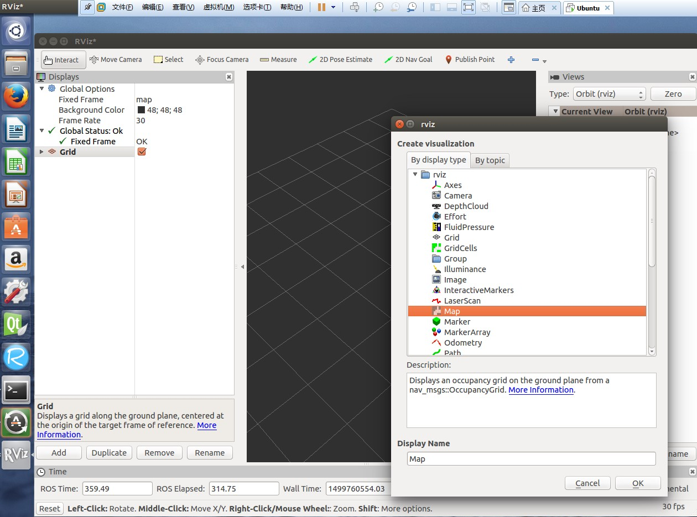
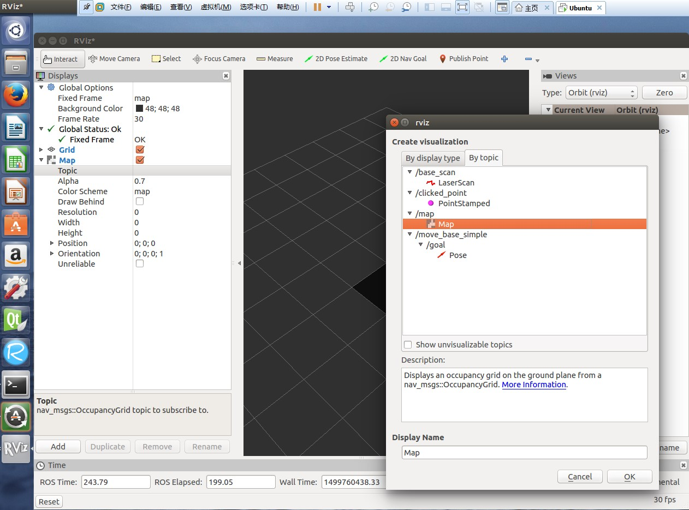
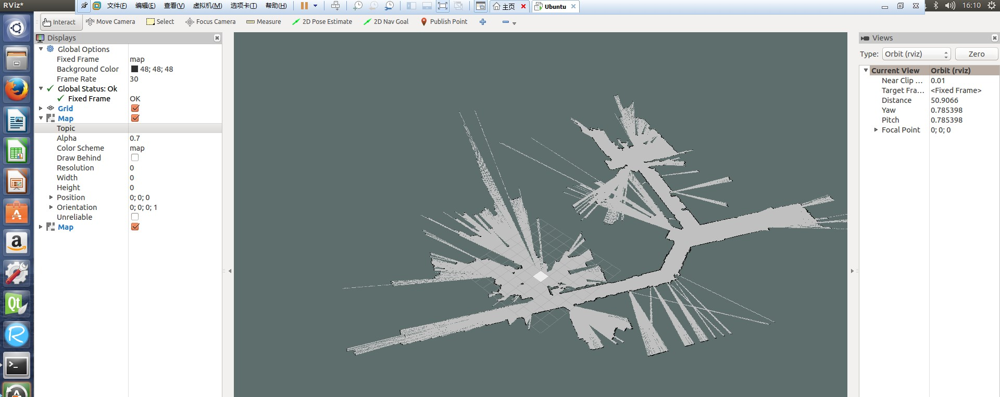

[Rviz](http://wiki.ros.org/rviz) 是 ROS 提供的一个非常强大的图形化显示工具，在实际机器人上建图之前我们先使用已有的地图记录进行模拟 SLAM 的过程，加深理解，为随后的真实环境建图打下基础。建立封闭环境下的二维地图是导航、定位、路径规划的前提。SLAM 全称 simultaneous localization and mapping 即时定位与地图构建，SLAM 理论最早在1988年由 Smith、Self以及 Cheeseman 共同提出。本篇学习使用 [Rviz](http://wiki.ros.org/rviz) 实时观测地图构建的过程，需要用到已有的地图建立的数据记录，[可在此下载](http://pr.willowgarage.com/data/gmapping/),需要安装 [gmapping](http://wiki.ros.org/gmapping) 包。
<!--more-->

# gmapping 安装
ROS 目前提供两种方法实现 SLAM，一种叫做 [hector_mapping](http://wiki.ros.org/hector_mapping),另外一种叫做 [gmapping](http://wiki.ros.org/gmapping)。两种算法不同，[gmapping](http://wiki.ros.org/gmapping) 算法较早，它使用粒子滤波并且需要里程计输入，但对传感器性能要求较低，适合初学者；[hector_mapping](http://wiki.ros.org/hector_mapping) 性能不错，它通过最小二乘法匹配扫描点，并且依赖高精度的激光雷达数据，但是不需要里程计输入。我们先尝试 [gmapping](http://wiki.ros.org/gmapping)，安装：
   ```
 $ sudo apt-get install ros-indigo-slam-gmapping
   ```
# Rviz开启SLAM观测
ROS 启用重放时的数据中的时间不是现在的本地时间，而是历史时间，因此我们需要告诉 ROS 系统，我们使用历史模拟时间：
   ```
 $ rosparam set use_sim_time true 
   ```
准备好已有的激光数据记录文件：
   ```
 $ wget http://pr.willowgarage.com/data/gmapping/basic_localization_stage.bag
   ```
记得开启 ROS master :
   ```
 $ roscore &
   ```
 [gmapping](http://wiki.ros.org/gmapping) 需要两个输入，一个为激光雷达数据，另外一个是全局 tf转换关系，这个 tf 中需要一个里程计数据以构建坐标系。启用 [gmapping](http://wiki.ros.org/gmapping) 监听 base_scan 话题发来的消息，该话题由模拟器发布：
   ```
 $ rosrun gmapping slam_gmapping scan:=base_scan
   ```
重放激光扫描的数据记录：
   ```
 $ rosbag play --clock basic_localization_stage.bag
   ```
启动 Rviz:
   ```
 $ rosrun rviz rviz
   ```
此时只是启动了Rviz 并没有给Rviz添加输入，因此它显示为空的网格，[gmapping](http://wiki.ros.org/gmapping) 的输出话题为 /map,因此我们将该 topic 添加到Rviz的输入,开启 Rviz 后，点击 add 按钮，选择 map 点击OK，会出现一个空的地图：

 

之后点击 map 中的topic，再点击 add 添加话题 /map:



最后地图会慢慢的展现出来：

