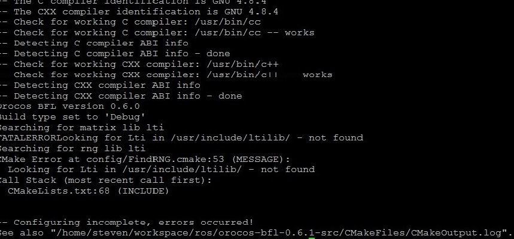

# 前言
计划在树莓派上仿真一下[ROS](http://www.ros.org/) 的导航功能，需要安装 [navigation](https://github.com/ros-planning/navigation)包，结果编译 [navigation](https://github.com/ros-planning/navigation) 包时提示错误：
　　```
 – package ‘orocos-bfl’ not found 
 CMake Error at /usr/share/cmake-2.8/Modules/FindPkgConfig.cmake:283 (message): 
 A required package was not found 
 Call Stack (most recent call first): 
 /usr/share/cmake-2.8/Modules/FindPkgConfig.cmake:337 (_pkg_check_modules_internal) 
 robot_pose_ekf/CMakeLists.txt:6 (pkg_check_modules)
　　```
于是填了后面的坑...
<!--more-->
# 贝叶斯滤波库
 *package ‘orocos-bfl’*是贝叶斯滤波库，参考 [BFL](http://www.orocos.org/bfl)。贝叶斯滤波库能够为动态贝叶斯网络的推理提供一个应用程序独立框架，以及递归信息处理和基于贝叶斯规则的估计算法,如卡尔曼滤波器,粒子过滤器、蒙特卡洛方法等，多应用于机器人的导航中。
## 移植
首先下载源码：
　　```
 $wget http://people.mech.kuleuven.be/~tdelaet/bfl_tar/orocos-bfl-0.6.1-src.tar.bz2
　　```
解压并建立 *build* 目录：
　　```
 $tar jxvf orocos-bfl-0.6.1-src.tar.bz2
 $cd  orocos-bfl-0.6.1-src
 $mkdir build
　　```
编译：
　　```
 $cmake .
　　```
提示错误：
缺少 [LTI-Lib](http://ltilib.sourceforge.net/doc/homepage/index.shtml) 库, [LTI-Lib](http://ltilib.sourceforge.net/doc/homepage/index.shtml) 是一个基于 *C++* 的面向对象的图像处理和计算机视觉库。
### LTI-Lib库的移植
方法参考 [LTI-Install-Guide](https://people.mech.kuleuven.be/~tdelaet/bfl_doc/installation_guide/node5.html)，树莓派貌似只能源码安装。
安装之前先安装 *libxt-dev* 和 *libboost*
　　```
 $sudo apt-get install libxt-dev
 $sudo apt-get install libboost-dev
　　```
当然也可以源码安装*libxt-dev*：
　　```
 $https://launchpad.net/ubuntu/+archive/primary/+files/libxt_1.1.4.orig.tar.gz
 $tar zxvf libxt_1.1.4.orig.tar.gz
 $cd libxt_1.1.4.orig
 $make  
 $sudo make install 
　　```
源码安装 [libboost-dev](https://sourceforge.net/projects/boost/files/) 参考 [Boost-Install](https://people.mech.kuleuven.be/~tdelaet/bfl_doc/installation_guide/node7.html)
　　```
 $tar -xzvf boost_1_34_0.tar.gz
 $cd boost_1_34_o
 $./configure
 $make 
 $sudo make install
　　```
源码安装[LTI-Lib](http://ltilib.sourceforge.net/doc/homepage/index.shtml)
下载源码[LTI-Source-Code](https://sourceforge.net/projects/ltilib/files/LTI-Lib-1/1.9.16/),并解压进入到 *linux* 目录：
　　```
 $tar zxvf 100410_ltilib-1.9.16.tar.gz
 $tar zxvf 100410_ltilib-extras-1.9.16.tar.gz
 $cd ltilib/linux

　　```
生成Makefile：

　　```
 $make -f Makefile.cvs
 $./configure --disable-debug --without-gtk --disable-gtk --prefix=~/install

　　```
编译安装,默认的安装目录是/usr/local/:
　　```
 $make
 $sudo make install
　　```
## 再次回到BFL的编译
　　```
 $tar -xjvf orocos-bfl-0.6.1-src.tar.bz2#解压
 $cd orocos-ocl-1.8.0
 $mkdir build
 $cmake .
 $make
 $make check //测试编译结果
 $sudo make install //安装
　　```
# 遇到的问题
编译过程中遇到很多问题，尤其是 [LTI-Lib](http://ltilib.sourceforge.net/doc/homepage/index.shtml) 库的编译，该库貌似最近没有更新，而且不适应新的 *G++*编译器。
## aclocal: not found
编译 [LTI-Lib](http://ltilib.sourceforge.net/doc/homepage/index.shtml) 时在步骤 *make* 提示错误：
　　```
 $make -f Makefile.cvs
  Calling aclocal...
  /bin/sh: 2: aclocal: not found
  make: *** [aclocal.m4] Error 127

　　```
需要安装 *autoconf* 
　　```
 $sudo apt-get install autoconf
　　```
## cannot run /bin/bash ./config.sub
在 [LTI-Lib](http://ltilib.sourceforge.net/doc/homepage/index.shtml) 的编译配置步骤./configure出现错误：
　　```
 cannot run /bin/bash ./config.sub
　　```
确定已安装libtool libtool-ltdl libtool-ltdl-devel
如果没安装，使用以下命令安装：
　　```
 $sudo apt-get  install  libtool
 $sudo apt-get  install  libltdl-dev
　　```
如果都已安装应该是链接出了问题。
　　```
 $ls -al config/* 查看链接路径
 $find / -name config.sub 或者locate config.sub 查找config.sub的路径
 $ln -s -f /正确路径/config.sub config.sub
　　```
例如我的:
　　```
 $ln -s -f /usr/share/libtool/config/config.sub config.sub
　　```
同样的道理：config.guess路径不对也这样改过来,或者直接拷贝系统下的文件：
 */usr/share/libtool/config/config.sub* 和 *config.guess *到LTI源码目录。
## configure: error: cannot compile a simple Fortran program
 配置 [LTI-Lib](http://ltilib.sourceforge.net/doc/homepage/index.shtml) 时出现错误：
　　```
 ./configure
 checking for Fortran 77 libraries of ...
 checking for gcc... gcc
 checking whether we are using the GNU C compiler... yes
 checking whether gcc accepts -g... yes
 checking for gcc option to accept ISO C89... none needed
 checking for dummy main to link with Fortran 77 libraries... none
 checking for Fortran 77 name-mangling scheme... configure: error: in `/home/steven/workspace/ros/ ltilib/linux':
 configure: error: cannot compile a simple Fortran program
 See `config.log' for more details
　　```
解决：
　　```
 $sudo apt-get install f2c gfortran libblas-dev liblapack-dev libpcre3-dev libreadline-dev
　　```
## setParameters’ was not declared in this scope
　　```
 make
 ../src/math/ltiCyclicTridiagonalEquationSystem_template.h: In instantiation of ‘lti::cyclicTridiagonalEquationSystem<T>::cyclicTridiagonalEquationSystem(const lti::cyclicTridiagonalEquationSystem<T>::parameters&) [with T = double]’:
 ../src/math/ltiCyclicTridiagonalEquationSystem.cpp:44:18:   required from here
 ../src/math/ltiCyclicTridiagonalEquationSystem_template.h:40:28: error: ‘setParameters’ was not declared in this scope, and no declarations were found by argument-dependent lookup at the point of instantiation [-fpermissive]
     setParameters(theParams);
                            ^
 ../src/math/ltiCyclicTridiagonalEquationSystem_template.h:40:28: note: declarations in dependent  base ‘lti::functor’ are not found by unqualified lookup
 ../src/math/ltiCyclicTridiagonalEquationSystem_template.h:40:28: note: use ‘this->setParameters’ instead
 ../src/math/ltiCyclicTridiagonalEquationSystem_template.h: In instantiation of ‘lti::cyclicTridiagonalEquationSystem<T>::cyclicTridiagonalEquationSystem(lti::vector<T>, lti::vector<T>, lti::vector<T>, const T&, const T&) [with T = double]’:
 ../src/math/ltiCyclicTridiagonalEquationSystem.cpp:44:18:   required from here
 ../src/math/ltiCyclicTridiagonalEquationSystem_template.h:54:20: error: ‘setParameters’ was not declared in this scope, and no declarations were found by argument-dependent lookup at the point of instantiation [-fpermissive]
　　```
经确认 *setParameters* 是有定义的，在文件 *src/basics/ltiFunctor.h* 中。突然想到是不是编译器的版本问题，果断降级编译器，考虑将GCC降级 目前系统的gcc版本为4.8将其降级为4.6：
　　```
$sudo apt-get install gcc-4.6 g++-4.6
　　```
如果下载deb文件，则安装使用命令：
　　```
 $sudo dpkg –i *.deb
 $sudo apt-get -f install //然后修改系统依赖
　　```
设置系统使用的默认 GCC
　　```
 $ln -f -s /usr/bin/gcc-4.6 /usr/bin/gcc
 $ln -f -s /usr/bin/gcc-ar-4.6 /usr/bin/gcc-ar
 $ln -f -s /usr/bin/gcc-nm-4.6 /usr/bin/gcc-nm
 $ln -f -s /usr/bin/gcc-ranlib-4.6 /usr/bin/gcc-ranlib
 $ln -f -s /usr/bin/g++-4.6 /usr/bin/g++
　　```
##  linux/videodev.h: No such file or directory
make 后出现的错误：
　　```
 ../src/io/ltiJPEGLibFunctor.cpp: In member function ‘bool lti::loadJPEG::load(FILE*, lti::image&, bool&)’:
 ../src/io/ltiJPEGLibFunctor.cpp:309:35: warning: variable ‘rowCounter’ set but not used [-Wunused-but-set-variable]
 Compiling debug version of ../src/io/ltiLeutronFrameGrabber.cpp
 Compiling debug version of ../src/io/ltiLncFeatureFile.cpp
 Compiling debug version of ../src/io/ltiLoadImageList.cpp
 Compiling debug version of ../src/io/ltiLoadVectorImageList.cpp
 Compiling debug version of ../src/io/ltiLTIFunctor.cpp
 Compiling debug version of ../src/io/ltiMicroEnablePulnix.cpp
 Compiling debug version of ../src/io/ltiPanTiltUnit.cpp
 Compiling debug version of ../src/io/ltiPNGFunctor.cpp
 Compiling debug version of ../src/io/ltiPNGLibFunctor.cpp
 Compiling debug version of ../src/io/ltiQuickCam.cpp
 Compiling debug version of ../src/io/ltiRunLengthCodec.cpp
 Compiling debug version of ../src/io/ltiSonyEviD100P.cpp
 Compiling debug version of ../src/io/ltiToUCam.cpp
 ../src/io/ltiToUCam.cpp:57:28: fatal error: linux/videodev.h: No such file or directory
 compilation terminated.
 make: *** [../obj/debug/ltiToUCam.o] Error 1
　　```
新版内核中已经不再有 *videodev.h* 文件，而是用 *libv4l1-videodev.h* 代替。先查找系统中是否有该文件：
　　```
 $sudo find / -name videodev.h
　　```
系统不存在此文件需要安装：
　　```
$sudo apt-get install libv4l-dev
　　```
指向：
　　```
 $sudo ln -s /usr/include/libv4l1-videodev.h /usr/include/linux/videodev.h
　　```
## pwc-ioctl.h: No such file or directory
lit库make 后的错误：
　　```
 ../src/io/ltiToUCam.cpp:58:23: fatal error: pwc-ioctl.h: No such file or directory
compilation terminated.
　　```
系统提示不存在文件 [pwc-ioctl.h](https://saillard.org/linux/pwc/) 这个文件应该是webcamera的驱动文件,下载地址: https://saillard.org/linux/pwc/files/pwc-10.0.11.tar.bz2
下载完后，解压并找到 *pwc-ioctl.h* 文件，拷贝到 *lti* 源代码 的 */src/io/* 目录下。


