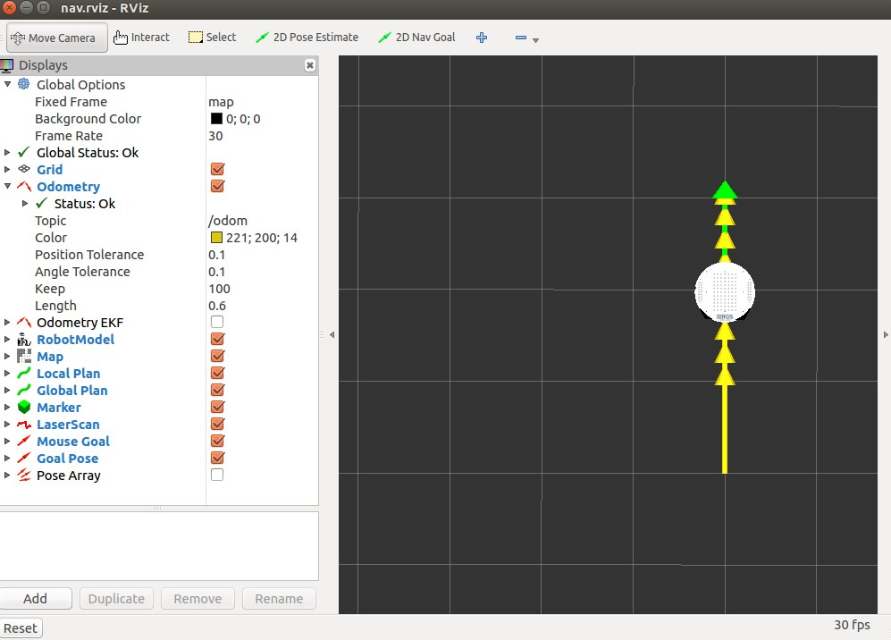
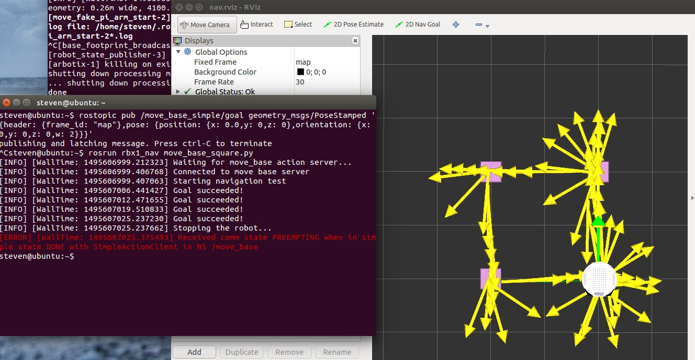
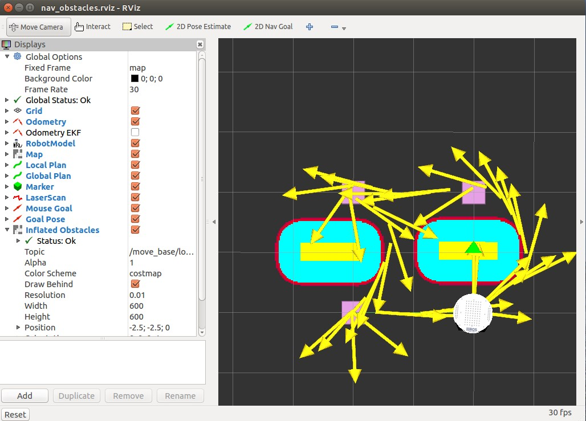
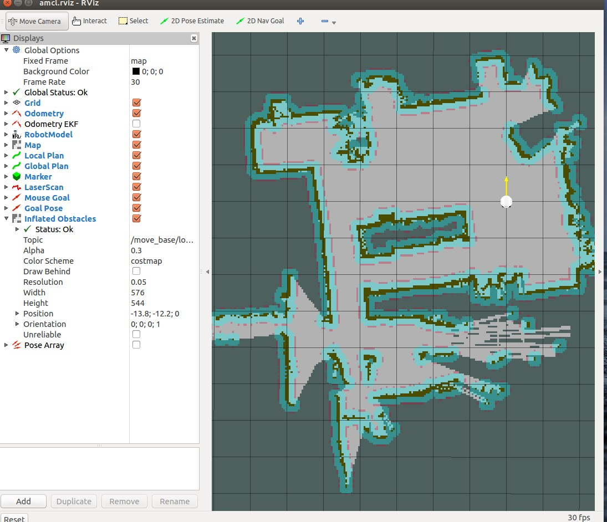
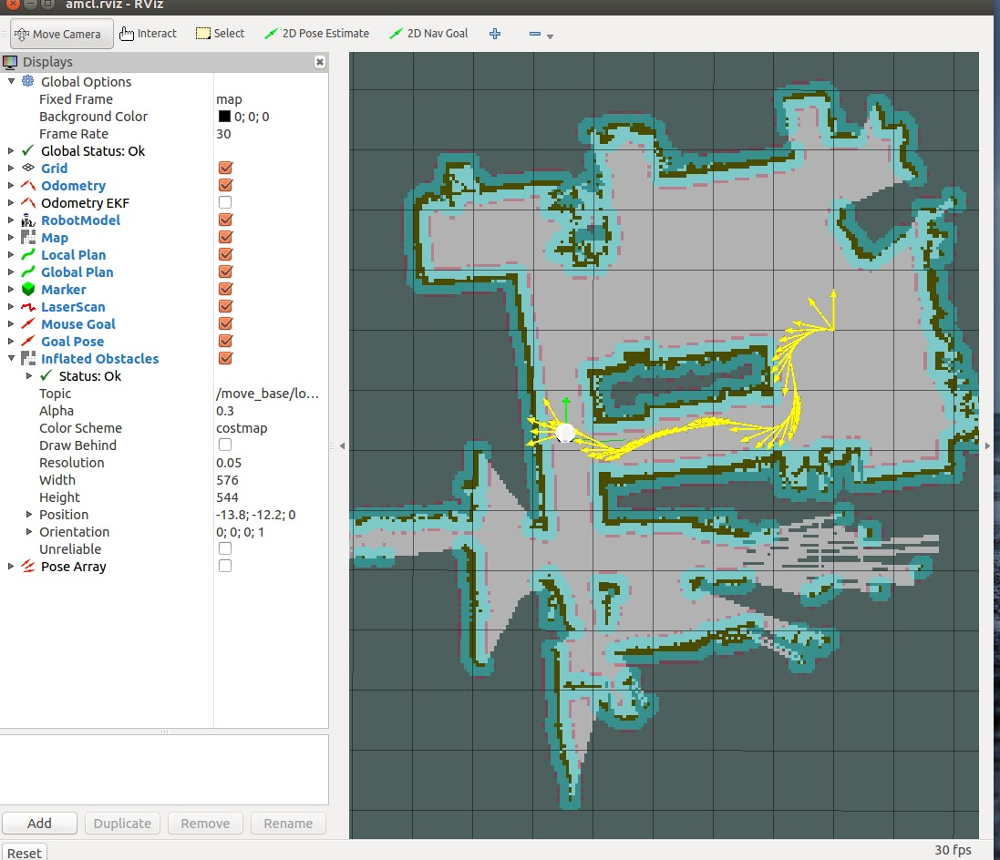

在进入实际的机器人运动控制之前，先使用空白地图或现有地图进行ROS导航功能的仿真,以便于更进一步了解机器人的导航控制策略。
*环境: ubuntu 14.04 LTS 32bits *
*ROS*: *Indigo*
<!--more-->
# Navigation 安装
在进行导航仿真之前，需要先下载 *ROS* 官方提供的 [ROS-Navigation](http://wiki.ros.org/cn/navigation)，安装下载：
　　```
 $cd ~/catkin_ws/src
 $git clone https://github.com/ros-planning/navigation.git
 $cd navigation　
 $git checkout indigo-devel
 $cd ~/catkin_ws
 $catkin_make
 $rospack profile
   ```
可能会报错：
   ```
 catkin_ws/src/navigation/map_server/src/image_loader.cpp:43:27: fatal error: SDL/SDL_image.h: No such file or directory
 #include <SDL/SDL_image.h>
   ```
安装 [SDL](https://www.libsdl.org/),SDL（Simple DirectMedia Layer）是一套开放源代码的跨平台多媒体开发库，使用C语言写成。SDL提供了数种控制图像、声音、输出入的函数，让开发者只要用相同或是相似的代码就可以开发出跨多个平台（Linux、Windows、Mac OS X等）的应用软件。参考 [SDL](https://zh.wikipedia.org/wiki/SDL):
   ```
 $ sudo apt-get install libsdl-image1.2-dev libsdl1.2-dev
   ```
# 使用 arbotix 测试 move_base
[move_base](http://wiki.ros.org/move_base) 是导航功能里比较重要的一项，它获取传感器数据并负责路径规划、距离计算、成本计算等。


*move_base* 节点运行前需要四个配置文件，它们定义了路径规划需要的一些配置参数，包括越过障碍物的代价、机器人的半径、即时距离计算、机器人移动速度等参数。在 *ROS by example* 中的示例代码 *rbx1* 中有关于每个机器人的四个配置文件，它们位于 *rbx1/rbx1_nav/config* 中，每个机器人下面都有对应的四个配置文件：
*base_local_planner_params.yaml*
*costmap_common_params.yaml*
*global_costmap_params.yaml*
*local_costmap_params.yaml*
里面的参数说明可以参考官方文档[]()
下面的命令启动启动一个机器人，使用 *move_base*使其向前移动 2m：
   ```
 $roslaunch rbx1_bringup fake_turtlebot.launch //启动一个机器人 使用ArbotiX模拟器
 $roslaunch rbx1_nav fake_move_base_blank_map.launch ///以空白地图启动move_base节点
 $rosrun rviz rviz -d `rospack find rbx1_nav`/nav.rviz //启动Rviz
 $ rostopic pub /move_base_simple/goal geometry_msgs/PoseStamped '{header: {frame_id: "map"},pose: {position: {x: 1.0,y: 0,z: 0},orientation: {x: 0,y: 0,z: 0,w: 2}}}' //向前运动2m

   ```
返回原地：
   ```
$ rostopic pub /move_base_simple/goal geometry_msgs/PoseStamped '{header: {frame_id: "map"},pose: {position: {x: 0.0,y: 0,z: 0},orientation: {x: 0,y: 0,z: 0,w: 2}}}' //返回
   ```


让机器人走一个正方形：
   ```
 $rosrun rbx1_nav move_base_square.py//让机器人走正方形
   ```



# 带障碍物的导航
将空白地图换做带障碍物的地图再次使机器人运行一个正方形：
   ```
 $roscore
 $roslaunch rbx1_bringup fake_turtlebot.launch //加载一个模拟机器人
 $roslaunch rbx1_nav fake_move_base_map_with_obstacles.launch  //加载一张带障碍物的地图
 $rosrun  rviz rviz -d `rospack find rbx1_nav`/nav_obstacles.rviz //加载rviz  带障碍物的导航
 $rosrun rbx1_nav move_base_square.py //使其自动走一个正方形
   ```


# 复杂地图导航与蒙特卡洛定位
使用ROS导航包里现有的复杂地图结合 [ACML](http://wiki.ros.org/amcl)-(Adaptive Monte Carlo Localization) 进行导航功能的测试。[ACML](http://wiki.ros.org/amcl) 即自适应蒙特卡罗定位，关于它的原理回头再仔细分析。
   ``` 
 $roscore
 $roslaunch rbx1_bringup fake_turtlebot.launch //运行一个机器人
 $roslaunch rbx1_nav fake_amcl.launch //运行fake_amcl.launch调用已有的测试地图
 $rosrun rviz rviz -d `rospack find rbx1_nav`/amcl.rviz //启动rviz 并调用amcl配置文件
   ```
也可以手动指定要调用的地图：
   ```
 $roslaunch rbx1_nav fake_amcl.launch map:=test_map.yaml
   ```



此时点击2D New Goal按钮，让机器人运动到指定目标：



