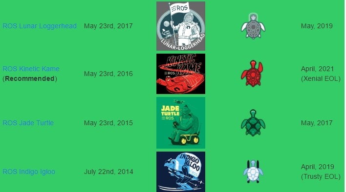

一直想记录一下ROS学习过程中的点滴，先从最基础的 ROS-Beginner-Tutorials开始， 以便于帮助更多的人。本篇是ROS学习的开篇，参考 [ROS-Beginner-Tutorials](http://wiki.ros.org/cn/ROS/Tutorials)。
# ROS安装
目前ROS官方还在维护的版本有4个(截至201705),参考 [ROS-Distributions](http://wiki.ros.org/Distributions)：
<!--more-->
因为我的环境是ubuntu14.04,支持的 ROS 版本为 [ROS-Indigo](http://wiki.ros.org/indigo), 因此我选择安装 [ROS-Indigo](http://wiki.ros.org/indigo)。
*环境： ubuntu 14.04 Trusty LTS 32bits*
安装可以参考官网: [ROS-Indigo-Installation-ubuntu](http://wiki.ros.org/indigo/Installation/Ubuntu)
添加代码仓：
   ```
 $sudo sh -c 'echo "deb http://packages.ros.org/ros/ubuntu $(lsb_release -sc) main" > /etc/apt/sources.list.d/ros-latest.list'
   ```
设定key:
   ```
 $sudo apt-key adv --keyserver hkp://ha.pool.sks-keyservers.net:80 --recv-key 421C365BD9FF1F717815A3895523BAEEB01FA116
   ```
更新：
   ```
 $sudo apt-get update
   ```
选择桌面版完全安装：
   ```
 $sudo apt-get install ros-indigo-desktop-full
   ```
初始化rosdep:
   ```
 $sudo rosdep init
 $rosdep update
   ```
设定环境变量让系统能找到ROS：
   ```
 $echo "source /opt/ros/indigo/setup.bash" >> ~/.bashrc
 $source ~/.bashrc
   ```
安装rosinstall工具，方便下载ROS：
   ```
 $sudo apt-get install python-rosinstall
   ```
# 管理环境
检查我们是否配置好了环境变量：
   ```
 $export | grep ROS
   ```
检查是否有 [ROS_ROOT](http://wiki.ros.org/ROS/EnvironmentVariables#ROS_ROOT) 和 [ROS_PACKAGE_PATH](http://wiki.ros.org/ROS/EnvironmentVariables#ROS_PACKAGE_PATH) 的配置。
# 创建ROS工作空间
[catkin_make](http://wiki.ros.org/catkin/commands/catkin_make) 命令只适用于 ROS Groovy 及其以后的版本。

   ```
 $mkdir -p ~/catkin_ws/src
 $cd ~/catkin_ws/src
   ```
这就创建了一个 [catkin 工作空间](http://wiki.ros.org/catkin/workspaces), 里面是空的，只有一个 [CMakeLists.txt](http://wiki.ros.org/catkin/CMakeLists.txt), 但依然可以编译它：
   ```
 $cd ~/catkin_ws/
 $catkin_make
   ```
当前目录下会生成 *build* 和 *devel* 这两个文件夹。在 *devel* 文件夹里面可以看到几个 setup.*sh 文件。 source 这些文件中的任何一个都可以将当前工作空间设置在ROS工作环境的最顶层，参考 [catkin](http://wiki.ros.org/catkin)文档。接下来首先 source 一下新生成的 setup.bash 文件：
   ```
 $source ~/catkin_ws/devel/setup.bash
   ```
也可以将这句命令加入到 ~/.bashrc 中，这样每次打开一个 *terminal* 会自动 *source* 。
确保工作空间已经正确配置可以通过以下命令查看：
   ```
 $echo $ROS_PACKAGE_PATH
   ```
正确的输出一般为：
   ```
/home/yourusername/catkin_ws/src:/opt/ros/indigo/share:/opt/ros/indigo/stacks
   ```
至此，ROS的安装与配置已经搭建完成。

 
