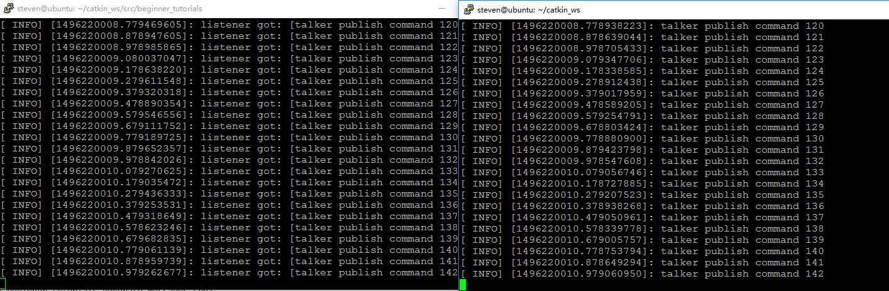

本篇学习 ROS 中简单的发布器和订阅器节点的编写。节点就是 ROS 网络中的一个可执行文件，它既可以订阅消息也可以发布消息。本篇涉及的代码已上传至 [mygithub](https://github.com/StevenShiChina/beginner_tutorials)。
<!--more-->
# 发布器
我们将创建一个发布器节点 talker，它将不断的在 ROS 网络中广播消息。在 beginner_tutorials 目录下新建一个 src 目录
   ```
 $ mkdir -p ~/catkin_ws/src/beginner_tutorials/src
 $ roscd beginner_tutorials/src/ 
   ```
src 文件夹用于放置 beginner_tutorials 包的所有源代码，新建 talker.cpp 在 beginner_tutorials/src/ 目录下添加如下代码：
   ```
 #include "ros/ros.h" /*引用ROS系统中发部分常用的头文件*/

 #include "std_msgs/String.h" /*消息类型定义*/

 #include <sstream>

 int main(int argc, char **argv)
 {
   /*初始化ROS talker节点名*
   ros::init(argc, argv, "talker");

   /*为该进程创建一个节点句柄 第一个创建的 NodeHandle 会为节点进行初始化，
   最后一个销毁的 NodeHandle 则会释放该节点所占用的所有资源*
   
   ros::NodeHandle n;

   /*告诉 master 我们将要在 command（话题名） 上发布 std_msgs/String 类型的消息。
   这样 master 就会告诉所有订阅了 command 话题的节点，将要有数据发布。第二个参数是发布序列的大小。
   如果我们发布的消息的频率太高，缓冲区中的消息在大于 1000 个的时候就会开始丢弃先前发布的消息。 
   NodeHandle::advertise() 返回一个 ros::Publisher 对象,它有两个作用：
   1) 它有一个 publish() 成员函数可以让你在topic上发布消息； 
   2) 如果消息类型不对,它会拒绝发布*/
   
   ros::Publisher chatter_pub = n.advertise<std_msgs::String>("command", 1000);
   
   /*ros::Rate 对象可以允许指定自循环的频率。它会追踪记录自上一次调用 Rate::sleep() 
   后时间的流逝，并休眠直到一个频率周期的时间,本例指定循环频率为10HZ */
  
   ros::Rate loop_rate(10);

   int count = 0;

  /*roscpp 会默认生成一个 SIGINT 句柄，它负责处理 Ctrl-C 键盘操作——使得 ros::ok() 返回 false。 
    如果下列条件之一发生，ros::ok() 返回false： 
    1  SIGINT 被触发 (Ctrl-C) 
    2  被另一同名节点踢出 ROS 网络 
    3  ros::shutdown() 被程序的另一部分调用 
    4 节点中的所有 ros::NodeHandles 都已经被销毁 
    一旦 ros::ok() 返回 false, 所有的 ROS 调用都会失效*/
   
   while (ros::ok())
   {
     /*我们使用一个由 msg file 文件产生的『消息自适应』类在 
     ROS 网络中广播消息。现在我们使用标准的String消息，它只有一个数据成员 "data"。
     当然，你也可以发布更复杂的消息类型。 */
     
     std_msgs::String msg;
     
     std::stringstream ss;
     
     ss << "talker publish command " << count;
     
     msg.data = ss.str();
     
     /*ROS_INFO 和其他类似的函数可以用来代替 printf/cout 等函数。
     具体可以参考 http://wiki.ros.org/rosconsole，以获得更多信息*/
     
     ROS_INFO("%s", msg.data.c_str()); 
     
    /*广播消息*/
     
     chatter_pub.publish(msg);
     
     /*在这个例子中并不是一定要调用 ros::spinOnce()，因为我们不接受回调。
      如果你的程序里包含其他回调函数，最好在这里加上 ros::spinOnce()这一语句，
     否则你的回调函数就永远也不会被调用了*/
    
     ros::spinOnce();
     
     /*休眠一段时间，使得发布频率为10HZ*/
     loop_rate.sleep();
    
     ++count;
    }
  return 0;
 }
   ```
上面的内容可以总结为：
 1 初始化 ROS 系统 
 2 在 ROS 网络内广播我们将要在 command 话题上发布 std_msgs/String 类型的消息 
 3 以每秒 10 次的频率在 chatter 上发布消息 
接下来编写一个订阅器用于接收该节点发布的消息。
# 订阅器
新建 listener.cpp 放置于 beginner_tutorials 的 src 目录下：
   ```
 $ roscd beginner_tutorials/src/
 $ vim listener.cpp
   ```
添加如下代码：
   ```
 #include "ros/ros.h"
 #include "std_msgs/String.h"
 /*定义回调函数*/
 void chatterCallback(const std_msgs::String::ConstPtr& msg)
 {
   /*打印收到的信息，消息是以 boost shared_ptr 指针的形式传输，这就意味着你可以存储它而又不需要复制数据。 */
   ROS_INFO("listener got: [%s]", msg->data.c_str());
 }

 int main(int argc, char **argv)
 {
  /*初始化节点，命名为listener*/
  
  ros::init(argc, argv, "listener");

  /*创建节点句柄*/
 
   ros::NodeHandle n;
  
  /*订阅主题,并注册回调函数，当有消息发布到这个话题时，ROS 就会调用 chatterCallback() 函数。
   第二个参数是队列大小，以防我们处理消息的速度不够快，当缓存达到 1000 条消息后，再有新的消息到来就将开始丢弃先前接收的消息。 */
  
  ros::Subscriber sub = n.subscribe("command", 1000, chatterCallback);
  
  /*进入自循环，可以尽可能快的调用消息回调函数。如果没有消息到达，它不会占用很多 CPU，所以不用担心。一旦 ros::ok() 返回 false，
   ros::spin() 就会立刻跳出自循环。这有可能是 ros::shutdown() 被调用，或者是用户按下了 Ctrl-C，
   使得 master 告诉节点要终止运行。也有可能是节点被人为关闭的。 
   还有其他的方法进行回调，但在这里我们不涉及。想要了解，可以参考 http://wiki.ros.org/roscpp_tutorials package
   里的一些 demo 应用。需要更为详尽的信息，可以参考 http://wiki.ros.org/roscpp/Overview。 */
   
   ros::spin();
   return 0;
 }
   ```
上面的代码可以总结为：
 1 初始化ROS系统 
 2 订阅 chatter 话题 
 3 进入自循环，等待消息的到达 
 4 当消息到达，调用 chatterCallback() 函数 
# 编译测试
编译测试之前需要修改 beginner_tutorials 中的 CMakeLists.txt 文件，添加以下内容：
   ```
include_directories(include ${catkin_INCLUDE_DIRS})

add_executable(talker src/talker.cpp)
target_link_libraries(talker ${catkin_LIBRARIES})

add_executable(listener src/listener.cpp)
target_link_libraries(listener ${catkin_LIBRARIES})
   ```
这会生成两个可执行文件, talker 和 listener, 默认存储到 [devel space](http://wiki.ros.org/catkin/workspaces#Development_.28Devel.29_Space) 目录下,具体是在 ~/catkin_ws/devel/lib/beginner_tutorials 中。
为可执行文件添加对生成的消息文件的依赖：
   ```
add_dependencies(talker beginner_tutorials_generate_messages_cpp)
add_dependencies(listener beginner_tutorials_generate_messages_cpp)
   ```
这样就可以确保自定义消息的头文件在被使用之前已经被生成。因为 catkin 把所有的 package 并行的编译，所以如果你要使用其他 catkin 工作空间中其他 package 的消息，同样也需要添加对他们各自生成的消息文件的依赖。
编译：
   ```
 $ cd ~/catkin_ws/
 $ catkin_make
 $ source ./devel/setup.bash 
   ```
测试时打开两个 terminal,一个运行 talker 节点，一个运行 listener 节点：
   ```
 $ roscore &
 $ rosrun beginner_tutorials talker // 启动 talker节点
 $ rosrun beginner_tutorials listener // 启动 listener 节点
   ```
效果：

参考 [WritingPublisherSubscriber](http://wiki.ros.org/cn/ROS/Tutorials/WritingPublisherSubscriber%28c%2B%2B%29)

