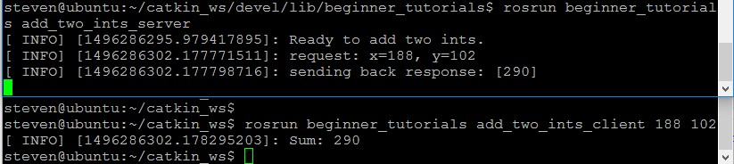

本篇学习简单的 ROS 服务器和客户端的编写，
服务器和客户端也是 ROS 网络中的一个节点，服务器可以提供某些服务，客户端发出请求，服务器做出响应。
<!--more-->
# 服务器节点
我们将创建一个 service 节点 (add_two_ints_server)，该节点接收两个整形数字，并返回它们的和。客户端可以给服务器发送请求。
   ```
 $ roscd beginner_tutorials/src
   ```
下载文件 [add_two_ints_server.cpp](https://github.com/ros/catkin_tutorials/blob/master/create_package_srvclient/catkin_ws/src/beginner_tutorials/src/add_two_ints_server.cpp),将文件放置于 beginner_tutorials/src 目录下。源码说明：
   ```
 #include "ros/ros.h"

 /*beginner_tutorials/AddTwoInts.h由编译系统自动根据我们先前创建的srv文件
  生成的对应该srv文件的头文件*/
 #include "beginner_tutorials/AddTwoInts.h"

 /*add函数提供两个int值求和的服务，int值从request里面获取，
  而返回数据装入response内，这些数据类型都定义在srv文件内部，
  函数返回一个boolean值*/

 bool add(beginner_tutorials::AddTwoInts::Request  &req,
         beginner_tutorials::AddTwoInts::Response &res)
 {
  res.sum = req.a + req.b;
  ROS_INFO("request: x=%ld, y=%ld", (long int)req.a, (long int)req.b);
  ROS_INFO("sending back response: [%ld]", (long int)res.sum);
  return true;
 }

 int main(int argc, char **argv)
 {
  ros::init(argc, argv, "add_two_ints_server");
  ros::NodeHandle n;
 
 /*service 服务建立*/
  ros::ServiceServer service = n.advertiseService("add_two_ints", add);
  ROS_INFO("Ready to add two ints.");
  ros::spin();

  return 0;
 }
   ```
# 客户端节点
同样将源码下载到目录 beginner_tutorials/src 下，下载 [add_two_ints_client.cpp](https://github.com/ros/catkin_tutorials/blob/master/create_package_srvclient/catkin_ws/src/beginner_tutorials/src/add_two_ints_client.cpp)。
源码及说明：
   ```
 #include "ros/ros.h"
 #include "beginner_tutorials/AddTwoInts.h"
 #include <cstdlib>

 int main(int argc, char **argv)
 {
   ros::init(argc, argv, "add_two_ints_client");
   if (argc != 3)
   {
     ROS_INFO("usage: add_two_ints_client X Y");
     return 1;
   }

   ros::NodeHandle n;
   
   /*为add_two_ints service创建一个client。ros::ServiceClient 对象待会用来调用service*/

   ros::ServiceClient client = n.serviceClient<beginner_tutorials::AddTwoInts>("add_two_ints");

  /*实例化一个由ROS编译系统自动生成的service类，并给其request成员赋值。
   一个service类包含两个成员request和response。同时也包括两个类定义Request和Response*/

   beginner_tutorials::AddTwoInts srv;
   srv.request.a = atoll(argv[1]);
   srv.request.b = atoll(argv[2]);

   /*调用service。由于service的调用是模态过程（调用的时候占用进程阻止其他代码的执行），
   一旦调用完成，将返回调用结果。如果service调用成功，call()函数将返回true，
   srv.response里面的值将是合法的值。如果调用失败，call()函数将返回false，
   srv.response里面的值将是非法的*/
 
   if (client.call(srv))
   {
     ROS_INFO("Sum: %ld", (long int)srv.response.sum);
   }
   else
   {
     ROS_ERROR("Failed to call service add_two_ints");
     return 1;
   }

   return 0;
 }
   ```
# 编译测试
编译之前先修改下 CMakeLists.txt ,文件位于:
 ~/catkin_ws/src/beginner_tutorials/CMakeLists.txt，参考 [CMakeLists.txt](https://raw.github.com/ros/catkin_tutorials/master/create_package_srvclient/catkin_ws/src/beginner_tutorials/CMakeLists.txt):
   ```
 add_executable(add_two_ints_server src/add_two_ints_server.cpp)
 target_link_libraries(add_two_ints_server ${catkin_LIBRARIES})
 add_dependencies(add_two_ints_server beginner_tutorials_gencpp)
 add_executable(add_two_ints_client src/add_two_ints_client.cpp)
 target_link_libraries(add_two_ints_client ${catkin_LIBRARIES})
 add_dependencies(add_two_ints_client beginner_tutorials_gencpp)
   ```
生成两个可执行程序 add_two_ints_server 和 add_two_ints_client ，这两个可执行程序默认被放在的 devel space 下的包目录下。可以直接调用可执行程序，或者使用 rosrun 命令去调用它们。它们不会被装在usr/bin目录下，如果希望在安装的时候可执行程序在PATH变量里面，需要设置一下install target，请参考：[catkin/CMakeLists.txt](http://wiki.ros.org/catkin/CMakeLists.txt)
编译：
   ```
 $ cd ~/catkin_ws/
 $ catkin_make
   ```
编译完成后会在目录 ~/catkin_ws/devel/lib/beginner_tutorials 下生成两个可执行文件 add_two_ints_client  和 add_two_ints_server 现在可以运行并测试它们：
   ```
 $ roscore &
 $ rosrun beginner_tutorials add_two_ints_server
   ```
如果运行时找不到程序包，运行一下 *rospack profile* 另外开启一个terminal 运行客户端:
   ```
$ rosrun beginner_tutorials add_two_ints_client  188 102
   ```
输出结果看图：
参考 [WritingServiceClient](http://wiki.ros.org/cn/ROS/Tutorials/WritingServiceClient%28c%2B%2B%29)。


