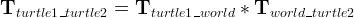

一个完整的机器人有腿(或轮子)、有眼睛、有手、有大脑，大脑控制机器人去协调的动作。问题来了，大脑是如何知道腿在哪儿？眼睛在哪儿？手臂在哪儿？要帮主人把房门打开，如何控制手臂去开门？这些都涉及到一个关键的问题-机器人的坐标变换。本篇学习 ROS 中的 [tf](http://wiki.ros.org/tf) 。
<!--more-->
# tf 初理解

tf 是 ROS 中的坐标变换系统，它可以跟踪多个参考坐标系的坐标，使用树形数据结构根据时间缓冲来维护这些坐标及其坐标关系，帮助我们在任意时间完成两个或多个参考系中的坐标变换。 tf 以分布式形式存在，所有节点都可以使用这些变换数据，节点可以监听 tf 变换，接收系统中发布的所有参考坐标系，并查询需要的参考坐标系；节点可以广播 tf 变换，向系统中广播参考系坐标关系，每个节点的参考坐标广播可以直接插入 tf 树中告知系统。
# 实例
通过一个实例来更好的理解  [tf](http://wiki.ros.org/tf)，参考 [官网](http://wiki.ros.org/tf)。
启动一个demo:
   ```
 $ roslaunch turtle_tf turtle_tf_demo.launch
   ```
此时会看到有两个 turtle 同时出现，将光标移动到 terminal 以便于用键盘的方向键来控制其中一个 turtle 的移动，可以看到当一个移动时另外一个一直做跟随运动：


该例子使用 tf 库创建的三个坐标系，一个是全局坐标系，一个是 turtle1 坐标系，另一个是 turtle2 坐标系。它使用 tf 广播发布 turtle 的坐标，另外一个去监听这个坐标，并计算它们之间的位置差，从而移动一个去跟随另一个的位置。
# tf 工具使用
[view_frames](http://wiki.ros.org/tf#view_frames)：

   ```
 $ rosrun tf view_frames
   ```
[view_frames](http://wiki.ros.org/tf#view_frames) 可以以PDF的形式创建当前坐标广播系统树，命令输出如下：
   ```
Listening to /tf for 5.000000 seconds
Done Listening
dot - graphviz version 2.36.0 (20140111.2315)

Detected dot version 2.36
frames.pdf generated
   ```
它会在当前目录下生成 frames.pdf 文件，可以使用如下命令查看：
   ```
$ evince frames.pdf
   ```

从图中可以看出，系统存在三个参考坐标系，world 为父坐标系即全局坐标系，另外两个也都有自己的坐标系，信息中还包括发送频率、缓存长度等信息。

[rqt_tf_tree](http://wiki.ros.org/rqt_tf_tree):

   ```
$ rosrun rqt_tf_tree rqt_tf_tree
   ```
[rqt_tf_tree](http://wiki.ros.org/rqt_tf_tree) 是一个可视化的实时坐标树查看工具，可以随时点击刷新按钮来实时的查看坐标广播树。

[tf_echo](http://wiki.ros.org/tf):
使用：
   ```
rosrun tf tf_echo [reference_frame] [target_frame]
   ```
如何从 turtle1 得到 turtle2 的坐标:


该命令输出指定的坐标变换关系，如：
   ```
$ rosrun tf tf_echo turtle1 turtle2
   ```
输出一般为：
   ```
At time 1496812263.516
- Translation: [0.000, 0.000, 0.000]
- Rotation: in Quaternion [0.000, 0.000, 0.707, 0.707]
            in RPY (radian) [0.000, -0.000, 1.571]
            in RPY (degree) [0.000, -0.000, 90.000]
At time 1496812264.205
- Translation: [0.000, 0.000, 0.000]
- Rotation: in Quaternion [0.000, 0.000, 0.707, 0.707]
            in RPY (radian) [0.000, -0.000, 1.571]
            in RPY (degree) [0.000, -0.000, 90.000]
At time 1496812265.213
- Translation: [0.000, 0.000, 0.000]
- Rotation: in Quaternion [0.000, 0.000, 0.707, 0.707]
            in RPY (radian) [0.000, -0.000, 1.571]
            in RPY (degree) [0.000, -0.000, 90.000]
At time 1496812266.205
- Translation: [0.000, 0.000, 0.000]
- Rotation: in Quaternion [0.000, 0.000, 0.707, 0.707]
            in RPY (radian) [0.000, -0.000, 1.571]
            in RPY (degree) [0.000, -0.000, 90.000]
   ```
它是一直输出的，当控制移动 turtle1 时可以看到 turtle2 的坐标是怎么变化的，也就是 turtle2 的坐标是怎么根据 turtle1 的出来的。
# rviz
使用 [rviz]() 可视化工具查看坐标系之间的坐标关系
   ```
$ rosrun rviz rviz -d `rospack find turtle_tf`/rviz/turtle_rviz.rviz
   ```
当通过键盘控制 turtle 运动时，可以在 rviz 中观察到两个 turtle 的位置关系及坐标的变换：

远处两个小的坐标系分别为 turtle1 和 turtle2 的坐标系，左下角为系统全局坐标系。本篇先到这里，下一篇进一步学习 tf 坐标变换。
参考 [Introduction tf](http://wiki.ros.org/tf/Tutorials/Introduction%20to%20tf)。