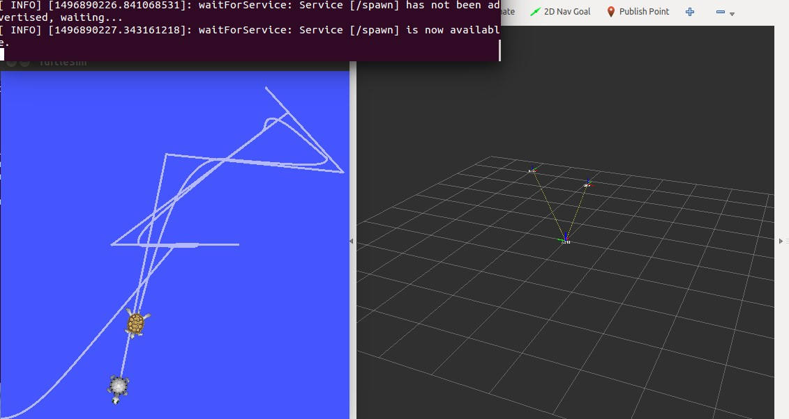

本篇继续学习 [tf](http://wiki.ros.org/tf)。通过编写一个简单的 tf broadcaster 以及 tf listener 来更进一步的理解坐标变换。本篇涉及到的代码已上传到 [mygithub](https://github.com/StevenShiChina/learning_tf)。
# tf broadcaster
tf broadcaster 用于广播坐标变换，任何节点都可以监听该变换。先创建一个程序包，名字随心，这里我们命名为 *learning_tf*,包的依赖项为 *roscpp rospy turtlesim*
<!--more-->
   ```
 $ cd ~/catkin_ws/src/
 $ catkin_create_pkg learning_tf roscpp rospy turtlesim
   ```

为了便于使用 *roscd* 我们先编译一下这个程序包:

   ```
 $ cd ~/catkin_ws/
 $ catkin_make
 $ rospack profile
   ```

此时使用 roscd 输入lear 再按 TAB 即可出现 *learning_tf/*。进入 *learning_tf/src* 目录下，新建文件 *turtle_tf_broadcaster.cpp* 添加如下代码：

   ```
 #include <ros/ros.h>
 #include <tf/transform_broadcaster.h> 
 #include <turtlesim/Pose.h>
 
 std::string turtle_name;
 
 
 
 void poseCallback(const turtlesim::PoseConstPtr& msg)
 {
   //创建一个 TransformBroadcaster 对象用于发布坐标变换
   static tf::TransformBroadcaster br;
   
   //创建Transform 对象并将2D的坐标转换为3D坐标系
   tf::Transform transform;
   transform.setOrigin( tf::Vector3(msg->x, msg->y, 0.0) );//获取 x y 坐标，不需要Z坐标 
  
   tf::Quaternion q;
   q.setRPY(0, 0, msg->theta);// x y轴旋转为0因为在地面运动只能绕Z轴的旋转
   transform.setRotation(q);//
   //发布坐标变换 ros::Time::now()为转换携带的时间戳 传递父节点的名字 world 子节点为turtle_name
   br.sendTransform(tf::StampedTransform(transform, ros::Time::now(), "world", turtle_name));
 }
 
 int main(int argc, char** argv)
 {
   ros::init(argc, argv, "my_tf_broadcaster");

   if (argc != 2){ROS_ERROR("need turtle name as argument"); return -1;};
  
   turtle_name = argv[1];
 
   ros::NodeHandle node;
  //订阅 turtle_name 的 turtleX/pose 话题，当turtle位置改变时调用回调函数 poseCallback
   ros::Subscriber sub = node.subscribe(turtle_name+"/pose", 10, &poseCallback);
 
   ros::spin();
   return 0;
  };

   ```
代码的整个流程为：
1 订阅 turtleX/pose 位置话题
2 发布坐标变换到tf树
修改CMakeLists.txt:

   ```
 add_executable(turtle_tf_broadcaster src/turtle_tf_broadcaster.cpp)
 target_link_libraries(turtle_tf_broadcaster ${catkin_LIBRARIES})
   ```

编译：

   ```
 $ cd ~/catkin_ws/
 $ catkin_make
   ```

编译报错：

   ```
Linking CXX executable /home/steven/catkin_ws/devel/lib/learning_tf/turtle_tf_broadcaster
CMakeFiles/turtle_tf_broadcaster.dir/src/turtle_tf_broadcaster.cpp.o: In function `poseCallback(boost::shared_ptr<turtlesim::Pose_<std::allocator<void> > const> const&)':
turtle_tf_broadcaster.cpp:(.text+0x39): undefined reference to `tf::TransformBroadcaster::TransformBroadcaster()'
turtle_tf_broadcaster.cpp:(.text+0x1a3): undefined reference to `tf::TransformBroadcaster::sendTransform(tf::StampedTransform const&)'
collect2: ld returned 1 exit status
make[2]: *** [/home/steven/catkin_ws/devel/lib/learning_tf/turtle_tf_broadcaster] Error 1
make[1]: *** [learning_tf/CMakeFiles/turtle_tf_broadcaster.dir/all] Error 2
make: *** [all] Error 2
Invoking "make -j1 -l1" failed
   ```

忘记了在 CMakeLists.txt 文件需要添加 tf 包的依赖：

   ```
find_package(catkin REQUIRED COMPONENTS
    roscpp
    rospy
    turtlesim
    tf
  )
   ```

编译完成后在 ~/catkin_ws/devel/lib/learning_tf/ 目录下会看到编译好的可执行文件 turtle_tf_broadcaster
接下来创建一个 launch 文件：

   ```
$ mkdir -p ~/catkin_ws/src/learning_tf/launch
$ roscd learning_tf/launch/
$ touch start_demo.launch
   ```

输入以下内容：

   ```
<launch>
    <!-- Turtlesim Node-->
    <node pkg="turtlesim" type="turtlesim_node" name="sim"/>

    <node pkg="turtlesim" type="turtle_teleop_key" name="teleop" output="screen"/>
    <!-- Axes -->
    <param name="scale_linear" value="2" type="double"/>
    <param name="scale_angular" value="2" type="double"/>

    <node pkg="learning_tf" type="turtle_tf_broadcaster"
          args="/turtle1" name="turtle1_tf_broadcaster" />
    <node pkg="learning_tf" type="turtle_tf_broadcaster"
          args="/turtle2" name="turtle2_tf_broadcaster" />

  </launch>
   ```

launch文件启动了4个节点，分别是：
 1 turtlesim 包中的类型为 turtlesim_node 名称为 sim 的节点；
 2 turtlesim 包中的类型为 turtle_teleop_key 名称为 teleop 的节点；
 3 learning_tf 包中类型为 turtle_tf_broadcaster 名称为 turtle1_tf_broadcaster 的节点；
 4 learning_tf 包中类型为 turtle_tf_broadcaster 名称为 turtle2_tf_broadcaster 的节点。

# tf listener
前面编写了broadcaster 用于发布 turtle 的坐标变换到 tf树，下面来编写 listener 来监听坐标的变换。在 learning_tf/src 目录下新建文件 turtle_tf_listener.cpp 添加如下代码:

   ```
 #include <ros/ros.h>
 #include <tf/transform_listener.h> //接收转换
 #include <geometry_msgs/Twist.h> //消息
 #include <turtlesim/Spawn.h> //再生
  
 int main(int argc, char** argv){

     ros::init(argc, argv, "my_tf_listener");//节点名称
  
     ros::NodeHandle node;//节点
 
     //再生服务
     ros::service::waitForService("spawn");
     ros::ServiceClient add_turtle =
      node.serviceClient<turtlesim::Spawn>("spawn");
     turtlesim::Spawn srv;
     add_turtle.call(srv);
 
     //通过话题 turtle2/cmd_vel 发布 geometry_msgs::Twist 类型消息
     ros::Publisher turtle_vel = 
     node.advertise<geometry_msgs::Twist>("turtle2/cmd_vel", 10);
     
     //创建接收对象，一旦TransformListener创建，就开始接收tf转换消息
     tf::TransformListener listener; 
 
     ros::Rate rate(10.0);
     while (node.ok()){
       tf::StampedTransform transform;
       //from turtle2 到 trutle1 即当 turtle2移动时,turtle1跟随 turtle2 运动
       try{
         listener.lookupTransform("/turtle2", "/turtle1",
                                  ros::Time(0), transform);
       }
       catch (tf::TransformException &ex) {
         ROS_ERROR("%s",ex.what());
         ros::Duration(1.0).sleep();
         continue;
       }
       // 计算新的角速度和线速度
       geometry_msgs::Twist vel_msg;
       vel_msg.angular.z = 4.0 * atan2(transform.getOrigin().y(),
                                       transform.getOrigin().x());
       vel_msg.linear.x = 0.5 * sqrt(pow(transform.getOrigin().x(), 2) +
                                     pow(transform.getOrigin().y(), 2));
       turtle_vel.publish(vel_msg);
  
       rate.sleep();
     }
     return 0;
   };


   ```
在CMakeLists.txt中添加依赖项：
   ```
add_executable(turtle_tf_listener src/turtle_tf_listener.cpp)
target_link_libraries(turtle_tf_listener ${catkin_LIBRARIES})
   ```
编译如果提示错误：
   ```
turtle_tf_listener.cpp:3:32: fatal error: 
turtlesim/Velocity.h: No such file or directory compilation terminated.
   ```
则文件使用的为之前版本，应该选择下载 hydro 版本的 参考 [Writing listener C++](http://wiki.ros.org/tf/Tutorials/Writing%20a%20tf%20listener%20%28C%2B%2B%29)
之后修改start_demo.launch 将listener节点添加进去：
   ```
<node pkg="learning_tf" type="turtle_tf_listener" name="listener" />
   ```
# 测试
停止之前的launch 文件，然后启动 start_demo.launch：
   ```
$ roslaunch learning_tf start_demo.launch
   ```
可以通过以下命令查看坐标广播信息：
   ```
$ rosrun tf tf_echo /world /turtle1
   ```

错误

运行 start_demo.launch 时提示错误* [ERROR] [1496887441.589043649]: "turtle2" passed to lookupTransform argument target_frame does not exist. *  但是当控制一个 turtle 移动时另外一个也可以跟随移动，参照 http://answers.ros.org/question/148121/something-wrong-with-tf-tutorial/ 的修改，在函数 listener.lookupTransform 的前面添加 listener.waitForTransform("/turtle2", "/turtle1", ros::Time(0), ros::Duration(3.0));然后重新编译，再次运行错误消失。运行 rviz 可以看到两个 turtle 之间的运动坐标变换
   ```
 $ rosrun rviz rviz -d `rospack find turtle_tf`/rviz/turtle_rviz.rviz
   ```


# adding a frame
通常情况下，系统中有一个全局坐标系 world ，当添加一个激光扫描仪，或者再添加一个双目摄像头，那么此时就需要在系统中添加两个坐标参考系，利用 tf 让系统帮我们将激光扫描仪的数据或双目摄像头的数据转换到全局坐标系中去，因此添加一个坐标系是非常必要的。
tf 以树形结构维护和保存多个参考系坐标，在这个结构中不能有闭环产生，这就意味着，坐标参考系树形结构中只能有一个父参考系 parent,它可以有多个子参考坐标系 child。下面图中 tf 树形结构中有三个参考坐标系，world，turtle1 和 turtle2。 并且 turtle1 和 trutle2 都是 world 的子参考坐标系，如果再添加一个新的坐标参考系 carrot1 它必须是以上三个参考坐标系的子参考系。


接着前面，我们在 turtle1 基础上添加一个参考坐标系 carrot1, 它的父参考系是 turtle1。在 learning_tf/src 目录下建立文件 frame_tf_broadcaster.cpp，添加以下代码：
   ```
#include <ros/ros.h>
#include <tf/transform_broadcaster.h>

int main(int argc, char** argv)
{
	ros::init(argc, argv, "my_tf_broadcaster");
	ros::NodeHandle node;

	tf::TransformBroadcaster br;
	tf::Transform transform;
  
	ros::Rate rate(10.0);
	while (node.ok()){
		transform.setOrigin( tf::Vector3(0.0, 2.0, 0.0) );
		transform.setRotation( tf::Quaternion(0, 0, 0, 1) );
		br.sendTransform(tf::StampedTransform(transform, ros::Time::now(), "turtle1", "carrot1"));
		rate.sleep();
     }
	return 0;
}
   ```
父参考系 turtle1 ，子参考系 carrot1 ，carrot1 在 x y z 方向上与 turtle1 的偏移为 (x:0.0,y:2.0,z:0.0)。修改 CMakeLists.txt 文件添加依赖：
   ```
add_executable(frame_tf_broadcaster src/frame_tf_broadcaster.cpp)
target_link_libraries(frame_tf_broadcaster ${catkin_LIBRARIES})
   ```
编译：
   ```
 $ cd ~/catkin_ws/
 $ catkin_make
   ```
在 ~/catkin_ws/devel/lib/learning_tf/ 文件夹下会生成可执行的节点文件 frame_tf_broadcaster ，我们将它的启动放到 start_demo.launch 文件中，添加以下内容：
   ```
 <node pkg="learning_tf" type="frame_tf_broadcaster" 
	 name="broadcaster_frame" />
   ```
运行测试看下效果，roslaunch 会一并执行 roscore 所以不用再提前运行 roscore:
   ```
 $ roslaunch learning_tf start_demo.launch
   ```
我们发现添加了这个坐标系，并没有对之前的 turtle 产生影响，这就恰恰说明了添加一个新的参考坐标系不会影响以前固有的参考坐标系。我们的监听节点依然使用的是之前定义的参考坐标系。现在，我们打开前面编写的监听节点源码 learning_tf/src/turtle_tf_listener.cpp, 我们将 /turtle1 替换成 /carrot1 ：
   ```
 listener.waitForTransform("/turtle2", "/carrot1",ros::Time(0), ros::Duration(3.0));
 listener.lookupTransform("/turtle2", "/carrot1",ros::Time(0), transform);
   ```
再次编译并执行 start_demo.launch，我们发现，当移动 turtle1 时， turtle2 在跟随 turtle1 的同时总是保持一定的距离，这个距离就是 carrot1 参考系相对于 turtle1 的偏移，因此 turtle2 跟随的是 carrot1 虽然我们没有定义这个模型，但依然能感觉到这个随动关系:


# moving frame 
建立移动参考系，让两个参考系的关系不再是固定的而是随着时间变化的，因此可以简单的将固定参考系的关系修改成随着时间而变化的，修改 frame_tf_broadcaster.cpp 文件：
   ```
 transform.setOrigin( tf::Vector3(2.0*sin(ros::Time::now().toSec()), 2.0*cos(ros::Time::now().toSec()), 0.0) );
 transform.setRotation( tf::Quaternion(0, 0, 0, 1) )
   ```
以上变换将 carrot1 相对于父参考系 turtle1 的坐标变换修改成时间的正余弦函数，我们再次编译并重新运行一下看效果：

turtle2 一直绕着 turtle1 做画圆运动，因为上面的函数是三角函数 且符合 x2 + y2 = r2 关系。
参考:[Writing a tf broadcaster C++](http://wiki.ros.org/tf/Tutorials/Writing%20a%20tf%20broadcaster%20%28C%2B%2B%29)   /  [Writing a tf listener C++](http://wiki.ros.org/tf/Tutorials/Writing%20a%20tf%20listener%20%28C%2B%2B%29) / [Adding a frame](http://wiki.ros.org/tf/Tutorials/Adding%20a%20frame%20%28C%2B%2B%29)
