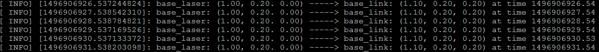

# Transform Configuration 变换配置
变换树是一种偏移，体现了不同坐标系之间的变换和旋转。假设有一个简单的机器人，只有移动底座以及一个位于底座上方的激光扫描仪。因此定义两个坐标系，一个对应激光扫描仪的中心点的坐标系，一个对应于移动底座中心点的坐标系，两个坐标系分别取名为 *base_laser* 和 *base_link* 。


<!--more-->
假设我们已经从激光扫描仪获取了一些数据，但这些数据都是以物体到激光扫描仪的距离给出的，即坐标系是 *base_laser*。 现在通过这些数据让机器人避开一些障碍物，如果不将这些激光扫描仪获取的数据从 *base_laser* 转换到 *base_link* 那么机器人在避开障碍物的过程中有可能失败，因此需要将激光扫描仪获取的数据从 *base_laser* 坐标系转换到 *base_link* 坐标系。因此需要知道两个坐标系的关系。看上图，*base_laser* 中心点位于 *base_link* 中心点上方 20cm 处，并向右偏移 10cm 。因此从激光扫描仪到移动底座的转换关系为(x:-0.1m,y:0.0m,z:-0.2m),反过来从移动底座到激光扫描仪的转换关系为(x:0.1m,y:0.0m,z:0.2m)。
当然这种变换关系我们可以手动去计算保存，需要的时候再调用，但是如果坐标系统增加，变换关系复杂，那么就需要利用 tf 来实现了。使用 tf 来管理坐标转关系，需要将转换关系添加到转换树中，转换树中的每一个节点都对应着一种坐标系，节点之间的连线即是两个坐标相互转换的一种表示，从当前节点到子节点的表示。 tf 利用树结构保证了两个坐标系之间只存在唯一的转换关系，我们假定节点的连线方向从父节点指向子节点。


基于以上描述，我们需要创建两个节点，分别命名为 *base_laser* 以及 *base_link*。为了明确两者之间的关系，需要指定谁是父节点 parent，谁是子节点 child。因为 tf 假设所有的转换都是从 parent 到 child。这里我们选择 *base_link* 为 parent 父节点，*base_laser* 为 child 子节点，将来如果有其他传感器也将作为子节点添加到移动底座。因此转换关系的数学关系为(x:0.1m,y:0.0m,z:0.2m)。知道这个转换关系 *base_link* 就可以推理出 *base_laser* 扫描出的数据跟自己的位置关系，因此可以安全的避开障碍物并规划合理的路径。这个转换实质是将 *base_laser* 坐标系的点转换到 *base_link* 坐标系中去。
# Broadcasting a Transform 广播变换
创建源码包，添加依赖项：
   ```
 $ cd ~/catkin_ws/src/
 $ catkin_create_pkg robot_setup_tf roscpp tf geometry_msgs
   ```
创建一个节点用于广播变换，我们将节点命名为 tf_broadcaster，在 robot_setup_tf/src 目录下建立文件 tf_broadcaster.cpp，添加以下内容：
   ```
 #include <ros/ros.h>
 #include <tf/transform_broadcaster.h>
  
   int main(int argc, char** argv)
   {
       ros::init(argc, argv, "robot_tf_publisher");
       ros::NodeHandle n;
  
       ros::Rate r(100);
      //创建TransformBroadcaster对象，用于发布变换关系
      tf::TransformBroadcaster broadcaster;
      //通过TransformBroadcaster来发送转换关系，需要附带5个参数。
      //第1个参数，我们传递了旋转变换，在两个坐标系的发送的任意旋转，
      //都必须通过调用btQuaternion.现在情况下，我们不想旋转，
      //所以我们在调用btQauternion的时候，将pitch,roll,yaw的参数都置0.
      //第2个参数，btVector3，任何变换过程都需要调用它。
      //相应的传感器的x方向距离机体基准偏移10cm，z方向20cm。
      //第3个参数，我们需要给定转换关系携带一个时间戳，我们标记为ros::Time::now()。
      //第4个参数，我们需要传递parent节点的名字。
      //第5个参数，传递的是child节点的名字。
      while(n.ok()){
          broadcaster.sendTransform(
              tf::StampedTransform(
                  tf::Transform(tf::Quaternion(0, 0, 0, 1), tf::Vector3(0.1, 0.0, 0.2)),
              ros::Time::now(),"base_link", "base_laser"));
          r.sleep();
 
      }
 
  }

   ```
通过TransformBroadcaster来发送转换关系，需要附带5个参数。第1个参数，我们传递了旋转变换，在两个坐标系的发送的任意旋转，都必须通过调用 btQuaternion。现在我们不想旋转，所以我们在调用 btQauternion 的时候，将 pitch,roll,yaw 的参数都置0。第2个参数 btVector3，任何变换过程都需要调用它。相应的传感器的 x 方向距离机体基准偏移 10cm，z 方向 20cm。第3个参数，我们需要给定转换关系携带一个时间戳，我们标记为 ros::Time::now()。第4个参数，我们需要传递 parent 节点的名字。第5个参数，传递的是 child 节点的名字。 

# Using a Transform 调用变换 
上面的节点用于发布转换关系，即将 *base_laser* 的坐标转换为 *base_link* 的坐标，现在我们利用这个转换关系，将从激光扫描仪获取的数据转换到移动底座对应的坐标系中来，即 *base_laser* 到 *base_link* 的转换。需要建立一个节点用于监听这种变换，在 robot_setup_tf/src 目录下新建文件 tf_listener.cpp 并添加以下代码：
   ```
 #include <ros/ros.h>
 #include <geometry_msgs/PointStamped.h>
 #include <tf/transform_listener.h>
  
//创建一个函数，参数为TransformListener,作用为将“base_laser”坐标系的点，变换到“base_link”坐标系中。
//这个函数将会以ros::Timer定义的周期，作为一个回调函数周期调用,目前周期是1s
 void transformPoint(const tf::TransformListener& listener){
       
     
      //此处，我们创建一个虚拟点，作为geometry_msgs::PointStamped。
      //消息名字最后的“Stamped”的意义是，它包含了一个头部，
      //允许我们去把时间戳和消息的frame_id相关联起来。
      //我们将会设置laser_point的时间戳为ros::time(),
      //即是允许我们请求TransformListener取得最新的变换数据。
      //对于header里的frame_id，我们设置为“base_laser”,
      //因为我们是创建的是扫描仪坐标系里的虚拟点。
      //最后，我们将会设置具体的虚拟点，比如x:1.0,y:0.2,z:0.0 
      //we'll create a point in the base_laser frame that we'd like to transform to the base_link frame
       geometry_msgs::PointStamped laser_point;
       laser_point.header.frame_id = "base_laser";
  
      //we'll just use the most recent transform available for our simple example
      laser_point.header.stamp = ros::Time();
 
      //just an arbitrary point in space
      //这里我们给定一个固定点
      laser_point.point.x = 1.0;
      laser_point.point.y = 0.2;
      laser_point.point.z = 0.0;
 
      //我们已经有了从“base_laser”到“base_link”变换的点数据。
      //进一步，我们通过TransformListener对象，
      //调用transformPoint(),填充三个参数来进行数据变换。
      //第1个参数，代表我们想要变换的目标坐标系的名字。
      //第2个参数填充需要变换的原始坐标系的点对象，
      //第3个参数填充，目标坐标系的点对象。
      //所以，在函数调用后，base_point里存储的信息就是变换后的点坐标。 
      try{
          geometry_msgs::PointStamped base_point;
          listener.transformPoint("base_link", laser_point, base_point);
 
          ROS_INFO("base_laser: (%.2f, %.2f. %.2f) -----> base_link: (%.2f, %.2f, %.2f) at time %.2f",
          laser_point.point.x, laser_point.point.y, laser_point.point.z,
          base_point.point.x, base_point.point.y, base_point.point.z, base_point.header.stamp.toSec());
      }
     //显示异常信息
      catch(tf::TransformException& ex){
          ROS_ERROR("Received an exception trying to transform a point from \"base_laser\" to \"base_link\": %s", ex.what());
      }
  }
 
 int main(int argc, char** argv){
      ros::init(argc, argv, "robot_tf_listener");
      ros::NodeHandle n;
      //一个TransformListener目标会自动的订阅ROS系统中的变换消息主题，
      //同时管理所有的该通道上的变换数据
      tf::TransformListener listener(ros::Duration(10));
 
      //we'll transform a point once every second
      ros::Timer timer = n.createTimer(ros::Duration(1.0), boost::bind(&transformPoint, boost::ref(listener)));
 
      ros::spin();
 
 }
   ```
# 编译测试
在编译之前需要修改 CMakeLists.txt 文件，添加构建依赖项
   ```
add_executable(tf_broadcaster src/tf_broadcaster.cpp)
add_executable(tf_listener src/tf_listener.cpp)
target_link_libraries(tf_broadcaster ${catkin_LIBRARIES})
target_link_libraries(tf_listener ${catkin_LIBRARIES})
   ```
编译:
   ```
 $ cd ~/catkin_ws/
 $ catkin_make
 $ rospack profile
   ```
开启三个 terminal 分别运行：
   ```
 $ roscore
 $ rosrun robot_setup_tf tf_broadcaster
 $ rosrun robot_setup_tf tf_listener
   ```
在 tf_listener 运行后可以看到如下输出，每隔1秒发布一次：



参考 [RobotSetup/TF](http://wiki.ros.org/cn/navigation/Tutorials/RobotSetup/TF)
