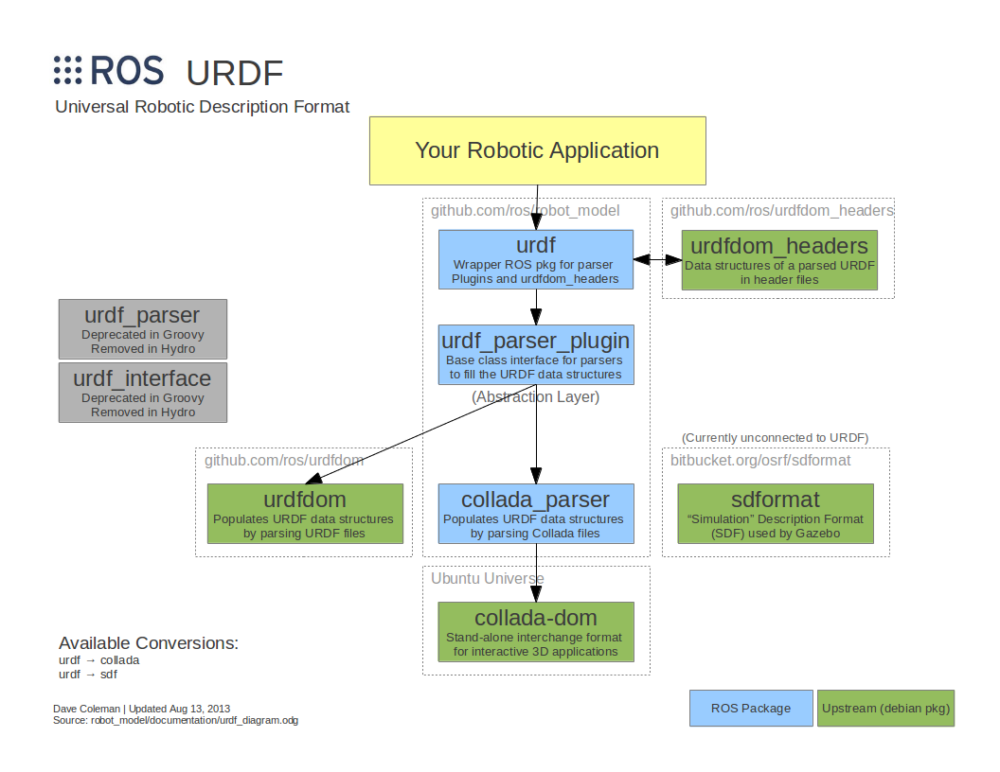
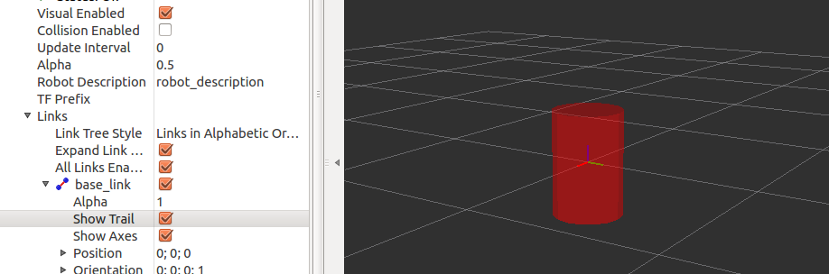
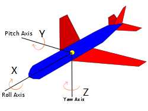
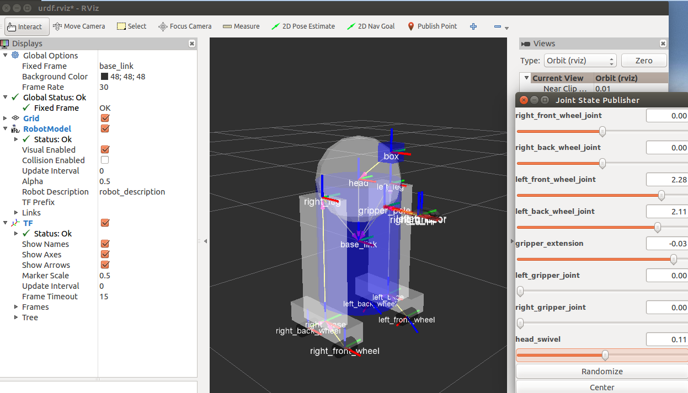

URDF的全称为 Unified Robot Description Format，通用机器人描述格式，它是一种特殊的 xml 格式文件，它能够抽象的描述现实中的机器人硬件，包括外形和组件。URDF 包括很多不同的功能包以及组件，它们之间的关系如图所描述：


<!--more-->

# 构建可视化机器人模型
开始之前先下载 [joint_state_publisher](http://wiki.ros.org/joint_state_publisher) 以及 [urdf_tutorial](http://wiki.ros.org/urdf_tutorial) 两个包。
   ```
 $ cd ~/catkin_ws/src/
 $ git clone  https://github.com/ros/urdf_tutorial.git
 $ git clone https://github.com/ros/robot_model.git
   ```
 [joint_state_publisher](http://wiki.ros.org/joint_state_publisher) 属于 robot_model 代码仓的一个 package ，需要注意的是 robot_model 有很多分支，我们下载后需要选择 indigo-devel 分支：
   ```
 $ cd ~/catkin_ws/src/robot_model/   
 $ git checkout indigo-devel
   ```
## 单个模型
先看一个简单的模型描述，在 urdf_tutorial/urdf 中的 01-myfirst.urdf 文件：
   ```
   <?xml version="1.0"?>
   <robot name="myfirst">
     <link name="base_link">
       <visual>
         <geometry>
           <cylinder length="0.6" radius="0.2"/>
         </geometry>
       </visual>
     </link>
   </robot>

   ```
首先描述了机器人的名字 myfirst,该机器人仅有一个 link 名字为  base_link, 它包含一个 cylinder 长度为 0.6m，半径为 0.2m。
使用 Rviz 查看这个模型：
   ```
$ roslaunch urdf_tutorial display.launch model:=urdf/01-myfirst.urdf
   ```
出现错误：
   ```
Traceback (most recent call last):
  File "/opt/ros/indigo/share/xacro/xacro.py", line 62, in <module>
    xacro.main()
  File "/opt/ros/indigo/lib/python2.7/dist-packages/xacro/__init__.py", line 673, in main
    f = open(args[0])
IOError: [Errno 2] No such file or directory: 'urdf/01-myfirst.urdf'
Invalid <param> tag: Cannot load command parameter [robot_description]: command [/opt/ros/indigo/share/xacro/xacro.py urdf/01-myfirst.urdf] returned with code [1]. 

Param xml is <param command="$(find xacro)/xacro.py $(arg model)" name="robot_description"/>
The traceback for the exception was written to the log file
   ```
错误提示貌似找不到 01-myfirst.urdf 这个文件，但事实上它是存在的，换一种方式打开：
   ```
 $ roslaunch urdf_tutorial display.launch model:='$(find urdf_tutorial)/urdf/01-myfirst.urdf'
   ```
如果进入到目录 ~/catkin_ws/src/urdf_tutorial/urdf_tutorial 下再用上述命令打开就不会出现错误：
   ```
 $ cd ~/catkin_ws/src/urdf_tutorial/urdf_tutorial
 $ roslaunch urdf_tutorial display.launch model:=urdf/01-myfirst.urdf
   ```
图中所示，我们可以看到只有一个圆柱体存在：



需要注意的两点：
a,固定坐标系以网格中心作为参考点，它正是 base_link 的坐标系；
b,圆柱体的中心正好位于网格中心即 base_link原点，因此，圆柱体的另一半在网格下面。

## 多个模型 
一个模型就是一个 link 元素，添加多个模型就需要多个link，link 之间需要使用 joint 连接，joint 有固定于可动之分。下面看一个固定 joint 连接，文件位于 urdf_tutorial/urdf 中的 02-multipleshapes.urdf：
   ```
  <?xml version="1.0"?>
   <robot name="multipleshapes">
     <link name="base_link">
       <visual>
         <geometry>
           <cylinder length="0.6" radius="0.2"/>
         </geometry>
       </visual>
     </link>
 
    <link name="right_leg">
      <visual>
        <geometry>
          <box size="0.6 0.1 0.2"/>
        </geometry>
      </visual>
    </link>
 
    <joint name="base_to_right_leg" type="fixed">
      <parent link="base_link"/>
      <child link="right_leg"/>
    </joint>
 
  </robot>
   ```
在圆柱体的基础上又定义了一个box，尺寸为 0.6m x 0.1m x 0.2m ,一个 joint 连接两个模型，joint 必须指定它所连接的两个模型的父link与子link,子 link 的位置依赖于父 link 的位置。
可以运行命令查看：
   ```
 $ roslaunch urdf_tutorial display.launch model:=urdf/02-multipleshapes.urdf 
   ```
图中可以看到两个模型的中心重合，因为他们的坐标原点一样，如果我们不希望他们重合，可以定义多个坐标系原点。
## 原点
上图腿的位置位于圆柱体的中间部分，下面我们调整它的位置，参见文件urdf_tutorial/urdf/03-origins.urdf
   ```
<?xml version="1.0"?>
   <robot name="origins">
     <link name="base_link">
       <visual>
         <geometry>
           <cylinder length="0.6" radius="0.2"/>
         </geometry>
       </visual>
     </link>
 
    <link name="right_leg">
      <visual>
        <geometry>
          <box size="0.6 0.1 0.2"/>
        </geometry>
        <origin rpy="0 1.57075 0" xyz="0 0 -0.3"/>
      </visual>
    </link>
 
    <joint name="base_to_right_leg" type="fixed">
      <parent link="base_link"/>
      <child link="right_leg"/>
      <origin xyz="0 -0.22 0.25"/>
    </joint>
 
  </robot>

   ```
由代码可看出，两个 link 即两个零件由名称为 base_to_right_leg 的 joint 连接，joint 的原点相对于 base_link 的原点偏移为x方向0，y 方向-0.22，z 方向 0.25，因此 child link 即 right_leg 的原点位于base_link 的上方 0.25 右方0.22 的位置。如果不指定 child link 的姿态角，它将和base_link具有相同的姿态角，即子坐标系和父坐标系姿态角相同。上述代码既定义了right_leg 在xyz方向的偏移，同时也定义了rpy 姿态角(roll pitch yaw),相对于joint 原点即子坐标参考系，right_leg 在z方向上下移了0.3,俯仰角为pi/2弧度，即相对于之前绕Y轴旋转了90度，之前为水平，现在变为垂直。可以通过 Rviz 查看：
   ```
 $ roslaunch urdf_tutorial display.launch model:=urdf/03-origins.urdf
   ```
姿态角的定义如图：

机身前方为 Roll 轴，一般定义为 X 轴，绕 X 轴的旋转角度称为 Roll 即翻滚角，绕 Pitch 轴的旋转称为俯仰角，此处一般定义为 Y 轴，绕 Yaw 轴的旋转称为偏航角，一般定义为 Z 轴。
另外也可以定义机体组件的颜色，可以添加不同形状的组件可以参考 04-materials.urdf 以及 05-visual.urdf。
# 构建可移动机器人模型
对应文件为 06-flexible.urdf
## 头部
   ```
 <joint name="head_swivel" type="continuous">
   <parent link="base_link"/>
   <child link="head"/>
   <axis xyz="0 0 1"/>
   <origin xyz="0 0 0.3"/>
  </joint>
   ```
定义的joint用于连接 base_link 与 head ，类型为 continuous,意思是它可以旋转任意角度，因此这个连接是可移动的连接。需要注意的是必须指定它旋转的轴，上面指定旋转的矢量为 [0,0,1] 即只能绕Z轴旋转。
## 抓手
   ```
 <joint name="left_gripper_joint" type="revolute">
   <axis xyz="0 0 1"/>
   <limit effort="1000.0" lower="0.0" upper="0.548" velocity="0.5"/>
   <origin rpy="0 0 0" xyz="0.2 0.01 0"/>
   <parent link="gripper_pole"/>
   <child link="left_gripper"/>
 </joint>
   ```
joint 为 revolute 即旋转类型，它和 continuous 类型类似，但 revolute 类型有极限约束，指定上下极限位置的同时，还需要指定最大速度以及 effort。注意这里的上下极限是单位是弧度。
## 夹臂
   ```
  <joint name="gripper_extension" type="prismatic">
     <parent link="base_link"/>
     <child link="gripper_pole"/>
     <limit effort="1000.0" lower="-0.38" upper="0" velocity="0.5"/>
     <origin rpy="0 0 0" xyz="0.19 0 0.2"/>
  </joint>
   ```
夹臂是一种不同的 joint，称为柱状 joint,也就是说它沿着一个轴运动，而不是绕着轴运动。这里的极限与抓手不同的是极限单位是米而不是弧度。还有两种其它类型的 joint，柱状 joint 只能做一维运动，一个平面 joint 可以做二维运动，一个浮动的 joint 可以做三维运动。
## 指定姿态
进入到目录urdf_tutorial/urdf_tutorial中，运行命令：
   ```
$ roslaunch urdf_tutorial display.launch model:=urdf/06-flexible.urdf
   ```
可以看大如下机器人模型以及 Joint State Publisher 的控制界面：


当在 Rviz 中滑动滑块时，会看到模型移动。首先GUI解析URDF文件，找到所有非固定的 joint 以及他们的运动约束极限，然后，利用滑块的值发布消息 [sensor_msgs/JointState](http://docs.ros.org/api/sensor_msgs/html/msg/JointState.html) ,之后 [robot_state_publisher](http://wiki.ros.org/robot_state_publisher) 计算在不同的部件之间的所有变换，变换后的 tf 坐标树被用来在 Rviz 中显示这些形状。
# 添加物理属性和碰撞属性
## 碰撞属性
为了使机器人能在 [Gazebo](http://www.gazebosim.org/) 中仿真，需要定义机器人的碰撞属性。这部分的例子可以参考 07-physics.urdf
   ```
<link name="base_link">
	<visual>
         <geometry>
           <cylinder length="0.6" radius="0.2"/>
         </geometry>
         <material name="blue"/>
	</visual>
	<collision>
        <geometry>
           <cylinder length="0.6" radius="0.2"/>
         </geometry>
	</collision>
 	<inertial>
         <mass value="10"/>
         <inertia ixx="1.0" ixy="0.0" ixz="0.0" iyy="1.0" iyz="0.0" izz="1.0"/>
	</inertial>
</link>

   ```
代码中可见，collision 元素与 visual 元素同级，都属于 link 的直接子元素; collision 元素定义它的外形方式与 visual 元素一样，都使用 geometry 实现。也可以与 visual 一样使用相同的方式指定一个原点。很多情况下我们希望 collision 的几何外形和原点与 visual 的几何外形和原点一样，但是有两种特殊情况：一种情况是快速处理，做碰撞检测的两个网格比两个简单的几何尺寸的计算要复杂的多，因此在碰撞元素中更倾向于使用简单的几何尺寸来代替网格以便于减少计算复杂度。另外一种情况是安全区域，你可能希望限制接近于敏感设备的运动，比如，我们不希望任何东西与R2D2的头部相撞，我们可能会定义碰撞的几何尺寸为一个圆柱，用于防止任何东西靠近它的头部。
## 物理属性
在 [Gazebo](http://www.gazebosim.org/) 中仿真需要定义机器人的物理属性，包括 inertial 惯性、contact coefficients 连接系数 以及 joint dynamics 关节动力等属性。转动惯量可以使用一个3x3的矩阵表示：
$\left[
\begin{matrix}
ixx & ixy & ixz \\\\
ixy & iyy & iyz \\\\
ixz & iyz & izz \\\\
\end{matrix}
\right]$
因为它是对称的，因此可以仅使用6个元素来表示。这部分同样可参考 07-physics.urdf。
## 使用 Xacro 简化 URDF 文件
[xacro](http://wiki.ros.org/xacro) 是一宏语言，可以压缩 URDF 文件的大小，增加文件的可读性和可维护性。这部分代码可参考 08-macroed.urdf.xacro ，为了使用 xacro 我们需要指定一个命名空间，以便文件能被正确的解析，一般在文件的头部会加入以下：
   ```
 <?xml version="1.0"?>
   <robot name="macroed" xmlns:xacro="http://ros.org/wiki/xacro">
   ```
模型的名称此处定义为 macroed 。使用 xacro 声明常量能够避免在很多行重复使用同一个值，当修改该值时只需要修改一处即可，可增加代码维护性。常量的声明方法：
   ```
<xacro:property name="width" value="0.2" />
<xacro:property name="bodylen" value="0.6" />
   ```
使用时可以直接使用变量名来引用：
   ```
<cylinder radius="${width}" length="${bodylen}"/>
   ```
也可以在${}结构中加入四则运算：
   ```
<cylinder radius="${wheeldiam/2}" length="0.1"/>
<origin xyz="${baselen*reflect/3} 0 -${wheeldiam/2+.05}" rpy="0 0 0"/>
   ```
也可以使用宏更进一步简化：
   ```
<xacro:macro name="default_inertial" params="mass">
  <inertial>
       <mass value="${mass}" />
       <inertia ixx="1.0" ixy="0.0" ixz="0.0" iyy="1.0" iyz="0.0" izz="1.0" />
   </inertial>
</xacro:macro>
   ```
使用：
   ```
<xacro:default_inertial mass="10"/>
   ```
未完
参考：[urdf/tutorial](http://wiki.ros.org/urdf/Tutorials)
