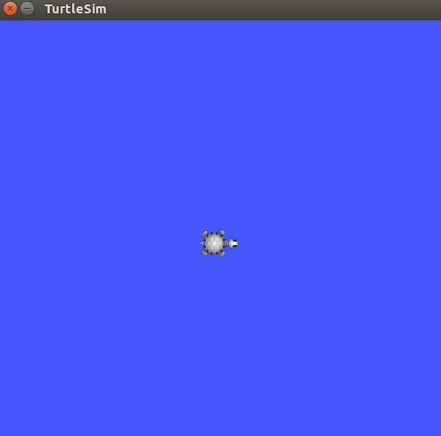

本篇学习 ROS 节点相关知识。节点是 ROS 程序包中的一个可执行文件，它可以与其他节点进行通信，节点可以发布或订阅话题，也可以提供或使用某种服务 。
<!--more-->
# 相关介绍
[Nodes](http://wiki.ros.org/Nodes): 表示 ROS 中的节点，它表现形式为一个可执行文件，它可以通过 ROS 与其它节点进行通信。
[Messages](http://wiki.ros.org/Messages): 表示消息，它是一种 ROS 数据类型，用于订阅或发布到一个话题。
[Topics](http://wiki.ros.org/Topics): 表示话题，节点可以发布消息到话题，也可以订阅话题以接收消息。
[Master](http://wiki.ros.org/Master): 表示节点管理器，它提供 ROS 名称服务，帮助 ROS 节点找到彼此。
[rosout](http://wiki.ros.org/rosout): 类似标准输出 stdout。
[roscore](http://wiki.ros.org/roscore): 相当于 ROS 中的服务器，运行所有节点前必须先运行 roscore。
# 使用
先运行 roscore:
   ```
 $ roscore & //后台运行
   ```
可以使用 rosnode 查看节点信息：
   ```
 $ rosnode list //列出活跃的节点
   ```
此时输出一般为：
   ```
 /rosout
   ```
表示当前只有一个 rosout 节点在运行，这个节点用于收集和记录调试输出信息，它必须先于其它节点运行，并且总是一直在运行。
返回特定节点的信息：
   ```
 $ rosnode info /rosout
   ```
此时输出一般为：
   ```
 Node [/rosout]
 Publications:
  * /rosout_agg [rosgraph_msgs/Log]

 Subscriptions:
  * /rosout [unknown type]

 Services:
  * /rosout/set_logger_level
  * /rosout/get_loggers


 contacting node http://ubuntu:56062/ ...
 Pid: 2811
   ```
可以看出，rosout 既发布主题也订阅主题并且提供 log 日志服务。
# 运行节点
[rosrun](http://wiki.ros.org/rosrun) 用于运行某个 ROS 程序包内的节点，而不需要知道这个包的路径，当然前提是这个包已经加入到 ROS 的环境变量中，即 ROS 可以找到它。
用法：
   ```
$ rosrun [package_name] [node_name]
   ```
示例：
   ```
$ rosrun turtlesim turtlesim_node
   ```
运行程序包 turtlesim 中的 turtlesim_node 节点。要使用 [turtlesim](http://wiki.ros.org/turtlesim) 需要事先安装这个包：
   ```
$ sudo apt-get install ros-indigo-ros-tutorials
   ```
或者通过源码下载后自行编译 参考 [ros_tutorials](https://github.com/ros/ros_tutorials) 。运行效果
如果此时打开另一个 terminal 并使用前面的命令查看节点信息：
   ```
 $ rosnode list
   ```
此时的输出一般为：
   ```
 /rosout
 /turtlesim
   ```
也可以查看 /turtlesim 节点的具体信息：
   ```
 $ rosnode info /turtlesim
   ```
输出一般为：
   ```
Node [/turtlesim]
Publications:
 * /turtle1/color_sensor [turtlesim/Color]
 * /rosout [rosgraph_msgs/Log]
 * /turtle1/pose [turtlesim/Pose]

Subscriptions:
 * /turtle1/cmd_vel [unknown type]

Services:
 * /turtle1/teleport_absolute
 * /turtlesim/get_loggers
 * /turtlesim/set_logger_level
 * /reset
 * /spawn
 * /clear
 * /turtle1/set_pen
 * /turtle1/teleport_relative
 * /kill


contacting node http://ubuntu:53732/ ...
Pid: 3904
Connections:
 * topic: /rosout
    * to: /rosout
    * direction: outbound
    * transport: TCPROS
   ```
我们也可以通过命令行修改节点名字，使用 ROS 的 [RemappingArguments](http://wiki.ros.org/Remapping%20Arguments) 改变节点名称：
   ```
$ rosrun turtlesim turtlesim_node __name:=my_turtle
   ```
改变节点名称前，先 kill 掉之前运行的节点 turtlesim_node。此时再输入命令查看节点信息，名字已经改变了：
   ```
 /my_turtle
 /rosout
   ```
我们可以使用 ping 命令查看节点通讯是否可达：
   ```
 $ rosnode ping my_turtle
   ```
输出：
   ```
 rosnode: node is [/my_turtle]
 pinging /my_turtle with a timeout of 3.0s
 xmlrpc reply from http://ubuntu:40832/  time=1.326084ms
 xmlrpc reply from http://ubuntu:40832/  time=0.391006ms
 xmlrpc reply from http://ubuntu:40832/  time=0.315189ms
 xmlrpc reply from http://ubuntu:40832/  time=0.321150ms
 xmlrpc reply from http://ubuntu:40832/  time=0.367880ms
 xmlrpc reply from http://ubuntu:40832/  time=0.342846ms
   ```
至此，关于 ROS 节点的学习告一段落。
参考 [Understanding-Nodes](http://wiki.ros.org/cn/ROS/Tutorials/UnderstandingNodes)