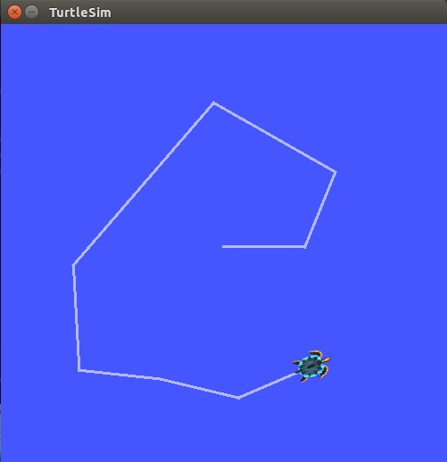
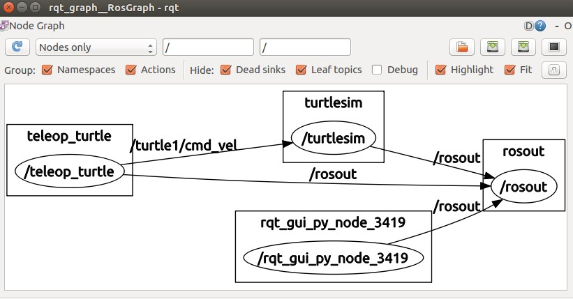
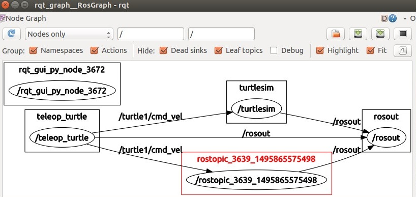
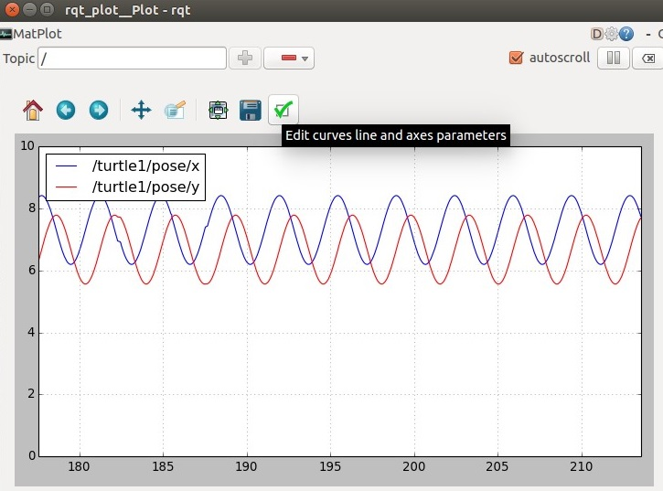

本篇学习 ROS 中的话题 [Topics](http://wiki.ros.org/rostopic) 以及 [Topics](http://wiki.ros.org/rostopic) 的使用。源码位于 [ROS-communications](https://github.com/ros/ros_comm)，参考 [UnderstandingTopics](http://wiki.ros.org/cn/ROS/Tutorials/UnderstandingTopics)。开始之前我们先运行 turtlesim 节点，并用键盘来控制它的移动。开一个 terminal 运行：
   ```
 $ roscore &
 $ rosrun turtlesim turtlesim_node
   ```
开启另外一个 terminal 运行键盘控制节点：
   ```
 $rosrun turtlesim turtle_teleop_key
   ```
<!--more-->
现在随便移动键盘的方向键，看看 图画里的 turtle 是否在跟随你的指令移动:


在此期间键盘是如何控制它移动的，期间到底发生了什么，下面我们来进一步分析。

# 理解话题
为了更形象的理解话题，我们使用工具 [rqt_graph](http://wiki.ros.org/rqt_graph)，如果没有安装则通过以下命令安装：
   ```
 $ sudo apt-get install ros-indigo-rqt //如果使用的其他发行版替换indigo即可
 $ sudo apt-get install ros-indigo-rqt-common-plugins
   ```
保持前面的 turtlesim 节点在运行状态，新开一个 terminal 运行 [rqt_graph](http://wiki.ros.org/rqt_graph):
   ```
 $ rosrun rqt_graph rqt_graph
   ```
我们会看到下图：

将鼠标放置于/turtle1/cmd_vel 上，相应的ROS节点和话题就会高亮显示，turtlesim 和 teleop_turtle 两个节点通过话题 /turtle1/cmd_vel 进行通信。我们可以使用 rostopic 工具查看话题的相关信息。
用法：
   ```
rostopic echo [topic]
   ```
示例：
   ```
$ rostopic echo /turtle1/cmd_vel
   ```
这个时候按键盘的向下方向键会看到如下信息：
   ```
 linear:
   x: -2.0
   y: 0.0
   z: 0.0
 angular:
   x: 0.0
   y: 0.0
   z: 0.0

   ```
此时刷新一下 rqt_graph 就会看到又多了一个订阅话题 /turtle1/cmd_vel 的节点，红色部分就是。



# 查看话题
rostopic list 能够列出所有当前订阅和发布的话题，保持前面的各个节点处于运行状态：
   ```
$ rostopic list -v
   ```
此时会输出：
   ```
Published topics:
 * /turtle1/color_sensor [turtlesim/Color] 1 publisher
 * /turtle1/cmd_vel [geometry_msgs/Twist] 1 publisher
 * /rosout [rosgraph_msgs/Log] 4 publishers
 * /rosout_agg [rosgraph_msgs/Log] 1 publisher
 * /turtle1/pose [turtlesim/Pose] 1 publisher

Subscribed topics:
 * /turtle1/cmd_vel [geometry_msgs/Twist] 2 subscribers
 * /rosout [rosgraph_msgs/Log] 1 subscriber
 * /statistics [rosgraph_msgs/TopicStatistics] 1 subscriber
   ```
上面列出了所有的订阅和发布的话题及其类型。关于 rostopic list 的其他使用方法可通过帮助命令查看：
   ```
 $rostopic list -h
   ```
# 理解消息
话题之间的通信是通过在节点之间发送消息 [Ros Messages](http://wiki.ros.org/Messages) 实现的。发布器 teleop_turtle 和订阅器 turtlesim 之间必须发送和接收相同类型的消息才能通信。也就是说话题的类型是由发布在它上面的消息类型决定的。使用 rostopic type 命令可以查看发布在某个话题上的消息类型：
用法：  
   ```
rostopic type [topic]
   ```
示例：
   ```
$ rostopic type turtle1/cmd_vel //查看话题 turtle1/cmd_vel 上的消息类型
   ```
一般会输出：
   ```
geometry_msgs/Twist
   ```
可以使用 [rosmsg](http://wiki.ros.org/rosmsg) 命令查看消息的详细类型：
   ```
$ rosmsg show geometry_msgs/Twist
   ```
输出：
   ```
geometry_msgs/Vector3 linear
  float64 x
  float64 y
  float64 z
geometry_msgs/Vector3 angular
  float64 x
  float64 y
  float64 z
   ```
上面可以看到消息  geometry_msgs/Twist 的类型 一个是 x y z 三轴的线速度，另外一个是 x y z 三轴的角速度。

# 使用话题
rostopic pub 可以把消息发布到某个正在广播的话题上。
用法：
   ```
rostopic pub [topic] [msg_type] [args]
   ```
示例：
   ```
$ rostopic pub -1 /turtle1/cmd_vel geometry_msgs/Twist -- '[2.0, 0.0, 0.0]' '[0.0, 0.0, 1.8]'
   ```
该命令会发送一条消息到话题 /turtle1/cmd_vel 上，并使得 turtlesim 以2.0大小的线速度和1.8大小的角速度开始移动。 -1 的意思是发布一条消息后马上退出，geometry_msgs/Twist 为消息类型，后面是 x y z 的数值，前面一组代表线速度，后面一组代表角速度。geometry_msgs/Twist 消息里包含两组浮点类型元素 linear 和 angular 。参数格式遵循 [YAML](http://wiki.ros.org/ROS/YAMLCommandLine) 语法。
上面的命令并没有让 turtle 保持一直运动，因为我们的命令只发布了一次就退出了，而要使其一直运动需要控制命令的发布频率：
   ```
$ rostopic pub /turtle1/cmd_vel geometry_msgs/Twist -r 1 -- '[2.0, 0.0, 0.0]' '[0.0, 0.0, 1.8]'
   ```
这条命令以 1hz 的频率发布消息到话题 /turtle1/cmd_vel 上，参数 -r 表示频率,后面的 1 为 1hz,此时会看到 turtle 沿着圆形轨迹不停的转动。
使用 rostopic hz 命令可以查看消息发布的频率
用法：
   ```
 rostopic hz [topic]
   ```
示例：
   ```
 $ rostopic hz /turtle1/cmd_vel
   ```
输出：
   ```
subscribed to [/turtle1/cmd_vel]
average rate: 1.000
        min: 1.000s max: 1.000s std dev: 0.00000s window: 2
   ```
可见消息发布的频率正如我们前面的设置1 hz。我们也可以查看话题 /turtle1/pose 的发布频率：
   ```
 $ rostopic hz /turtle1/pose
   ```
输出：
   ```
subscribed to [/turtle1/pose]
average rate: 62.534
        min: 0.015s max: 0.017s std dev: 0.00052s window: 61
   ```
可见 turtlesim 正以大约62hz 的频率发布数据给 turtle ，这个应该是位置数据。我们也可以结合 rostopic type 和 rosmsg show 命令来获取关于某个话题的更深层次的信息。
   ```
 $rostopic type /turtle1/cmd_vel | rosmsg show
   ```
# 使用rqt_plot

[rqt_plot](http://wiki.ros.org/rqt_plot) 是 [Qt](https://www.qt.io/) 开发的图形用户界面，可以将某个话题上的数据以图形的方式实时的绘制出来，如果没有安装首先通过以下命令安装，参考[rqt_plot](http://wiki.ros.org/rqt_plot):

   ```
 $ sudo apt-get install ros-indigo-rqt
 $ sudo apt-get install ros-indigo-rqt-common-plugins
   ```
使用：
   ```
 $ rosrun rqt_plot rqt_plot
   ```
窗口左上角可以添加需要的话题，右边的减号可以删除不需要的话题。点击那个绿色的对号按钮可以调节时间和坐标等信息：


更多 rqt_plot 的使用请参阅官方文档 [rqt_plot](http://wiki.ros.org/rqt_plot) 或 [rosindex-rqt_plot](http://rosindex.github.io/p/rqt_plot/#indigo) 。

