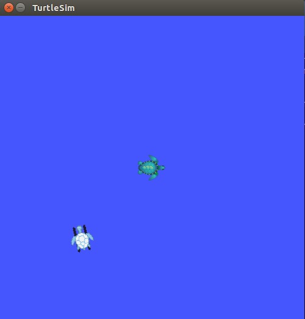
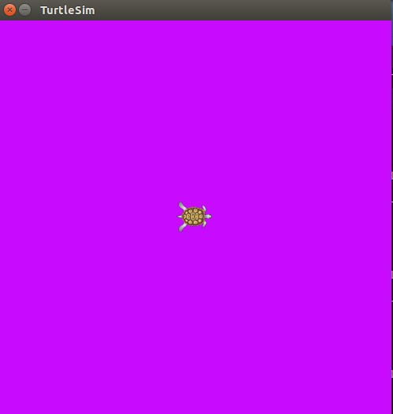

本篇学习 ROS 的服务和参数。
# ROS 服务
Services 是 ROS 节点之间通信的另一种方式，服务允许节点发送请求(request)，并获得响应(response)。[rosservice](http://wiki.ros.org/rosservice) 命令可以使用 ROS 客户端/服务器框架提供的服务，[rosservice](http://wiki.ros.org/rosservice) 提供了很多可以在 topic 上使用的命令：
   ```
 rosservice list         输出可用服务的信息
 rosservice call         调用带参数的服务
 rosservice type         输出服务类型
 rosservice find         依据类型寻找服务find services by service type
 rosservice uri          输出服务的ROSRPC uri
   ```
测试上述命令之前先运行 turtlesim 节点:
   ```
 $ roscore &
 $ rosrun turtlesim turtlesim_node
   ```
并用键盘进行控制，显示出运动轨迹。
<!--more-->
## rosserice list
   ```
 $ rosservice  list
   ```
rosservice list 命令显示出 turtlesim 节点提供的一些服务，其中 rosout 为 roscore 提供的服务：
   ```
 /clear //清除
 /kill  //终止
 /reset //重置
 /rosout/get_loggers
 /rosout/set_logger_level
 /spawn //再生
 /turtle1/set_pen //设定画笔包括颜色、线条宽度、开关等
 /turtle1/teleport_absolute //绝对参数
 /turtle1/teleport_relative //相对参数
 /turtlesim/get_loggers //日志
 /turtlesim/set_logger_level //日志等级
   ```
参数的详细说明参阅 [turtlesim](http://wiki.ros.org/turtlesim)。
## rosservice type
rosservice type 用于显示某个服务的类型，使用方法：
   ```
rosservice type [service]
   ```
比如我们想查看 turtlesim 节点提供的 clear 服务：
   ```
 $ rosservice type clear
   ```
输出：
   ```
 std_srvs/Empty
   ```
服务的类型为空Empty,这表明在调用这个服务时不需要参数。那我们调用一次这个参数看下效果，使用方法：
   ```
 rosservice call [service] [args]
   ```
测试：
   ```
 $ rosservice call clear
   ```
之前 turtule 运行的轨迹被清除。上面是不带参数的服务，我们查看一下带参数的服务 spwan:
   ```
 $ rosservice type spawn| rossrv show
   ```
输出：
   ```
 float32 x
 float32 y
 float32 theta
 string name
 ---
 string name
   ```
以上可以看出 spawn 服务需要的参数有 x y 坐标值、角度以及名字等参数。我们使用 spawn 服务在指定位置再生成一个 turtle :
   ```
$ rosservice call spawn 3 3 1.8 "another turtle"
   ```
上面命令在坐标(3,3) 方位角为 1.8 生成一个名字为 "anotherturtle" 的 turtle,注意名字之间不能有空格。


# ROS 参数
[rosparam](http://wiki.ros.org/rosparam) 使得我们能够存储并操作 ROS 参数服务器 [Parameter Server](http://wiki.ros.org/Parameter%20Server) 上的数据。参数服务器能够存储整型、浮点、布尔、字符串、字典和列表等数据类型。[rosparam](http://wiki.ros.org/rosparam) 使用 [YAML](https://zh.wikipedia.org/wiki/YAML) 标记语言的语法。一般而言，[YAML](https://zh.wikipedia.org/wiki/YAML) 的表述很自然：1 是整型, 1.0 是浮点型, one 是字符串, true 是布尔, [1, 2, 3]是整型列表, {a: b, c: d}是字典。 [rosparam](http://wiki.ros.org/rosparam) 有很多指令可以用来操作参数:
   ```
rosparam set            设置参数
rosparam get            获取参数
rosparam load           从文件读取参数
rosparam dump           向文件中写入参数
rosparam delete         删除参数
rosparam list           列出参数名
   ```
rosparam list 命令可列出某个节点在参数服务器上的各种参数：
   ```
$ rosparam list
   ```
输出：
   ```
/background_b //背景颜色 
/background_g //背景颜色
/background_r //背景颜色
/rosdistro
/roslaunch/uris/host_ubuntu__39737
/rosversion
/run_id
   ```
设置背景颜色通过命令 rosparam set 获取背景颜色使用命令 rosparam get
   ```
 rosparam set [param_name]
 rosparam get [param_name]
   ```
我们修改一下红色值：
   ```
 $ rosparam set background_r 200
   ```
调用清除命令参数才能生效：
   ```
 $ rosservice call clear
   ```

获取参数值：
   ```
 $ rosparam get /  //显示服务器上所有参数内容
   ```
输出：
   ```
 background_b: 255
 background_g: 10
 background_r: 200
 rosdistro: 'indigo

  '
 roslaunch:
  uris: {host_ubuntu__39737: 'http://ubuntu:39737/'}
 rosversion: '1.11.20

  '
 run_id: 0efaaffc-4599-11e7-a400-000c2915ac77
   ```
获取某个参数值，比如获取红色通道的值：
   ```
$ rosparam get background_r
   ```
可以使用 rosparam dump 命令将所有参数进行存储，使用 rosparam load 命令读取所有参数：
使用方法：
   ```
rosparam dump [file_name]
rosparam load [file_name] [namespace]
   ```
将所有参数写入文件 myparams.yaml 中：
   ```
 $ rosparam dump myparams.yaml
   ```
载入参数：
   ```
 $ rosparam load params.yaml copy  //将参数载入 copy 空间
 $ rosparam get copy/background_r
   ```
参考 [UnderstandingServicesParams](http://wiki.ros.org/cn/ROS/Tutorials/UnderstandingServicesParams)


