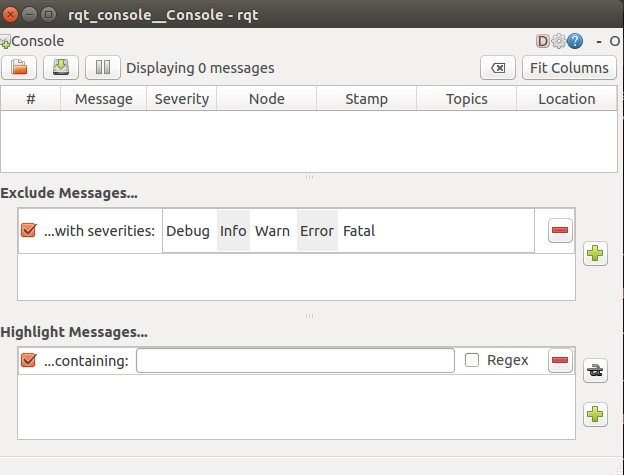
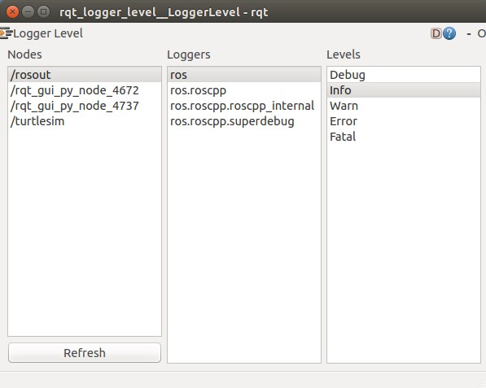
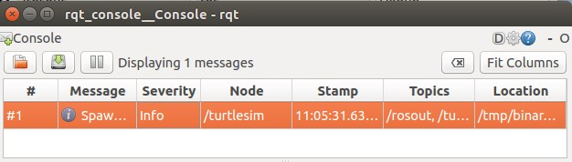
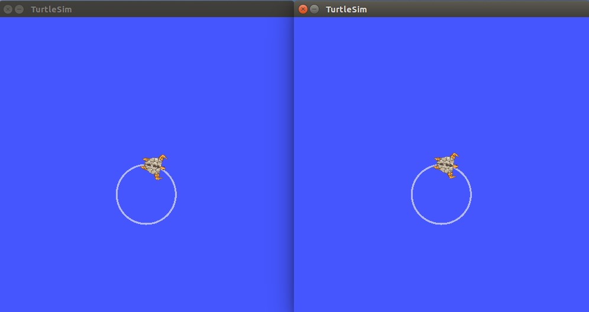
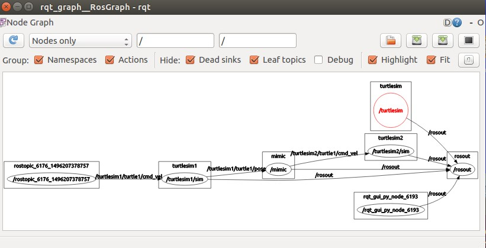

本篇学习 [rqt_console](http://wiki.ros.org/rqt_console) 与 [roslaunch](http://wiki.ros.org/roslaunch) 的使用。[rqt_console](http://wiki.ros.org/rqt_console) 属于 ROS 日志框架的一部分，用来显示节点的输出信息。[roslaunch](http://wiki.ros.org/roslaunch) 用于节点的运行，可以同时运行多个节点。
使用之前先安装以下程序包:
   ```
 $ sudo apt-get install ros-indigo-rqt
 $ sudo apt-get install ros-indigo-rqt-common-plugins
   ```
<!--more-->
如果之前已安装，也可忽略。
# rqt_console 与 rqt_logger_level
[rqt_console](http://wiki.ros.org/rqt_console) 显示节点信息， [rqt_logger_level](http://wiki.ros.org/rqt_logger_level) 用于修改节点运行时输出信息的日志等级。
开启 rqt_console 窗口与 rqt_logger_level 窗口：
   ```
 $ rosrun rqt_console rqt_console
 $ rosrun rqt_logger_level rqt_logger_level
   ```



开启一个新的 terminal 然后启动 turtlesim 节点：
   ```
 $ rosrun turtlesim turtlesim_node
   ```
因为默认的日志等级为 info 所以 [rqt_console](http://wiki.ros.org/rqt_console) 的输出为：


现在刷新一下 [rqt_logger_level](http://wiki.ros.org/rqt_logger_level) 窗口，并将日志等级修改为 Warn 并且让 turtle 做旋转动作：
   ```
 $ rostopic pub /turtle1/cmd_vel geometry_msgs/Twist -r 1 -- '[2.0, 0.0, 0.0]' '[0.0, 0.0, 1.8]'
   ```
 这里我的日志等级并没有修改过来，原因未知，待查。
日志等级按以下优先顺序排列：
   ```
 Fatal
 Error
 Warn
 Info
 Debug
   ```
Fatal是最高优先级，Debug是最低优先级。通过设置日志等级可以获取该等级及其以上优先等级的所有日志消息。比如，将日志等级设为Warn时，会得到Warn、Error和Fatal这三个等级的所有日志消息。
# roslaunch
[roslaunch](http://wiki.ros.org/roslaunch) 可以用来启动定义在 launch 文件中的多个节点，用法：
   ```
 $ roslaunch [package] [filename.launch]
   ```
进入 beginner_tutorials 目录,建立一个 launch 文件，
   ```
 $ roscd beginner_tutorials
 $ mkdir launch
 $ cd launch/
 $ vim turtlemimic.launch
   ```
在 turtlemimic.launch 文件中输入以下内容：
   ```
   <launch>
  
      <group ns="turtlesim1">
        <node pkg="turtlesim" name="sim" type="turtlesim_node"/>
     </group>
  
      <group ns="turtlesim2">
        <node pkg="turtlesim" name="sim" type="turtlesim_node"/>
      </group>
 
     <node pkg="turtlesim" name="mimic" type="mimic">
       <remap from="input" to="turtlesim1/turtle1"/>
       <remap from="output" to="turtlesim2/turtle1"/>
     </node>
 
  </launch>
   ```
创建了两个节点分组，一个名字为 turtlesim1 ，一个名字为 turtlesim2 ，两个组里都是用相同的  turtlesim节点并命名为 sim，在同时启动两个 turtlesim 模拟器时避免冲突。将所有话题的输入重命名为 turtlesim1 输出重命名为 turtlesim2，这样可以使 turtlesim2 模仿 turtlesim1。
启动：
   ```
 $ roslaunch beginner_tutorials turtlemimic.launch
   ```
 并在另一个 terminal 下发布运动指令：
   ```
 $ rostopic pub /turtlesim1/turtle1/cmd_vel geometry_msgs/Twist -r 1 -- '[2.0, 0.0, 0.0]' '[0.0, 0.0, -1.8]'
   ```
可以看到两个 turtle 在做同样的圆周运动

也可以通过 [rqt_graph]() 来更好的理解 launch文件中所做的事情：
   ```
$ rqt_graph
   ```

参考 [UsingRqtconsoleRoslaunch](http://wiki.ros.org/cn/ROS/Tutorials/UsingRqtconsoleRoslaunch) 

