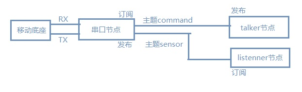
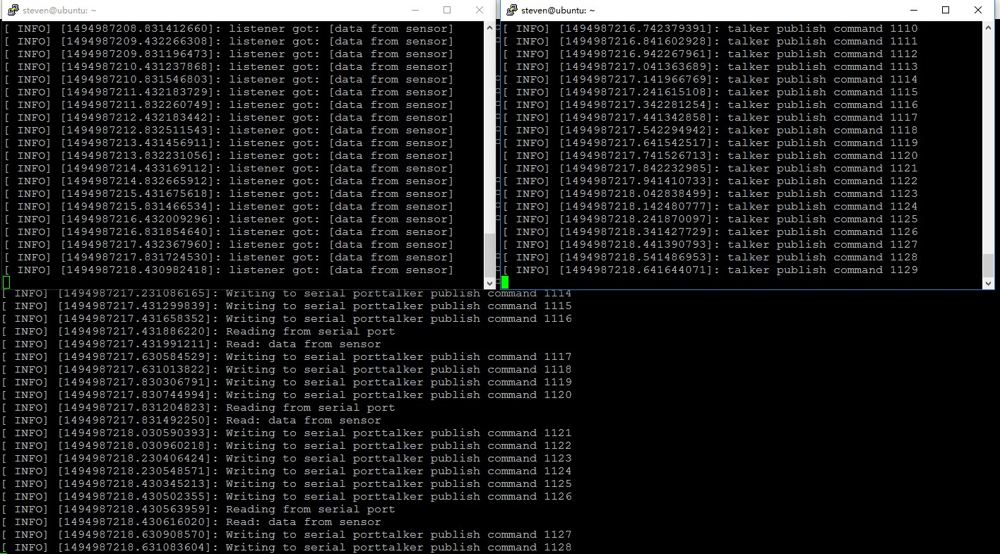

# 前言
移植 [ROS](http://www.ros.org/) 的目的是控制机器人移动或者控制飞行器按既定轨道飞行，那么如何实现 [ROS](http://www.ros.org/) 与底层的移动控制设备通信呢？底层设备一般都是ARM架构实现，资源有限，不可能跑个ubuntu，当然也可以移植 [ROS](http://www.ros.org/) 的框架，但这个要对底层设备进行 [ROS](http://www.ros.org/) 框架的封装，实现起来麻烦一些。普遍来讲，底层设备一般都具备串口，通过串口与底层设备通讯，也许是一种高效便捷的方法。
<!--more-->
# 架构
在 [ROS](http://www.ros.org/) 平台下，设计一个串口节点，该节点订阅talker控制节点发来的命令主题，将命令通过串口设备发送到移动底座也可以是飞控设备；同时串口节点实时接收移动底座通过串口发送过来的传感器实时数据，并将该数据封装后以 *sensor* 主题的模式进行发布， *listenner* 节点可以实现订阅该主题。这样就实现了 [ROS](http://www.ros.org/) 与移动底座的串口通信过程。
# 串口节点
*linux* 下的串口有很多现成的实现例子，比如 [libcssl](https://github.com/mwheels/libcssl) ,当然也可以自己编程实现。对于 [ROS](http://www.ros.org/) 架构的串口也有现成的例子 [serial](http://wiki.ros.org/serial) ,源代码 [serial code](https://github.com/wjwwood/serial.git) 。也有基于 [stm32](https://github.com/spiralray/stm32f1_rosserial) 的 [ROS](http://www.ros.org/) 串口代码框架。也可以参考 [uROSnode](https://github.com/openrobots-dev/uROSnode) 避免重复造轮子，这里使用 [ROS](http://www.ros.org/) 现有的串口源码。
## 建立工作目录
　　```
 $mkdir -p ~/catkin_ws/src/mypackage/
　　```
## 下载源代码
　　```
 $cd ~/catkin_ws/src/mypackage/
 $git clone https://github.com/wjwwood/serial.git
　　```
## 建立串口节点
　　在 *mypackage* 目录下建立自己的节点程序包：
　　```
 $catkin_create_pkg my_serial_node std_msgs rospy roscpp
　　```
此时会在 *mypackage/my_serial_node *目录下生成两个文件 *CMakeLists.txt* 和 *package.xml* 以及两个文件夹 *include/* 和 *src/*。修改 *CMakeLists.txt* 的内容：
　　```
 cmake_minimum_required(VERSION 2.8.3)
 project( my_serial_node )
 
  find_package(catkin REQUIRED COMPONENTS
     roscpp
     serial
     std_msgs
   )
  
  catkin_package(
    CATKIN_DEPENDS
      serial
      std_msgs
  )
 
  include_directories(
    ${catkin_INCLUDE_DIRS}
  )
 
  add_executable( my_serial_node src/my_serial_node.cpp)
 
  target_link_libraries( my_serial_node
    ${catkin_LIBRARIES}
  )

　　```
修改 *package.xml* 内容添加刚刚下载的 *serial* 依赖：
　　```
 <?xml version="1.0"?>
   <package>
     <name> my_serial_node</name>
     <version>0.0.0</version>
     <description>my serial node </description>
  
     <license>BSD</license>
 
    <buildtool_depend>catkin</buildtool_depend>
    <build_depend>serial</build_depend>
    <build_depend>std_msgs</build_depend>
    <run_depend>serial</run_depend>
    <run_depend>std_msgs</run_depend>
 
  </package>
　　```
在 *src* 目录下建立 *my_serial_node.cpp* 文件：
　　```
 #include <serial/serial.h>
 #include <std_msgs/String.h>
 #include <std_msgs/Empty.h>
 
 serial::Serial ros_ser;
 //回调函数
 void callback(const std_msgs::String::ConstPtr& msg){
      ROS_INFO_STREAM("Write to serial port" << msg->data);
      ros_ser.write(msg->data);
  }
 
 int main (int argc, char** argv){
      ros::init(argc, argv, "my_serial_node");
      ros::NodeHandle n;
      //订阅主题command
      ros::Subscriber command_sub = n.subscribe("command", 1000, callback);
      //发布主题sensor
      ros::Publisher sensor_pub = n.advertise<std_msgs::String>("sensor", 1000);
 
      try
      {
          ros_ser.setPort("/dev/ttyUSB0");
          ros_ser.setBaudrate(115200);
          ros_serial::Timeout to = serial::Timeout::simpleTimeout(1000);
          ros_ser.setTimeout(to);
          ros_ser.open();
      }
      catch (serial::IOException& e)
      {
          ROS_ERROR_STREAM("Unable to open port ");
          return -1;
      }
 
      if(ros_ser.isOpen()){
          ROS_INFO_STREAM("Serial Port opened");
      }else{
          return -1;
      }
 
      ros::Rate loop_rate(10);
      while(ros::ok()){
 
          ros::spinOnce();
 
          if(ros_ser.available()){
              ROS_INFO_STREAM("Reading from serial port");
              std_msgs::String serial_data;
              //获取串口数据
              serial_data.data = ros_ser.read(ros_ser.available());
              ROS_INFO_STREAM("Read: " << serial_data.data);
              //将串口数据发布到主题sensor
              sensor_pub.publish(serial_data);
          }
          loop_rate.sleep();
 
      }
  }

　　```
## 建立talker节点
同样在 *src* 目录下新建文件 *talker.cpp* ,并在 *CMakeLists.txt* 中添加以下内容：
　　```
 add_executable(talker src/talker.cpp)
 target_link_libraries(talker ${catkin_LIBRARIES})
　　```
*talker.cpp*内容：
　　```
#include "ros/ros.h"
#include "std_msgs/String.h"
#include <sstream>
int main(int argc, char **argv)
{
 ros::init(argc, argv, "talker");
 ros::NodeHandle n;
 //发布主题command
 ros::Publisher command_pub = n.advertise<std_msgs::String>("command", 1000);
 ros::Rate loop_rate(10);
 int count = 0;
 while (ros::ok())
 {
   std_msgs::String msg;
   std::stringstream ss_data;
   ss_data << "talker publish command " << count;
   msg.data = ss_data.str();
   ROS_INFO("%s", msg.data.c_str());
   command_pub.publish(msg);
   ros::spinOnce();
   loop_rate.sleep();
   ++count;
  }
  return 0;
}
　　```
## 建立listenner节点
方式同 *talker* 节点。代码如下：
　　```
#include "ros/ros.h"
#include "std_msgs/String.h"
//回调函数
void callback(const std_msgs::String::ConstPtr& msg)
{
 ROS_INFO("listener got: [%s]", msg->data.c_str());
}
int main(int argc, char **argv)
{
 ros::init(argc, argv, "listener");
 ros::NodeHandle n;
 //订阅主题
 ros::Subscriber sub = n.subscribe("sensor", 1000, callback);
 ros::spin();
 return 0;

}
　　```
# 测试
回到目录 *catkin_ws* 进行编译：
　　```
 $cd ~/catkin_ws/
 $catkin_make
　　```
测试时将底层设备通过串口与运行 [ROS](http://www.ros.org/) 系统设备的串口连接，并写好底层设备的串口驱动程序。在 [ROS](http://www.ros.org/) 平台上开三个终端运行三个节点：
　　```
 $roscore //必须先运行
 $rosrun my_serial_node my_serial_node
 $rosrun my_serial_node talker
 $rosrun my_serial_node listenner
　　```

效果如下：


