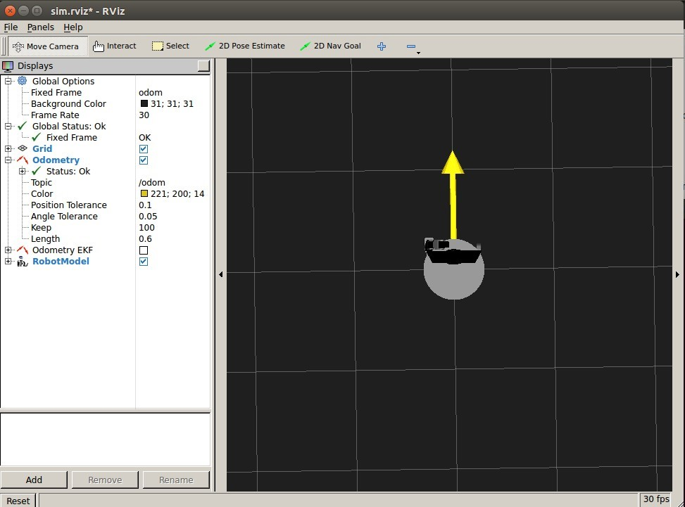
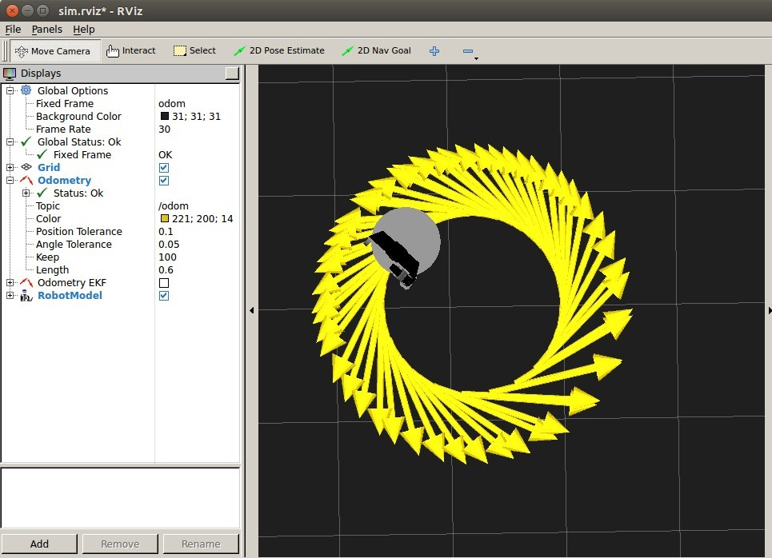
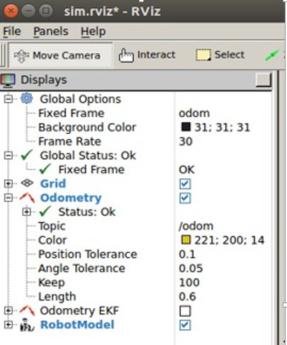
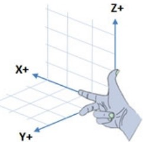

# 前言
在 *PC* 环境下进行机器人的运动仿真是 *ROS* 开发者必经的一个环节，*ROS* 官方提供了好用且强大的3D可视化工具 [rviz](http://wiki.ros.org/rviz)-3D visualization tool for ROS。
*环境: ubuntu 14.04 LTS 32bits *
*ROS*: *Indigo*
开启仿真之旅。
<!--more-->
# 安装 [rviz](http://wiki.ros.org/rviz)
安装之前首先确保在 *ubuntu* 系统下配置安装好了 *ROS* 环境，如果没有请参考官网安装，点击 [ROS-Install-on-Ubuntu](http://wiki.ros.org/indigo/Installation/Ubuntu)。安装3D可视化工具 [rviz](http://wiki.ros.org/rviz) 参考 [Rviz-Installation](http://wiki.ros.org/rviz/UserGuide)
　　```
 $sudo apt-get install ros-indigo-rviz
　　```
[rviz](http://wiki.ros.org/rviz) 只是一个3D可视化工具，需要安装一个模拟器 [Arbotix](http://wiki.ros.org/arbotix) 才能进行机器人的仿真，安装模拟器 [Arbotix](http://wiki.ros.org/arbotix)：
　　```
 $sudo apt-get install ros-indigo-arbotix*
 $rospack profile //更新ros软件包
　　```
# 开始仿真
仿真之前下载 [ros-by-example](https://github.com/pirobot/rbx1) 自带的例程代码：
　　```
 $cd ~/catkin_ws/src
 $git clone https://github.com/pirobot/rbx1.git
 $cd rbx1
 $git checkout indigo-devel
 $cd ~/catkin_ws
 $catkin_make
 $source ~/catkin_ws/devel/setup.bash
 $rospack profile 
　　```
使用 *rbx1* 包之前运行包里自带的 *rbx1-prereq.sh* 文件，安装一下依赖项，如果安装了可以略过：
　　```
 $sh rbx1-prereq.sh　
 $rospack profile
　　```
运行 *roscore* 先：
　　```
 $roscore &
　　```
开启一个机器人模型,模型位于*/rbx1/rbx1_bringup/launch*目录下：
　　```
 $roslaunch rbx1_bringup fake_pi_robot.launch
　　```
也可以选择其他的模型。之后开启 *Rviz* 可视化工具：
　　```
 $rosrun rviz rviz -d `rospack find rbx1_nav`/sim.rviz
　　```
一定要注意反单引号的使用，否则系统会报错。（ESC下面那个键）
此时就可以看到机器人模型：
参数 *sim.rviz* 是 *rviz* 的配置文件。机器人目前处于静止状态，我们发布一个命令，让它动起来，命令冒号后的空格必须有：
　　```
 $rostopic pub -r 10 /cmd_vel geometry_msgs/Twist '{linear: {x: 0.2, y: 0, z: 0}, angular: {x: 0, y: 0, z: 0.5}}'
　　```
效果：
需要停止机器人，可以在同一个窗口按下 *ctrl-c* 或者发布一个空的指令：
　```
 $rostopic pub -1 /cmd_vel geometry_msgs/Twist '{}'
　```
# 过程分析
*fake_pi_robot.launch* 文件是机器人的模型描述文件，功能是生成一个pi类型的机器人模型；
　```
 <launch>
     <param name="/use_sim_time" value="false" />
  
     <!-- Load the URDF/Xacro model of our robot -->
     <arg name="urdf_file" default="$(find xacro)/xacro.py '$(find rbx1_description)/urdf/pi_robot.xacro'" />
  
     <param name="robot_description" command="$(arg urdf_file)" />
  
     <node name="arbotix" pkg="arbotix_python" type="arbotix_driver" output="screen" clear_params="true">
        <rosparam file="$(find rbx1_bringup)/config/fake_pi_arbotix.yaml" command="load" />
        <param name="sim" value="true"/>
    </node>
 
    <node name="move_fake_pi_arm_start" pkg="rbx1_bringup" type="move_fake_pi_arm_start.py" output="screen" />
 
    <node name="robot_state_publisher" pkg="robot_state_publisher" type="state_publisher">
        <param name="publish_frequency" type="double" value="20.0" />
    </node>
 
    <!-- Run a static transform between /base_link and /base_footprint needed for SLAM -->
    <node pkg="tf" type="static_transform_publisher" name="base_footprint_broadcaster" args="0 0 0 0 0 0 /base_link /base_footprint 100" />
 
 
  </launch>

　```
大致过程先加载一个 *urdf*文件，这个文件用于描述机器人的样子，然后启动 *arbotix* 仿真，启动仿真节点，发布状态，最后是 *tf* 坐标变换。*sim.rviz*配置文件描述了 *rviz* 的配置，位于目录 *rbx1/rbx1_nav* 中，它的配置代码很长，大致描述的是一些显示配置，即 *rviz* 左侧那部分：

速度发布命令一个是角速度，一个是线速度，参考 [ROStopic](http://wiki.ros.org/cn/ROS/Tutorials/UnderstandingTopics)。
x y z 的方向遵循右手坐标系，机器人正前方为x轴，自地面向上为z轴，y轴垂直于其他两轴位于左方:



机器人只能贴着地面运动，只能绕Z轴做旋转运动，不可能沿Z轴做直线运动；也不可能绕着x轴或者绕着y轴做旋转运动。机器人只能向前运动或向后运动，即x方向；做旋转运动可以绕z轴顺时针或者逆时针，逆时针为正方向。旋转方向遵循右手螺旋法则，逆时针为正，顺时针为负。

*linear: {x: 0.2, y: 0, z: 0}*的意思就是机器人沿着x轴正方向，即向前运动，速度为 *0.2m/s* ;
*angular: {x: 0, y: 0, z: 0.5}* 的意思是机器人沿着z轴做逆时针旋转的角速度为 *0.5rad/s*;因此会得出以上机器人运动轨迹。
关于速度发布的语法遵循 [YAML](http://wiki.ros.org/ROS/YAMLCommandLine) 。
速度单位 *m/s*-米/秒 
角速度单位 *rad/s*-弧度/秒


