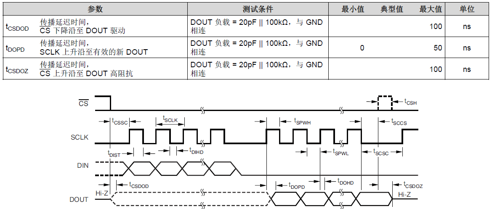
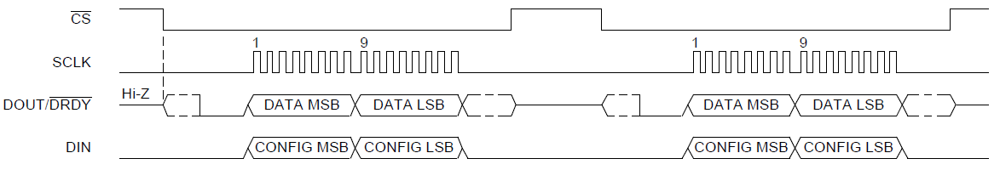
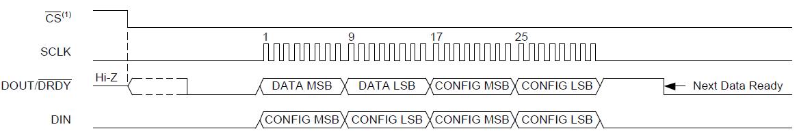
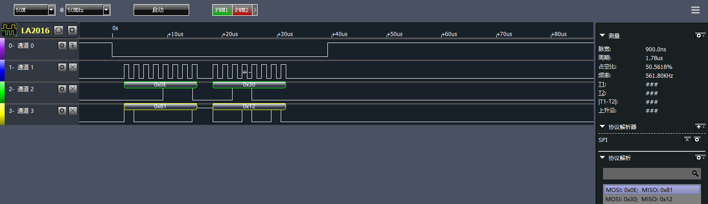
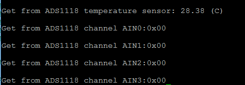

ADS1118 作为常用温度测量芯片被越来越多的开发者熟知，TI官方给出的是基于 MSP430 的驱动测试程序，由于 STM32 的普及，闲暇中移植了 MSP430 的 ADS1118 驱动程序到 STM32F103 平台下，并进行了测试，特在此记录，以飨读者。
<!--more-->
# 硬件连接
使用 STM32F103 的 SPI2 接口连接 ADS1118 的通信接口：

STM32F103|ADS1118
---|---|---|
PB12|CS
PB13|SCLK
PB14|DOUT
PB15|DIN

ADS1118 手册建议数据线之间接一个50欧电阻，实际测试可不接。ADS1118 电源接3.3V并加滤波电容。
# SPI 配置
ADS1118 接口的时序要求如图：


DIN 接口接收控制器送过来的配置数据，并且在 SCLK 的下降沿将数据锁存读入 ADS1118 内部，并且在 SCLK 的上升沿中将数据送出到 DOUT。基于此将 STM32F103 的 SPI 接口做如下配置，CPOL=0，CPHA = 1;
　　```
void SPI_config(void){
	SPI_Cmd(SPI_MASTER, DISABLE);//配置之前先关闭SPI接口

	SPI_InitStructure.SPI_Direction = SPI_Direction_2Lines_FullDuplex;//全双工
	SPI_InitStructure.SPI_Mode = SPI_Mode_Master;//主模式
	SPI_InitStructure.SPI_DataSize = SPI_DataSize_8b;//8bits
	SPI_InitStructure.SPI_CPOL = SPI_CPOL_Low;// CPOL=0
	SPI_InitStructure.SPI_CPHA = SPI_CPHA_2Edge;//CPHA=1
	SPI_InitStructure.SPI_NSS = SPI_NSS_Soft;//CS设置为软件配置
	SPI_InitStructure.SPI_BaudRatePrescaler = SPI_BaudRatePrescaler_64;//通信速率
	SPI_InitStructure.SPI_FirstBit = SPI_FirstBit_MSB;//高位在前
	SPI_InitStructure.SPI_CRCPolynomial = 7;
	SPI_Init(SPI_MASTER, &SPI_InitStructure);
	
	SPI_Cmd(SPI_MASTER, ENABLE);//配置完成使能SPI接口
}
　　```
对应 GPIO 的配置：
　　```
void SPI_GPIO_Configuration(void)
{
	GPIO_InitTypeDef GPIO_InitStructure;

	/* Configure SPI_MASTER pins-*/

	// Pin PB13 (SCLK) must be configured as as 50MHz push pull
	GPIO_StructInit(&GPIO_InitStructure);
	GPIO_InitStructure.GPIO_Pin = SPI_MASTER_PIN_SCK;
	GPIO_InitStructure.GPIO_Mode = GPIO_Mode_AF_PP;
	GPIO_InitStructure.GPIO_Speed = GPIO_Speed_50MHz;
	GPIO_Init(SPI_MASTER_GPIO, &GPIO_InitStructure);

	// Pin PB14 (MISO) must be configured as as input pull-up
	GPIO_StructInit(&GPIO_InitStructure);
	GPIO_InitStructure.GPIO_Pin = SPI_MASTER_PIN_MISO;
	GPIO_InitStructure.GPIO_Mode = GPIO_Mode_IN_FLOATING;
	GPIO_Init(SPI_MASTER_GPIO, &GPIO_InitStructure);

	// Pin PB15 (MOSI) must be configured as as 50MHz push pull
	GPIO_StructInit(&GPIO_InitStructure);
	GPIO_InitStructure.GPIO_Pin = SPI_MASTER_PIN_MOSI;
	GPIO_InitStructure.GPIO_Mode = GPIO_Mode_AF_PP;
	GPIO_InitStructure.GPIO_Speed = GPIO_Speed_50MHz;
	GPIO_Init(SPI_MASTER_GPIO, &GPIO_InitStructure);
	
	//SPI1 NSS 
	GPIO_StructInit(&GPIO_InitStructure);
	GPIO_InitStructure.GPIO_Pin = SPI_MASTER_PIN_NSS;
	GPIO_InitStructure.GPIO_Mode = GPIO_Mode_Out_PP;
	GPIO_Init(SPI_MASTER_GPIO, &GPIO_InitStructure);

	GPIO_SetBits(SPI_MASTER_GPIO, SPI_MASTER_PIN_NSS);
}
　　```
另外记得使能端口时钟：
　　```
void SPI_RCC_Configuration(void){
	/* Enable GPIO clock for SPI_MASTER */
	RCC_APB2PeriphClockCmd(SPI_MASTER_GPIO_CLK | RCC_APB2Periph_AFIO, ENABLE);
	/* Enable SPI_MASTER Periph clock */
	RCC_APB1PeriphClockCmd(SPI_MASTER_CLK, ENABLE); 
}
　　```
# 读写实现
ADS1118 在发送寄存器配置的同时会传输转换结果，手册中提到既支持16bits 模式也支持32bits模式。

16bits模式：



32bits模式：



DIN 接口接收寄存器配置的同时DOUT接口输出转换结果，在32bits模式下发送完寄存器配置后第二次可以发送数据0，具体可参考手册。基于此设计数据发送读取函数：
　　```
//读写寄存器16bits模式
uint16_t SPI_read_write_Reg(uint16_t CofigReg)
{

	getdata1=SPI_send_Byte((uint8_t)(CofigReg>>8));
	getdata2=SPI_send_Byte((uint8_t)CofigReg);

	getdata= (uint16_t)getdata2|((uint16_t)getdata1<<8);

	return getdata;
}
uint8_t SPI_send_Byte(uint8_t byte)
{
 
	while(SPI_I2S_GetFlagStatus(SPI2, SPI_I2S_FLAG_TXE) == RESET){}
	
	SPI_I2S_SendData(SPI2, byte);
	
	while(SPI_I2S_GetFlagStatus(SPI2, SPI_I2S_FLAG_RXNE) == RESET){}
	
	return SPI_I2S_ReceiveData(SPI2);
}
　　```
获取 ADS1118 的片内温度需要将 ADS1118 的寄存器的第4bit修改为1，启动单次转换将第15bit写1即可：
　　```
float ads1118_get_temperature(void)
{
	uint16_t adc=0;
	float value=0;
	adsConfigReg.stru.NOP     =  DATA_VALID;
	adsConfigReg.stru.TS_MODE =  TEMPERATURE_MODE;
	adsConfigReg.stru.DR      =  DR_8_SPS;
	adsConfigReg.stru.MODE    =  SIGNLE_SHOT;
	adsConfigReg.stru.OS      =  SINGLE_CONVER_START;   
	
	ADS1118_ENABLE;
 
	adc = SPI_read_write_Reg(adsConfigReg.word);
	
	//conver to temperture
	if(adc&0x8000)
	{
		//-xx.xxx c
		adc>>=2;
		value=(0x3fff-adc+1)*(-0.03125);
	}
	else
	{
		//+xx.xxx c
		adc>>=2;
		value=adc*0.03125;     
	}
	ADS1118_DISABLE;
	return value;
}
　　```

ADS1118默认开启ADC模式，通过配置寄存器的12-14bit可以选择开启哪个通道，具体可参考手册。另外关于片内温度模式时，使用的是14bit左对齐模式。而且ADS1118的转换结果中，负数使用二进制补码格式，因此需要做一个转换，每个值代表0.03125℃，测试中的SPI通信数据：



测试时没有连接4路输入模拟量的输入，交替采集片内温度传感器的值：


