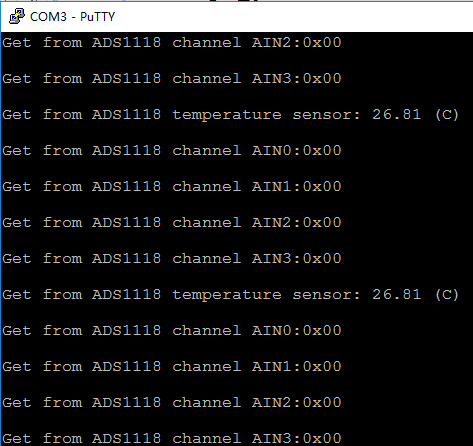

# 前言
在调试stm32f103芯片时，想在串口打印一些调试信息，总感觉没有linux下那么顺手。搜索一番，官方有解决方案，但限于使用一般串口模式，而如果使用DMA则实现起来麻烦一些，为了在DMA模式下使用printf，特做此记录。
<!--more-->
# 一般模式
一般模式下，就是重定义fputc函数，将输出重定向至串口。首先包含头文件 stdio.h,然后重写fputc函数：
　　```
#ifdef __GNUC__
/* With GCC/RAISONANCE, small printf (option LD Linker->Libraries->Small printf set to 'Yes') calls __io_putchar() */
#define PUTCHAR_PROTOTYPE int __io_putchar(int ch)
#else
#define PUTCHAR_PROTOTYPE int fputc(int ch, FILE *f)
#endif /* __GNUC__ */
PUTCHAR_PROTOTYPE
{
  /* Place your implementation of fputc here */
  /* e.g. write a character to the USART */
  USART_SendData(USART1, (uint8_t) ch);
  /* Loop until the end of transmission */
  while (USART_GetFlagStatus(USART1, USART_FLAG_TC) == RESET);
	
  return ch;
}
　　```
这样在使用printf函数时，会自动调用fputc函数。另外在工程属性的 “Target" -> "Code Generation" 选项中勾选 "Use MicroLIB"
# DMA模式
如果串口使用的是DMA发送，如何实现printf功能呢？串口使用DMA发送数据时，只需要将发送缓存的首地址以及数据长度给DMA即可。那么只要计算出printf要发送的数据首地址与长度也就可以给DMA去发送了。我们可以将要发送的数据放到一个队列里，CPU只负责搬运该数据，将数据的长度与首地址交给DMA即可实现printf的功能。我们简单的修改一下fputc函数：
　　```
PUTCHAR_PROTOTYPE
{
  /* Place your implementation of fputc here */
  /* e.g. write a character to the USART */
  //USART_SendData(USART1, (uint8_t) ch);
  /* Loop until the end of transmission */
 // while (USART_GetFlagStatus(USART1, USART_FLAG_TC) == RESET);
  remote_data_x_usart_In_Queue((uint8_t)ch);//将要发送的数据放入环形队列中
  return ch;
}
　　```
另外设计一个函数将数据从队列中取出，并将数据的首地址和长度给DMA：
　　```
int remote_data_x_usart_dma_ctl(void) 
{ 	
	uint32_t num=0; 	uint8_t data; 	
	if(DMA_GetCurrDataCounter(USARTm_Tx_DMA_Channe)==0) 
	{
		DMA_Cmd(USARTm_Tx_DMA_Channe,DISABLE); 		
		while((remote_data_x_usart_Out_Queue(&data))!=0)//数据出列	
		{	 			
			USARTmTxBuffer[num]=data; 			
			num++; 			
			if(num==USARTm_Tx_BUFFER_SIZE) 			
				break; 		
		} 		
		if(num>0) 		
		{ 			
			remote_data_x_usart_dma_start_tx((uint32_t)USARTmTxBuffer,num);//将数据首地址与长度给DMA
		} 		
		return 0; 	
	} 	
	else 	
		return 1; 
}
　　```
这样即可实现DMA模式下的 printf 功能。不过每次调用printf时必须调用一次 remote_data_x_usart_dma_ctl 函数。为了减少麻烦可以将该函数放到 sysTick 中断中，让CPU每次判断队列是否不为空，这样可能会降低系统效率，但也没降低多少性能。
　　```
void SysTick_Handler()
{

	if (usTicks != 0)
	{
		usTicks--;
	}
	
	remote_data_x_usart_dma_ctl();
}
　　```
数据的入列与出列可以简单设置如下：
　　```
//将数据插入队列
uint32_t remote_data_x_usart_In_Queue(uint8_t data) 
{ 	
	if(USARTm_Tx_Buf_Queue.USARTm_Tx_COUNTER <USARTm_Tx_BUFFER_SIZE)//判断队列是否满，不满才进行以下操作
		{
			if(USARTm_Tx_Buf_Queue.USARTm_Tx_PTR_HEAD >= USARTm_Tx_BUFFER_SIZE) //队列头指针超出队列宽度
				USARTm_Tx_Buf_Queue.USARTm_Tx_PTR_HEAD = 0; //头指针归零 		
			USARTm_Tx_Buf_Queue.USARTm_Tx_Buffer[USARTm_Tx_Buf_Queue.USARTm_Tx_PTR_HEAD] = data; //将数据入列		
			USARTm_Tx_Buf_Queue.USARTm_Tx_PTR_HEAD++; 	//头指针移动加一	
			USARTm_Tx_Buf_Queue.USARTm_Tx_COUNTER++;  	//队列宽度加一
			return 0; 	
		} 		
	return 1;	 	 
}
//从队列中获取一个数
uint32_t remote_data_x_usart_Out_Queue(uint8_t *data) 
{ 	
	uint32_t num;
	if(USARTm_Tx_Buf_Queue.USARTm_Tx_COUNTER > 0) 	//判断队列是否为空，不为空才能提取
		{ 		
			if(USARTm_Tx_Buf_Queue.USARTm_Tx_PTR_TAIL >= USARTm_Tx_BUFFER_SIZE)//盘对尾指针是否超出队列宽度			
				USARTm_Tx_Buf_Queue.USARTm_Tx_PTR_TAIL = 0;//超出就归零
			num = USARTm_Tx_Buf_Queue.USARTm_Tx_COUNTER;//获取队列宽度	
			*data = USARTm_Tx_Buf_Queue.USARTm_Tx_Buffer[USARTm_Tx_Buf_Queue.USARTm_Tx_PTR_TAIL]; //获取一个数据	
			USARTm_Tx_Buf_Queue.USARTm_Tx_PTR_TAIL++; //尾指针移动加一	
			USARTm_Tx_Buf_Queue.USARTm_Tx_COUNTER--; //数据被提取，队列宽度减一		
			return num; //返回队列宽度
		} 	
	else 	
		{ 		
			*data = 0xFF;//队列为空填充一个值
			return 0; //返回队列宽度
		} 
}
　　```
关于DMA的配置可参考STM32官方库，或者可以参考我的 [remote_data_x.c](https://github.com/StevenShiChina/stm32-ads1118/blob/master/User/remote_data_x.c) 以及 [remote_data_x.h](https://github.com/StevenShiChina/stm32-ads1118/blob/master/User/remote_data_x.h) 

测试时sysTick设置的是1ms中断，系统连接一个ADS1118采集4路模拟量并采集片内温度，显示效果：


