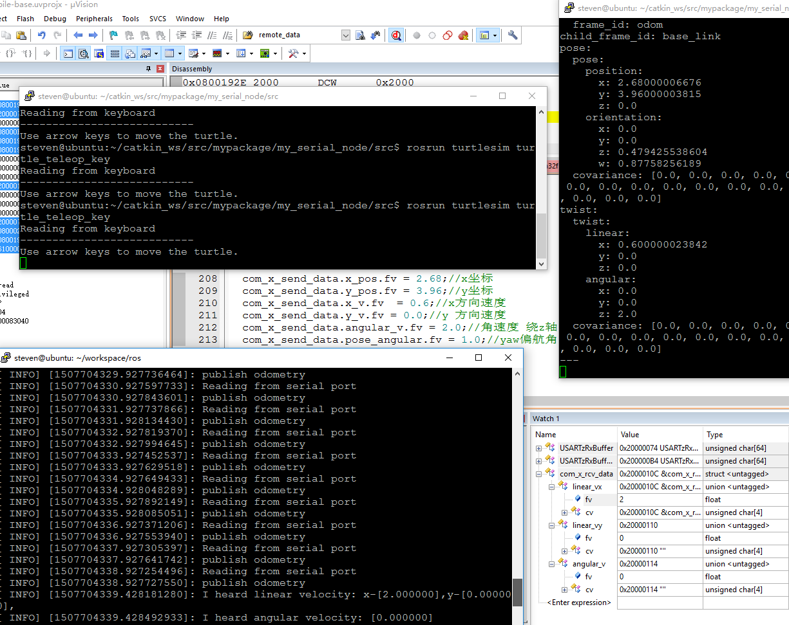

# 前言
一直有朋友咨询STM32到底如何与ROS实现信息交互，ROS如何获取移动底座的位置、速度、偏航角等信息，移动底座又是如何实时接收ROS的速度控制命令等。为了更清晰的描述这些问题，最近特意进行了总结归纳，从底层的STM32，到ROS的节点设计都做了详细的论述，放到这里给共同学习ROS的童鞋一个方向。
<!--more-->
# 设计思路
有的朋友使用全向移动底座，有的使用两轮差动或四轮驱动实现移动底座；为了保持代码通用性，运动学解析这一部分没有特别的说明，移动底座只接收 x 与 y 两个方向的线速度以及一个绕 z 轴的角速度；针对不同的移动底座，还需要设计不同的运动学解析函数，以便于将线速度与角速度转变成电机运动指令，从而控制电机运动。ROS 部分实现一个节点，该节点订阅 cmd_vel 话题，并将该话题转变成 x y 两个方向的线速度以及一个绕 z 轴的角速度，通过串口发送到移动底座，即给STM32；另外该节点还需要发布导航需要的 odom 消息，这个消息需要移动底座提供，通过STM32的串口发送机器人的位置、速度、偏航角等信息，经过特殊的变换之后再发布。
## STM32
STM32使用最多的便是STM32F103，为了便于调试，选择STM32的串口1作为调试串口，打印一些调试信息；使用STM32的串口3作为与 ROS 通信的端口；调试串口波特率设置为9600,8位数据1个停止位，偶校验；串口3设置为115200波特率，8位数据1个停止位无校验模式；当然这个波特率可以自行设置。数据的发送和接收可以是固定长度或不固定长度，为了适应不同的长度字节，建议使用DMA模式，并开启串口的空闲中断，否则很难判断一帧数据包的完全接收。当然也可以开启一个定时器，在一定时间内判断是否超时来间接的判断一帧数据是否完成。最好的方式就是开启串口空闲中断，将数据的发送和接收都由DMA负责，这样不占用CPU资源。
调试端口:
					PA9--->USART1_TX---->DMA1_Channel4    
					PA10--->USART1_RX--->DMA1_Channel5
与ROS通信端口:
					PB10--->USART3_TX---->DMA1_Channel2
					PB11---->USART3_RX--->DMA1_Channel3
### 数据接收
使用DMA接收数据，配置如下：
　　```
 DMA_Cmd(USARTz_Rx_DMA_Channe,DISABLE);//配置之前先停止
 DMA_DeInit(USARTz_Rx_DMA_Channe);//恢复缺省配置
 DMA_InitStructure.DMA_PeripheralBaseAddr = (uint32_t)USARTz_DR_Base;// 设置串口接收数据寄存器
 DMA_InitStructure.DMA_MemoryBaseAddr = (uint32_t)USARTzRxBuffer;//接收缓存地址 
 DMA_InitStructure.DMA_DIR = DMA_DIR_PeripheralSRC;//设置外设为数据源
 DMA_InitStructure.DMA_BufferSize = USARTzTxBufferSize;//需要接收的字节数
 DMA_InitStructure.DMA_PeripheralInc = DMA_PeripheralInc_Disable; //外设地址不做增加调整      
 DMA_InitStructure.DMA_MemoryInc = DMA_MemoryInc_Enable;  // 内存缓冲地址增加调整              
 DMA_InitStructure.DMA_PeripheralDataSize = DMA_PeripheralDataSize_Byte; // 外设数据宽度一个字节
 DMA_InitStructure.DMA_MemoryDataSize = DMA_MemoryDataSize_Byte; // 内存数据宽度一个字节        
 DMA_InitStructure.DMA_Mode = DMA_Mode_Normal;                           //单次传输模式
 DMA_InitStructure.DMA_Priority = DMA_Priority_VeryHigh; // 高优先级               
 DMA_InitStructure.DMA_M2M = DMA_M2M_Disable;  //关闭内存到内存的DMA模式
 DMA_Init(USARTz_Rx_DMA_Channe, &DMA_InitStructure);// 写入配置
 DMA_ClearFlag(USARTz_Rx_DMA_FLAG);    //清除DMA所有标志                       
 DMA_Cmd(USARTz_Rx_DMA_Channe, ENABLE); // 开启DMA接收通道
　　```
开启串口的空闲中断，并在空闲中断中读取串口数据：
　　```
/* Enable USART3 Receive  interrupts */
  USART_ITConfig(USART3, USART_IT_IDLE, ENABLE); 

 void USART3_IRQHandler(void)//串口中断
 {
    
	if(USART_GetITStatus(USART3, USART_IT_IDLE) != RESET)  
    {
        com_x_usart_dma_read();
		USART_ReceiveData( USART3 );
    }
 }
　　```
这样才能接收变长的数据帧。
### 数据发送
数据发送时只要将数据发送的首地址以及数据宽度给 DMA 即可，因为一开始固定了发送缓存地址，所以只需要指定发送缓存长度即可：
　　```
 void com_x_usart_dma_start_tx(uint8_t size)
 {
    USARTz_Tx_DMA_Channe->CNDTR = (uint16_t)size; //重新赋值，指定发送缓存长度 
    DMA_Cmd(USARTz_Tx_DMA_Channe, ENABLE);  // 开启DMA发送    
 }
　　```
### 调试功能
关于 stm32 的 printf 功能实现可以参考站内文章  
这里建议使用 DMA 方式实现 printf，因为底座还有很多任务要处理包括运动学解析以及电机控制等。
## ROS
需要设计一个 ROS 节点，该节点订阅 cmd_vel 话题，并发布 odom 消息；解析订阅的 cmd_vel 话题，转变成线速度以及角速度参数通过串口发送至移动底座；并实时监听串口送来的移动底座的位置、速度、偏航角等信息，整合成 odom 消息格式，发布出去。因为串口发送的都是16进制数据，因此涉及到浮点与16进制的转换，可以直接读内存实现：
　　```
//通过联合体获取浮点与16进制
typedef	union{
		float fv;
		uint8_t cv[4];
}float_union;
　　```
串口发送的数据格式也就是移动底座接收数据包的格式可以定义为：

head|head|velocity_x|velocity_y|angular_v|CRC
---|---|---
0xff|0xff|float|float|float|unsigned char

velocity_x 表示 x 方向线速度，velocity_y 表示 y 方向线速度，angular_v 表示绕 z 轴的角速度，因为移动底座为贴地面运行，因此只有绕 z 轴的角速度，数据发送的总长度为15字节。
串口接收的数据格式也就是移动底座发送的数据包格式可以定义为：

head|head|x-position|y-position|x-speed|y-speed|angular-speed|pose-angular|CRC
---|---|---
0xaa|0xaa|float|float|float|float|float|float|u8

x-position 表示机器人实时 x 坐标位置，y-position表示机器人实时 y 坐标位置，x-velocity表示机器人实时 x 坐标方向速度，y-velocity表示机器人实时 y 坐标方向速度，angular velocity表示机器人当前角速度，pose angular表示机器人当前偏航角。数据上传的总长度为27字节。校验和从有效数据开始取异或即可，如下示例：
　　```
data[8] = data[2]^data[3]^data[4]^data[5]^data[6]^data[7];//不计算数据包的头
					
　　```
ROS 端串口的数据发送与数据读取可以参考站内文章，需要注意的是在订阅 cmd_vel 话题时的回调函数中，参数类型选择 const geometry_msgs::Twist，另外在从串口获取到里程计信息后需要将偏航角转换成四元数才能进行发布：
　　```
 //将偏航角转换成四元数才能发布
 odom_quat = tf::createQuaternionMsgFromYaw(yaw.fvalue);

 //发布坐标变换父子坐标系
  odom_trans.header.frame_id = "odom";
  odom_trans.child_frame_id = "base_link";
  
  //发布tf坐标变换
  odom_broadcaster.sendTransform(odom_trans);
  //获取当前时间
  current_time = ros::Time::now();
  //载入里程计时间戳
  odom.header.stamp = current_time;
 
  //里程计位置数据
  odom.pose.pose.position.x = posx.fvalue;

  //载入线速度和角速度
  odom.twist.twist.linear.x = vx.fvalue;
  odom.twist.twist.angular.z = va.fvalue;
  //发布里程计消息
  read_pub.publish(odom);
  ROS_INFO("publish odometry");
　　```
# 测试
为了更直观的观察代码可用性，使用时我直接使用了 ROS 中的 turtlesim turtle_teleop_key 来使用键盘的方向键来键入速度、角速度等。测试时开三个terminal,分别运行：
　　``` 
 $ roscore  
 $ rosrun my_serial_node my_serial_node
 $ rosrun turtlesim turtle_teleop_key
　　```
此时可以通过键盘方向键发送运动命令，可以在终端窗口观察到信息的发布,STM32端可以手动给一些位置、速度等的固定值，可以接另外一台电脑连接STM32的调试串口，因为我就一个电脑，测试时直接使用JTAG观察变量：



该截图为按下向上的方向键时捕捉到的信息，可以清晰的看到 stm32 收到的线速度 x 方向为 2：


对应的也可以看到 ROS 的输出信息 ：


在STM32端给定的移动底座的实时位置、速度信息为：


此时我们在ROS端可以非常清晰的查看到该信息已经发布，并被我们捕捉到，开一个终端，输入rostopic echo /odom 进行查看：


至此，已经完全实现了STM32的串口与ROS进行数据交互，并且测试成功，实际使用时只要添加对应的移动底座运动学解析部分即可。全部源码稍后会放出，您也可以通过打赏19.9的方式更快的获取源码。近期打赏的朋友较多，为了方便区分，请打赏时在留言中附上邮箱地址。


