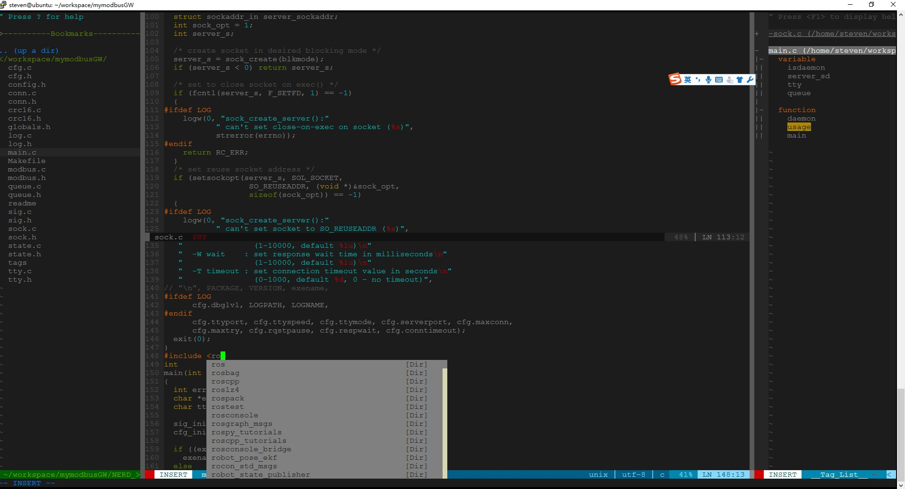

# 前言
*linux* 下有很多好用的 IDE，比如常见的 [Eclipse](https://eclipse.org/)、[Bluefish](http://bluefish.openoffice.nl/index.html)、[NetBeans](https://netbeans.org/) 等等，功能很多，有些功能我们不一定用得上,天天面对 *terminal* 敲命令的我们天生不喜欢鼠标。*linux* 下的文本编辑器使用最多的还是 [Vim](http://www.vim.org/) 。可不可以将 [Vim](http://www.vim.org/) 打造成一个好用的 IDE 来替代或者部分替代这些高大上的 IDE 呢? -程序猿天生喜欢折腾。话不多说先上图：
<!--more-->
# vim 插件管理
首先安装 [Vim](https://github.com/vim/vim.git), 确保版本在 7.4 以上。可以源码安装 [Vim](https://github.com/vim/vim.git) 也可以自动安装：
　　```
 $sudo apt-get install vim
　　```
由于发行版的不同，这种方式安装的 [Vim](https://github.com/vim/vim.git) 版本不一定是最新的，如果版本低于 7.4 请采用源码安装。 [Vim](https://github.com/vim/vim.git) 的插件管理一般是通过 [Vundle](https://github.com/VundleVim/Vundle.vim) 来实现。 安装 [Vundle](https://github.com/VundleVim/Vundle.vim):
　　```
$ git clone https://github.com/VundleVim/Vundle.vim.git ~/.vim/bundle/Vundle.vim
　　```
完成后修改用户目录下的 *.vimrc* 文件，添加以下项：
　　```
 "-----------Vundle configuration--------------------
 set nocompatible "去掉vi一致性
 filetype off  
 "包含vundle路径
 set rtp+=~/.vim/bundle/Vundle.vim
 call vundle#begin()
 Plugin 'VundleVim/Vundle.vim'
 Plugin 'xxx/xxx' "新插件
 call vundle#end()
 filetype plugin indent on
　　```
当需要安装新的插件时，将插件的仓库名按格式填入到*.vimrc* 文件：
　　```
Plugin 'xxx/xxx'
　　```
插件的安装格式为：
　　```
 Plugin 'repository' //在Github vim-scripts 用户下的仓库,只需要写出仓库名称
 Plugin 'username/repository' //在Github其他用户下的仓库, 需要写出”用户名/仓库名”
 Plugin 'git://github.com/something.git' //不在Github上的插件，需要写出git全路径
　　```
启动 *Vim*,运行命令安装插件：

　　```
 ：PluginInstall
　　```
卸载插件时先在 *.vimrc* 中删除掉不用的插件行然后运行清除命令：
　　```
 ：PluginClean
　　```
参考 [Vundle](https://github.com/VundleVim/Vundle.vim) 和 [vim-scripts](https://github.com/vim-scripts)
# 项目树
[NerdTree](https://github.com/scrooloose/nerdtree) 是一个树形目录插件，方便查看项目中的各个文件。
安装：
　　```
 Plugin 'scrooloose/nerdtree'

　　```
完成后在 *.vimrc* 中进行必要的配置：
　```
 "---------NERDTree Configruation-----------------------------------
 let NERDTreeShowBookmarks=1 " 当打开 NERDTree 窗口时，自动显示 Bookmarks
 let NERDTreeWinPos='left' "目录树在左边显示
 let NERDTreeWinSize=30 "目录树的窗口宽度
 "开启和关闭快捷键为F2 或者 直接输入命令:NERDTree
 map <F2> :NERDTreeToggle<CR>
　```
效果：

# 状态栏
[Vim-Powerline](https://github.com/Lokaltog/vim-powerline) *vim* 状态栏的显示，可以显示文件名、行列数、编码方式等。
安装：
　　```
 Plugin 'Lokaltog/vim-powerline'
　　```
现在新的仓库已迁移到 [powerline](https://github.com/powerline/powerline)。
效果：

# 括号自动补全
[auto-pair](https://github.com/jiangmiao/auto-pairs) 插件可以自动补全代码中的括号。安装：
　　```
 Plugin 'jiangmiao/auto-pairs'
　　```
# 代码自动补全
代码自动补全是各种IDE的必备功能，这里强烈推荐[YouCompleteMe](https://github.com/Valloric/YouCompleteMe)。它基于 [clang](https://zh.wikipedia.org/wiki/Clang) 能够为 *C/C++* 代码提供代码提示，也支持 *python C#*。[YouCompleteMe](https://github.com/Valloric/YouCompleteMe) 的安装正如传说中一样，非常麻烦，但使用起来非常爽。
## 安装
源码下载：
　　```
$git clone --recursive https://github.com/Valloric/YouCompleteMe.git ~/.vim/bundle/YouCompleteMe

　　```
安装 [clang](https://clang.llvm.org/get_started.html)：
　　
　　```
 $sudo apt-get install clang
　　```
[YouCompleteMe](https://github.com/Valloric/YouCompleteMe) 要求 [clang](https://clang.llvm.org/get_started.html) 最低版本为 3.9，如果不是可以在 [这里](http://releases.llvm.org/download.html) 下载。如果 *Ubuntu* 为32bits则需要下载源码手动编译。
安装 *python-dev*:
　　```
 $sudo apt-get install python-dev python3-dev
　　```
安装 *Cmake*:
　　```
 $sudo apt-get install cmake
　　```
源码编译：
　　```
$cd ~/.vim/bundle/YouCompleteMe
$./install.py --clang-completer --system-libclang
　　```
--system-libclang是指使用系统的*libclang*。新版 *YouCompleteMe* 编译时不再需要 *make ycm_support_libs*。
## 配置
拷贝系统配置到用户目录下：
　　```
 $cp ~/.vim/bundle/YouCompleteMe/third_party/ycmd/cpp/ycm/.ycm_extra_conf.py  ~/
　　```
*.vimrc*中的配置：
　　```
 "----------YouCompleteMe configuration---
 set runtimepath+=~/.vim/bundle/YouCompleteMe "使用插件
 let g:ycm_global_ycm_extra_conf = '~/.ycm_extra_conf.py' "指定全局配置文件路径
 set completeopt=longest,menu    "让Vim的补全菜单行为与一般IDE一致
 autocmd InsertLeave * if pumvisible() == 0|pclose|endif "离开插入模式后自动关闭预览窗口
 "回车即选中当前项
 inoremap <expr> <CR>       pumvisible() ? "\<C-y>" : "\<CR>"
 "上下左右键的行为
 inoremap <expr> <Down>     pumvisible() ? "\<C-n>" : "\<Down>"
 inoremap <expr> <Up>       pumvisible() ? "\<C-p>" : "\<Up>"
 inoremap <expr> <PageDown> pumvisible() ? "\<PageDown>\<C-p>\<C-n>":
 inoremap <expr> <PageUp>   pumvisible() ? "\<PageUp>\<C-p>\<C-n>" : "\<PageUp>"
 let g:ycm_key_list_select_completion = ['<Down>']
 let g:ycm_key_list_previous_completion = ['<Up>']
 let g:ycm_confirm_extra_conf=0 "关闭加载.ycm_extra_conf.py提示
 let g:ycm_collect_identifiers_from_tags_files=1 " 开启 YCM 基于标签引擎
 let g:ycm_min_num_of_chars_for_completion=2 " 从第2个键入字符就开始罗列匹配项
 let g:ycm_cache_omnifunc=0  " 禁止缓存匹配项,每次都重新生成匹配项
 let g:ycm_seed_identifiers_with_syntax=1    " 语法关键字补全
 nnoremap <F5> :YcmForceCompileAndDiagnostics<CR>"force recomile with syntastic
 inoremap <leader><leader> <C-x><C-o>
 let g:ycm_complete_in_comments = 1 "在注释输入中也能补全
 let g:ycm_complete_in_strings = 1 "在字符串输入中也能补全
 let g:ycm_collect_identifiers_from_comments_and_strings = 1 "注释和字符串中的文字也会被收入补全
 let g:clang_user_options='|| exit 0'
 let g:ycm_goto_buffer_command = 'horizontal-split' "跳转到定义处，分屏打开
 nnoremap <leader>jd :YcmCompleter GoToDefinitionElseDeclaration<CR> " 跳转到定义处
 let g:ycm_error_symbol = '>>' "错误提示符
 let g:ycm_warning_symbol = '>*' "警告提示符
　　```
## 32位系统安装
由于我使用的是ubuntu14.04 32bit系统，所以有很多软件需要手动编译，在这里将遇到的问题悉数总结一下，有和我同样配置的小伙伴可以参考。32位系统没有合适的 *clang* 和 *vim*发行包，需要手动编译安装。
### Cmake 安装
使用sudo apt-get install cmake 默认安装的 [Cmake](https://cmake.org/) 版本为2.8.12.2。当使用 [Cmake](https://cmake.org/) 编译LLVM时提示 [Cmake](https://cmake.org/) 版本太低，要求至少为3.4.3以上 因此需要升级[Cmake](https://cmake.org/)。 
下载源码：
　　```
 $wget https://cmake.org/files/v3.4/cmake-3.4.3.tar.gz
　　```
编译安装：
　　```
 $./configure
 $make
 $sudo make install
　　```
### Clang 编译安装
下载LLVM源代码并放到指定目录:
　　```
 $wget http://llvm.org/releases/3.9.0/llvm-3.9.0.src.tar.xz
 $tar xf llvm-3.9.0.src.tar.xz
 $mv llvm-3.9.0.src  llvm

　　```
下载clang的源码并放到指定目录：
　　```
 $cd llvm/tools
 $wget http://llvm.org/releases/3.9.0/cfe-3.9.0.src.tar.xz
 $tar xf cfe-3.9.0.src.tar.xz
 $mv cfe-3.9.0.src clang

　　```
下载clang-tools-extra源码并放到指定目录：
　　```
 $cd llvm/tools/clang/tools
 $wget http://llvm.org/releases/3.9.0/clang-tools-extra-3.9.0.src.tar.xz
 $tar xf clang-tools-extra-3.9.0.src.tar.xz
 $mv clang-tools-extra-3.9.0.src  extra

　　```
下载compiler-rt源码并放到指定目录：
　　```
 $cd llvm/projects
 $wget http://llvm.org/releases/3.9.0/compiler-rt-3.9.0.src.tar.xz
 $tar xf compiler-rt-3.9.0.src.tar.xz
 $mv compiler-rt-3.9.0.src compiler-rt
　　```
配置参考 [llvm官网](http://llvm.org/docs/GettingStarted.html#local-llvm-configuration)。
　　```
 $cmake –G “Unix Makefiles” /home/steven/software/llvm –DCMAKE_BUILD_TYPE=RELEASE –DLLVM_TARGETS_TO_BUILD=X86 –DLLVM_OPTIMIZED_TABLEGEN=ON –DCMAKE_INSTALL_PREFIX=/usr/local/llvm
　　```
编译参考 [llvm-cmake](http://llvm.org/docs/CMake.html)：
3.7.0以后，不允许在源码树中进行构建，我们可以在llvm源码目录同级目录中创建一个目录build，然后使用绝对路径进行构建。
退出llvm目录，在llvm同级目录下建立build目录，进入到build目录

　　```
 $cd ../..
 $mkdir build
 $cd build
 $cmake --build . //后面的 . 不能少,意思是当前目录
　　```
安装：
　　```
 $sudo cmake --build . --target install
　　```
也可以在安装时改变安装路径：
　　```
 $cmake –DCMAKE_INSTALL_PREFIX=/tmp/llvm –P cmake_install.cmake
　　```
安装后看系统是否能找到，如果不能需要手动添加到环境变量。
### vim升级
如果不升级 *Vim*,当调用 *YouCompleteMe* 时系统会提示错误：
　　```
YouCompleteMe unavailable: requires Vim 7.4.143+
　　```
因此需要升级 *Vim*。先卸载原有版本：
　　```
sudo apt-get remove vim
sudo apt-get remove vim-runtime
sudo apt-get remove vim -tiny
sudo apt-get remove vim-common
sudo apt-get remove vim-doc
sudo apt-get remove vim-scripts
　　```
首先安装一些依赖项：
　　```
sudo apt-get install libncurses5-dev libgnome2-dev libgnomeui-dev libgtk2.0-dev libatk1.0-dev libbonoboui2-dev libcairo2-dev libx11-dev libxpm-dev libxt-dev python-dev python3-dev ruby-dev lua5.1 lua5.1-dev　
　```
*–enable-pythoninterp* 和 *–enable-python3interp* 是 *vim* 对 *python* 版本的支持，安装 *YouCompleteMe* 必须要有这两个配置。
下载 [vim-8.0](http://mirror.metrocast.net/vim/unix/vim-8.0.tar.bz2):
　　```
 $wget http://mirror.metrocast.net/vim/unix/vim-8.0.tar.bz2
　　```
解压后配置：
　　```
./configure --with-features=huge --enable-multibyte --enable-rubyinterp --enable-pythoninterp --with-python-config-dir=/usr/lib/python2.7/config-i386-linux-gnu  --enable-python3interp --with-python3-config-dir=/usr/lib/python3.4/config-3.4m-i386-linux-gnu --enable-perlinterp --enable-luainterp --enable-gui=gtk2 --enable-cscope --prefix=/usr
　　```
注意上面的 *--with-python3-config-dir* 一定要指定 *python3* 的完全路径，否则系统找不到。
编译安装：
　　```
 $make VIMRUNTIMEDIR=/usr/share/vim/vim80
 $sudo make install
　　```
安装完后一定要测试一下依赖项是否完整，特别是对 *python3* 的依赖：
　　```
 $vim --version | grep python
　　```
如果输出包含则表示安装完整：
　　```
+cryptv          +linebreak       +python/dyn      +vreplace
+cscope          +lispindent      +python3/dyn     +wildignore
　　```
再回到以上YouCompleteMe的安装即可。
# 结语
*Vim* 还有很多有用的插件，需要慢慢研究，目前先装这些，对于常用的补全、跳转、快速查看目录等都可以实现，基本满足需求。


 

